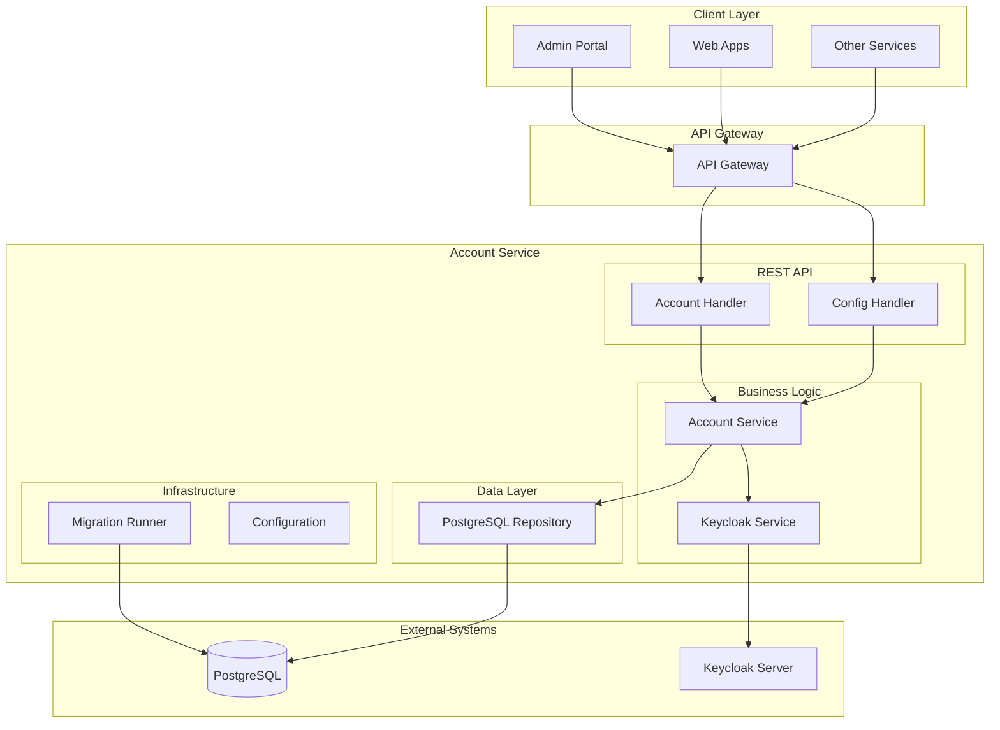
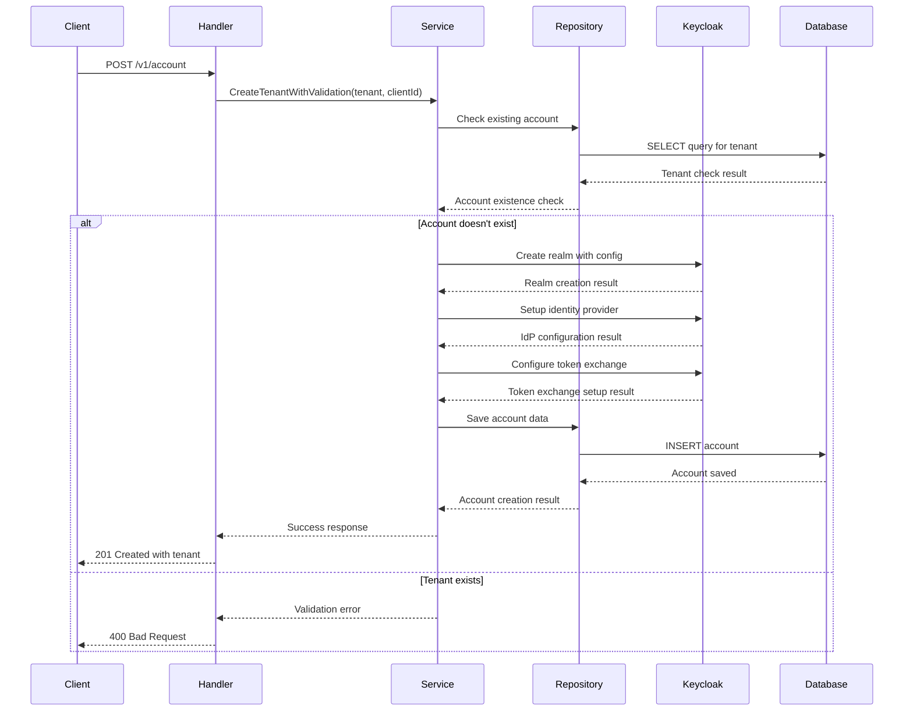

# Account Service (Go)

A Go-based implementation of the DIGIT Account service using the Gin framework. This service provides tenant provisioning, Keycloak realm management, and cross-realm token exchange configuration for multi-tenant DIGIT applications.

## Overview

**Service Name:** account

**Purpose:** Provides multi-tenant account management with automated Keycloak realm provisioning, identity provider configuration, and cross-realm token exchange setup for DIGIT applications.

**Owner/Team:** DIGIT Platform Team

## Architecture

**Tech Stack:**
- Go 1.24
- Gin Web Framework
- PostgreSQL (via GORM)
- Keycloak Admin API
- Docker

**Core Responsibilities:**
- Tenant account creation and management
- Automated Keycloak realm provisioning
- Identity provider configuration for cross-realm authentication
- Token exchange policy management
- Account configuration management
- Multi-tenant isolation and security

**Dependencies:**
- PostgreSQL 15
- Keycloak 22+ for identity management

### Diagrams

#### High-level Architecture Diagram



## Features

- ✅ Tenant account creation and management
- ✅ Automated Keycloak realm provisioning
- ✅ Cross-realm identity provider configuration
- ✅ Token exchange policy setup
- ✅ Account configuration management
- ✅ Multi-tenant data isolation
- ✅ REST API with JSON responses
- ✅ Database migrations with rollback support
- ✅ Docker containerization
- ✅ OpenTelemetry tracing integration
- ✅ Comprehensive error handling

## Installation & Setup

### Local Development (Manual Setup)

**Prerequisites:**
- Go 1.24+
- PostgreSQL 15
- Keycloak 22+

**Steps:**

1. Clone and setup
   ```bash
   git clone https://github.com/yourusername/account.git
   cd account
   go mod download
   ```

2. Setup PostgreSQL database
   ```bash
   createdb account
   ```

3. Setup Keycloak
   ```bash
   # Start Keycloak server
   docker run -p 8080:8080 -e KEYCLOAK_ADMIN=admin -e KEYCLOAK_ADMIN_PASSWORD=admin quay.io/keycloak/keycloak:22.0 start-dev
   ```

4. Run migrations
   ```bash
   go run ./cmd/server --migrate
   ```

5. Start service
   ```bash
   go run ./cmd/server
   ```

### Docker Production Setup

**Build the image:**
```bash
docker build -t account:latest .
```

**Run with environment variables:**
```bash
docker run -p 8080:8080 \
  -e DB_HOST=your-db-host \
  -e DB_PASSWORD=your-db-password \
  -e KEYCLOAK_BASE_URL=your-keycloak-url \
  account:latest
```

## Configuration

### Environment Variables

| Variable | Description | Default Value | Required |
|----------|-------------|---------------|----------|
| `SERVER_PORT` | Port for REST API server | `8080` | No |
| `DB_HOST` | PostgreSQL database host | `localhost` | Yes |
| `DB_PORT` | PostgreSQL database port | `5432` | No |
| `DB_USER` | PostgreSQL database username | `postgres` | No |
| `DB_PASSWORD` | PostgreSQL database password | `1234` | Yes |
| `DB_NAME` | PostgreSQL database name | `keycloak` | No |
| `DB_SSL_MODE` | PostgreSQL SSL mode | `disable` | No |
| `KEYCLOAK_BASE_URL` | Keycloak server base URL | `https://digit-lts.digit.org/keycloak-test` | Yes |
| `KEYCLOAK_ADMIN_USER` | Keycloak admin username | `username` | Yes |
| `KEYCLOAK_ADMIN_PASS` | Keycloak admin password | `pasword` | Yes |
| `KEYCLOAK_REALM_CONFIG_PATH` | Path to realm configuration file | `(auto-detected)` | No |

### Example .env file

```bash
# Server Configuration
SERVER_PORT=8080

# Database Configuration
DB_HOST=localhost
DB_PORT=5432
DB_USER=postgres
DB_PASSWORD=secure_password
DB_NAME=account
DB_SSL_MODE=disable

# Keycloak Configuration
KEYCLOAK_BASE_URL=http://localhost:8080
KEYCLOAK_ADMIN_USER=admin
KEYCLOAK_ADMIN_PASS=admin_password
KEYCLOAK_REALM_CONFIG_PATH=./internal/keycloak/realm_config.json
```

## API Reference

### REST API Endpoints

#### 1. Create Account
- **Endpoint**: `POST /v1/account`
- **Description**: Creates a new tenant account with Keycloak realm
- **Headers**: `X-Client-Id: {clientId}`
- **Request Body**:
```json
{
  "tenant": {
    "code": "example-tenant",
    "name": "Example Organization",
    "email": "admin@example.com",
    "additionalAttributes": {},
    "isActive": true
  }
}
```
- **Response**: `201 Created` with tenant details

**Sequence Diagram:**



#### 2. Search Accounts
- **Endpoint**: `GET /v1/account`
- **Description**: Searches for tenant accounts
- **Query Parameters**:
  - `code` (optional)
  - `name` (optional)
- **Response**: `200 OK` with matching tenants

#### 3. Update Account
- **Endpoint**: `PUT /v1/account/:id`
- **Description**: Updates existing tenant account
- **Headers**: `X-Client-Id: {clientId}`
- **Request Body**:
```json
{
  "tenant": {
    "name": "Updated Organization Name",
    "email": "newemail@example.com",
    "additionalAttributes": {},
    "isActive": true
  }
}
```
- **Response**: `200 OK` with updated tenant

#### 4. Create Account Configuration
- **Endpoint**: `POST /v1/account/config`
- **Description**: Creates configuration for tenant account
- **Headers**: `X-Client-Id: {clientId}`
- **Request Body**:
```json
{
  "tenantConfig": {
    "code": "example-tenant",
    "name": "Example Configuration",
    "defaultLoginType": "MOBILE_NUMBER",
    "otpLength": "6",
    "enableUserBasedLogin": true,
    "languages": ["en_IN", "hi_IN"],
    "documents": [],
    "additionalAttributes": {},
    "isActive": true
  }
}
```
- **Response**: `201 Created` with tenant configuration

#### 5. Search Account Configurations
- **Endpoint**: `GET /v1/account/config`
- **Description**: Searches for account configurations
- **Query Parameters**:
  - `code` (optional)
  - `name` (optional)
- **Response**: `200 OK` with matching tenant configurations

#### 6. Update Account Configuration
- **Endpoint**: `PUT /v1/account/config/:id`
- **Description**: Updates existing account configuration
- **Headers**: `X-Client-Id: {clientId}`
- **Request Body**:
```json
{
  "tenantConfig": {
    "name": "Updated Configuration",
    "defaultLoginType": "EMAIL",
    "otpLength": "4",
    "enableUserBasedLogin": false,
    "languages": ["en_IN"],
    "documents": [],
    "additionalAttributes": {},
    "isActive": true
  }
}
```
- **Response**: `200 OK` with updated tenant configuration

### Error Codes

| HTTP Status | Error Code | Description |
|-------------|------------|-----------|
| 400 | BAD_REQUEST | Invalid request parameters |
| 401 | UNAUTHORIZED | Authentication required |
| 403 | FORBIDDEN | Insufficient permissions |
| 404 | NOT_FOUND | Resource not found |
| 409 | CONFLICT | Resource already exists |

#### 7. Delete Account
- **Endpoint**: `DELETE /v1/account`
- **Description**: Deletes complete account including Keycloak realm, tenant, and configurations
- **Query Parameters**:
  - `tenantCode` (required) - The tenant code to delete
- **Response**: `204 No Content` with success message
| 422 | UNPROCESSABLE_ENTITY | Validation failed |
| 500 | INTERNAL_SERVER_ERROR | Server error |
| 502 | BAD_GATEWAY | Keycloak service unavailable |


### Project Structure

```
account/
├── cmd/server/                   # Application entrypoint
├── configs/                      # Configuration management
├── internal/                     # Private application code
│   ├── handlers/                # HTTP handlers
│   ├── services/                # Business logic
│   ├── repositories/            # Data access layer
│   ├── keycloak/               # Keycloak integration
│   ├── models/                 # Domain models
│   └── middleware/             # HTTP middleware
├── migrations/                  # SQL migration files
├── pkg/                        # Public packages
├── scripts/                    # Build/utility scripts
└── tests/                      # Integration tests
```


**Last Updated:** September 2025
**Version:** 1.0.0
**Maintainer:** DIGIT Platform Team 