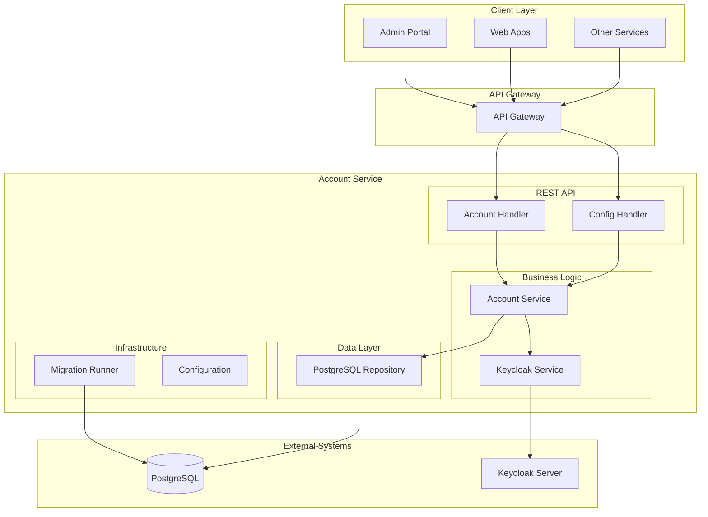
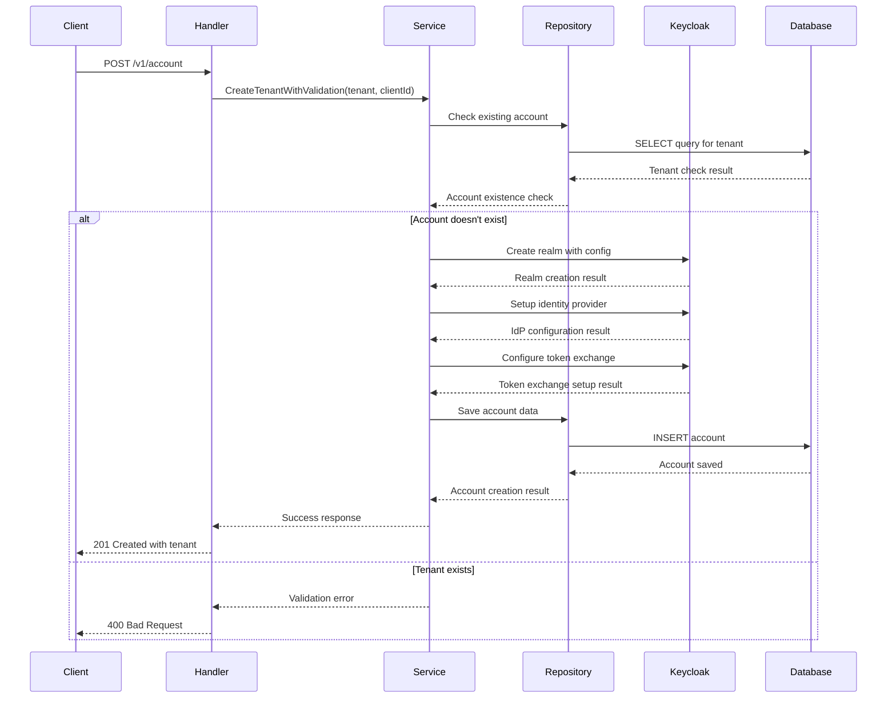

# Account Service (Go)

A Go-based implementation of the DIGIT Account service using the Gin framework. This service provides tenant provisioning, Keycloak realm management, and cross-realm token exchange configuration for multi-tenant DIGIT applications.

## Overview

**Service Name:** account

**Purpose:** Provides multi-tenant account management with automated Keycloak realm provisioning, identity provider configuration, and cross-realm token exchange setup for DIGIT applications.

**Owner/Team:** DIGIT Platform Team

## Architecture

**Tech Stack:**
- Go 1.24
- Gin Web Framework
- PostgreSQL (via GORM)
- Keycloak Admin API
- Docker

**Core Responsibilities:**
- Tenant account creation and management
- Automated Keycloak realm provisioning
- Identity provider configuration for cross-realm authentication
- Token exchange policy management
- Account configuration management
- Multi-tenant isolation and security

**Dependencies:**
- PostgreSQL 15
- Keycloak 22+ for identity management

### Diagrams

#### High-level Architecture Diagram



## Features

- ✅ Tenant account creation and management
- ✅ Automated Keycloak realm provisioning
- ✅ Cross-realm identity provider configuration
- ✅ Token exchange policy setup
- ✅ Account configuration management
- ✅ Multi-tenant data isolation
- ✅ REST API with JSON responses
- ✅ Database migrations with rollback support
- ✅ Docker containerization
- ✅ OpenTelemetry tracing integration
- ✅ Comprehensive error handling

## Installation & Setup

### Local Development (Manual Setup)

**Prerequisites:**
- Go 1.24+
- PostgreSQL 15
- Keycloak 22+

**Steps:**

1. Clone and setup
   ```bash
   git clone https://github.com/yourusername/account.git
   cd account
   go mod download
   ```

2. Setup PostgreSQL database
   ```bash
   createdb account
   ```

3. Setup Keycloak
   ```bash
   # Start Keycloak server
   docker run -p 8080:8080 -e KEYCLOAK_ADMIN=admin -e KEYCLOAK_ADMIN_PASSWORD=admin quay.io/keycloak/keycloak:22.0 start-dev
   ```

4. Run migrations
   ```bash
   go run ./cmd/server --migrate
   ```

5. Start service
   ```bash
   go run ./cmd/server
   ```

### Docker Production Setup

**Build the image:**
```bash
docker build -t account:latest .
```

**Run with environment variables:**
```bash
docker run -p 8080:8080 \
  -e DB_HOST=your-db-host \
  -e DB_PASSWORD=your-db-password \
  -e KEYCLOAK_BASE_URL=your-keycloak-url \
  account:latest
```

## Configuration

### Environment Variables

| Variable | Description | Default Value | Required |
|----------|-------------|---------------|----------|
| `SERVER_PORT` | Port for REST API server | `8080` | No |
| `DB_HOST` | PostgreSQL database host | `localhost` | Yes |
| `DB_PORT` | PostgreSQL database port | `5432` | No |
| `DB_USER` | PostgreSQL database username | `postgres` | No |
| `DB_PASSWORD` | PostgreSQL database password | `1234` | Yes |
| `DB_NAME` | PostgreSQL database name | `keycloak` | No |
| `DB_SSL_MODE` | PostgreSQL SSL mode | `disable` | No |
| `KEYCLOAK_BASE_URL` | Keycloak server base URL | `https://digit-lts.digit.org/keycloak-test` | Yes |
| `KEYCLOAK_ADMIN_USER` | Keycloak admin username | `username` | Yes |
| `KEYCLOAK_ADMIN_PASS` | Keycloak admin password | `pasword` | Yes |
| `KEYCLOAK_REALM_CONFIG_PATH` | Path to realm configuration file | `(auto-detected)` | No |

### Example .env file

```bash
# Server Configuration
SERVER_PORT=8080

# Database Configuration
DB_HOST=localhost
DB_PORT=5432
DB_USER=postgres
DB_PASSWORD=secure_password
DB_NAME=account
DB_SSL_MODE=disable

# Keycloak Configuration
KEYCLOAK_BASE_URL=http://localhost:8080
KEYCLOAK_ADMIN_USER=admin
KEYCLOAK_ADMIN_PASS=admin_password
KEYCLOAK_REALM_CONFIG_PATH=./internal/keycloak/realm_config.json
```

## API Reference

### REST API Endpoints

#### 1. Create Account
- **Endpoint**: `POST /v1/account`
- **Description**: Creates a new tenant account with Keycloak realm
- **Headers**: `X-Client-Id: {clientId}`
- **Request Body**:
```json
{
  "tenant": {
    "code": "example-tenant",
    "name": "Example Organization",
    "email": "admin@example.com",
    "additionalAttributes": {},
    "isActive": true
  }
}
```
- **Response**: `201 Created` with tenant details

**Sequence Diagram:**



#### 2. Search Accounts
- **Endpoint**: `GET /v1/account`
- **Description**: Searches for tenant accounts
- **Query Parameters**:
  - `code` (optional)
  - `name` (optional)
- **Response**: `200 OK` with matching tenants

#### 3. Update Account
- **Endpoint**: `PUT /v1/account/:id`
- **Description**: Updates existing tenant account
- **Headers**: `X-Client-Id: {clientId}`
- **Request Body**:
```json
{
  "tenant": {
    "name": "Updated Organization Name",
    "email": "newemail@example.com",
    "additionalAttributes": {},
    "isActive": true
  }
}
```
- **Response**: `200 OK` with updated tenant

#### 4. Create Account Configuration
- **Endpoint**: `POST /v1/account/config`
- **Description**: Creates configuration for tenant account
- **Headers**: `X-Client-Id: {clientId}`
- **Request Body**:
```json
{
  "tenantConfig": {
    "code": "example-tenant",
    "name": "Example Configuration",
    "defaultLoginType": "MOBILE_NUMBER",
    "otpLength": "6",
    "enableUserBasedLogin": true,
    "languages": ["en_IN", "hi_IN"],
    "documents": [],
    "additionalAttributes": {},
    "isActive": true
  }
}
```
- **Response**: `201 Created` with tenant configuration

#### 5. Search Account Configurations
- **Endpoint**: `GET /v1/account/config`
- **Description**: Searches for account configurations
- **Query Parameters**:
  - `code` (optional)
  - `name` (optional)
- **Response**: `200 OK` with matching tenant configurations

#### 6. Update Account Configuration
- **Endpoint**: `PUT /v1/account/config/:id`
- **Description**: Updates existing account configuration
- **Headers**: `X-Client-Id: {clientId}`
- **Request Body**:
```json
{
  "tenantConfig": {
    "name": "Updated Configuration",
    "defaultLoginType": "EMAIL",
    "otpLength": "4",
    "enableUserBasedLogin": false,
    "languages": ["en_IN"],
    "documents": [],
    "additionalAttributes": {},
    "isActive": true
  }
}
```
- **Response**: `200 OK` with updated tenant configuration

### Error Codes

| HTTP Status | Error Code | Description |
|-------------|------------|-----------|
| 400 | BAD_REQUEST | Invalid request parameters |
| 401 | UNAUTHORIZED | Authentication required |
| 403 | FORBIDDEN | Insufficient permissions |
| 404 | NOT_FOUND | Resource not found |
| 409 | CONFLICT | Resource already exists |

#### 7. Delete Account
- **Endpoint**: `DELETE /v1/account`
- **Description**: Deletes complete account including Keycloak realm, tenant, and configurations
- **Query Parameters**:
  - `tenantCode` (required) - The tenant code to delete
- **Response**: `204 No Content` with success message
| 422 | UNPROCESSABLE_ENTITY | Validation failed |
| 500 | INTERNAL_SERVER_ERROR | Server error |
| 502 | BAD_GATEWAY | Keycloak service unavailable |

## Observability

### Logging

**Format:** JSON structured logging with request correlation IDs

**Framework:** Standard Go log with context support

**Log Levels:** DEBUG, INFO, WARN, ERROR

**Example Log:**
```json
{
  "level": "INFO",
  "timestamp": "2024-01-15T10:30:45Z",
  "request_id": "req-123456",
  "tenant_id": "example-tenant",
  "method": "POST",
  "path": "/v1/account",
  "duration_ms": 245,
  "status_code": 201
}
```

### Metrics

**Framework:** Prometheus metrics exposed on `/metrics` endpoint

**Key Metrics:**
- `http_requests_total{path, method, status}` - Total HTTP requests
- `http_request_duration_seconds{path, method}` - Request duration histogram
- `db_connections_active` - Active database connections
- `keycloak_requests_total{operation, status}` - Keycloak API requests
- `accounts_created_total` - Total accounts created
- `realms_provisioned_total` - Total Keycloak realms provisioned

### Tracing

**Framework:** OpenTelemetry with Jaeger integration

**Configuration:**
```bash
export OTEL_TRACES_EXPORTER=jaeger
export OTEL_EXPORTER_JAEGER_ENDPOINT=http://localhost:14268/api/traces
export OTEL_SERVICE_NAME=tenant-management-service
```

**Trace Context:** Automatic trace propagation with W3C trace context headers

## Operations

### Health Checks

#### REST Health Check
- **Endpoint**: `GET /health`
- **Response**: `200 OK` with service status

#### Ready Check
- **Endpoint**: `GET /ready`
- **Response**: `200 OK` when service is ready to accept traffic

### Scaling Guidelines

**Resource Requirements:**
- **CPU:** 0.5-1 core per 100 RPS
- **Memory:** 1GB base + 100MB per 1000 tenants
- **Storage:** 10MB per tenant account

**Recommended Replicas:** 2-3 for production

**Horizontal Scaling:** Stateless design supports horizontal scaling

### Database Operations

#### Running Migrations
```bash
# Automatic (on startup)
go run ./cmd/server

# Manual migration
go run ./cmd/server --migrate
```

#### Backup Strategy
```bash
# PostgreSQL backup
pg_dump account > backup.sql

# Restore
psql account < backup.sql
```

#### Connection Pool Settings
- Max Open Connections: 25
- Max Idle Connections: 10
- Connection Max Lifetime: 5 minutes

### Keycloak Operations

#### Realm Configuration File

The service uses a `realm_config.json` template file for creating Keycloak realms. This file is automatically located using the following search order:

1. Path specified in `KEYCLOAK_REALM_CONFIG_PATH` environment variable
2. `internal/keycloak/realm_config.json` (relative to current working directory)
3. `internal/keycloak/realm_config.json` (relative to executable location)
4. `realm_config.json` (in executable directory)
5. `realm_config.json` (current working directory)
6. `internal/keycloak/realm_config.json` (one level up from executable)

#### Keycloak Health Check
```bash
# Check Keycloak connectivity
curl http://localhost:8080/health/ready
```

## Testing

### Running Tests

**All Tests:**
```bash
go test ./...
```

**Unit Tests Only:**
```bash
go test ./internal/...
```

**Integration Tests Only:**
```bash
go test ./tests/...
```

**With Coverage:**
```bash
go test -coverprofile=coverage.out ./...
go tool cover -html=coverage.out
```

**With Verbose Output:**
```bash
go test -v ./...
```

### Test Structure

#### Unit Tests
Located in the same package with `_test.go` suffix:
- `internal/services/accountservice_test.go` - Business logic tests
- `internal/repositories/accountrepository_test.go` - Database layer tests
- `internal/keycloak/client_test.go` - Keycloak integration tests
- `internal/handlers/accounthandler_test.go` - HTTP handler tests

#### Integration Tests
End-to-end tests in `tests/` directory:
- `tests/integration_test.go` - Complete API flow tests

### Test Dependencies

- **Testify:** `github.com/stretchr/testify` - Assertions and mocks
- **SQLMock:** `github.com/DATA-DOG/go-sqlmock` - Database mocking
- **HTTPMock:** `github.com/jarcoal/httpmock` - HTTP client mocking
- **SQLite:** `github.com/mattn/go-sqlite3` - In-memory database for integration tests

### Project Structure

```
account/
├── cmd/server/                   # Application entrypoint
├── configs/                      # Configuration management
├── internal/                     # Private application code
│   ├── handlers/                # HTTP handlers
│   ├── services/                # Business logic
│   ├── repositories/            # Data access layer
│   ├── keycloak/               # Keycloak integration
│   ├── models/                 # Domain models
│   └── middleware/             # HTTP middleware
├── migrations/                  # SQL migration files
├── pkg/                        # Public packages
├── scripts/                    # Build/utility scripts
└── tests/                      # Integration tests
```

## Release & Deployment

### Branching Strategy

**Git Flow:**
- `master` - Production releases
- `develop` - Development integration

### CI/CD Pipeline

TBD

### Versioning

TBD

### Deployment

**Docker Compose (Development):**
```yaml
version: '3.8'
services:
  account:
    build: .
    ports:
      - "8080:8080"
    environment:
      - DB_HOST=postgres
      - KEYCLOAK_BASE_URL=http://keycloak:8080
    depends_on:
      - postgres
      - keycloak
  
  postgres:
    image: postgres:15
    environment:
      - POSTGRES_DB=account
      - POSTGRES_PASSWORD=password
  
  keycloak:
    image: quay.io/keycloak/keycloak:22.0
    environment:
      - KEYCLOAK_ADMIN=admin
      - KEYCLOAK_ADMIN_PASSWORD=admin
    command: start-dev
```

**Kubernetes (Production):**
```yaml
# k8s/deployment.yaml
apiVersion: apps/v1
kind: Deployment
metadata:
  name: account
spec:
  replicas: 3
  selector:
    matchLabels:
      app: account
  template:
    metadata:
      labels:
        app: account
    spec:
      containers:
      - name: account
        image: account:latest
        ports:
        - containerPort: 8080
        env:
        - name: DB_HOST
          valueFrom:
            secretKeyRef:
              name: db-secret
              key: host
        livenessProbe:
          httpGet:
            path: /health
            port: 8080
          initialDelaySeconds: 30
          periodSeconds: 10
```

## Troubleshooting

### Common Issues

#### Database Connection Issues

**Error:** `could not connect to the database`

**Solutions:**
1. Verify PostgreSQL is running
2. Check connection string
3. Verify database exists
4. Check firewall settings

**Debug:**
```bash
# Test database connection
psql -h localhost -U postgres -d account
```

#### Keycloak Connection Issues

**Error:** `keycloak: connection refused`

**Solutions:**
1. Verify Keycloak is running
2. Check Keycloak base URL
3. Verify admin credentials
4. Check network connectivity

**Debug:**
```bash
# Test Keycloak connection
curl http://localhost:8080/health/ready
```

#### Realm Config File Not Found

**Error:** `realm configuration file not found`

**Solutions:**
1. Check the debug logs for file path attempts
2. Set the `KEYCLOAK_REALM_CONFIG_PATH` environment variable to the absolute path
3. Ensure the file is copied to the Docker image (check Dockerfile)
4. Verify the file permissions in the container

### Debug Mode

**Enable Debug Logging:**
```bash
export LOG_LEVEL=debug
go run ./cmd/server
```

**Enable SQL Query Logging:**
```bash
# In configuration
DB_DEBUG=true
```

### Monitoring Queries

**Database Performance:**
```sql
-- Slow queries
SELECT * FROM pg_stat_statements 
ORDER BY total_time DESC 
LIMIT 10;

-- Connection count
SELECT count(*) FROM pg_stat_activity;
```

**Keycloak Performance:**
```bash
# Check Keycloak metrics
curl http://localhost:8080/metrics
```

### Log Analysis

**Common Log Patterns:**
```bash
# Search for errors
grep "ERROR" application.log

# Find slow requests
grep "duration_ms" application.log | sort -k3 -n

# Analyze by endpoint
grep "/v1/account" application.log | head -20
```

## FAQ

### Technical Questions

**Q: Can I use different identity providers?**
A: Yes, modify the Keycloak client to support additional identity providers beyond the default CITIZEN realm configuration.

**Q: How do I add custom realm configurations?**
A: Update the `realm_config.json` template file with your custom settings before deployment.

**Q: What's the maximum number of tenants supported?**
A: The service is designed to handle thousands of tenants with proper database indexing and connection pooling.

### Operational Questions

**Q: How do I backup tenant data?**
A: Use PostgreSQL pg_dump for database backup and export Keycloak realm configurations via admin API.

**Q: Can I run multiple instances?**
A: Yes, the service is stateless and supports horizontal scaling with proper database connection management.

**Q: How do I monitor the service?**
A: Use the /health endpoint, Prometheus metrics, OpenTelemetry traces, and application logs.

## References

TBD

### Support Channels

TBD

---

**Last Updated:** September 2025
**Version:** 1.0.0
**Maintainer:** DIGIT Platform Team 