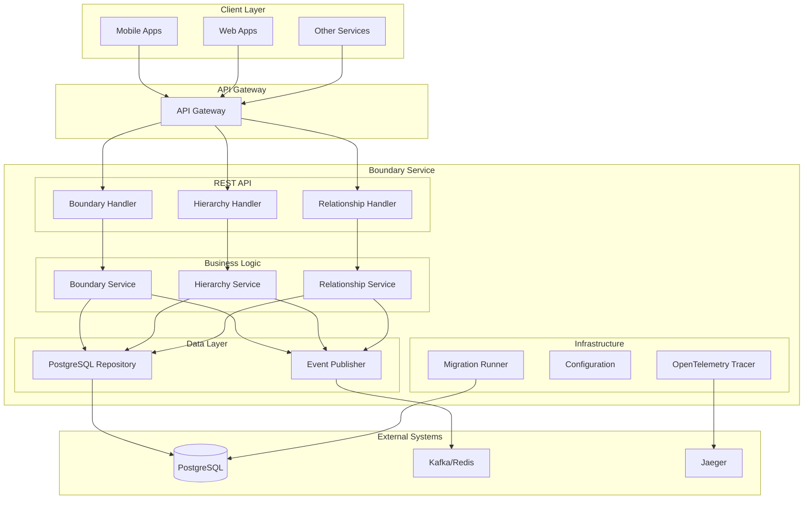
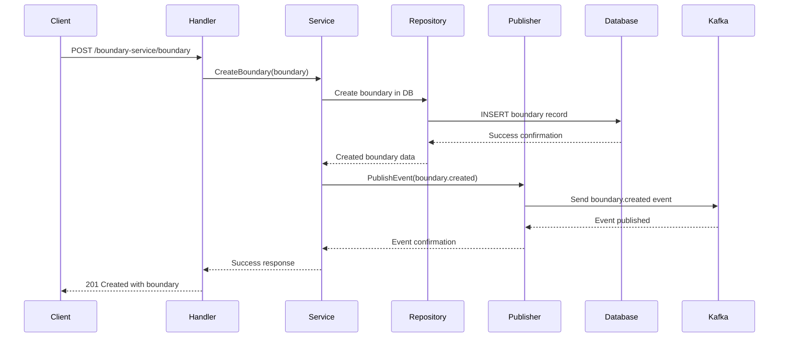
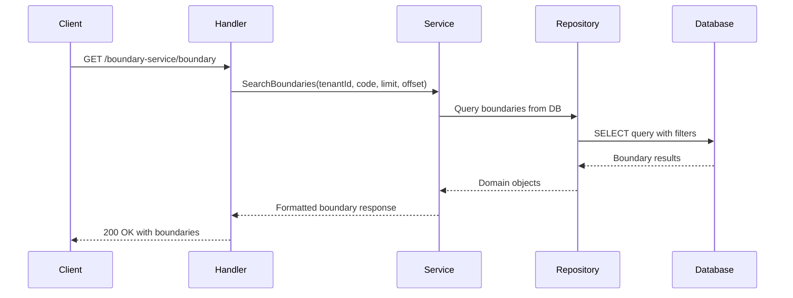
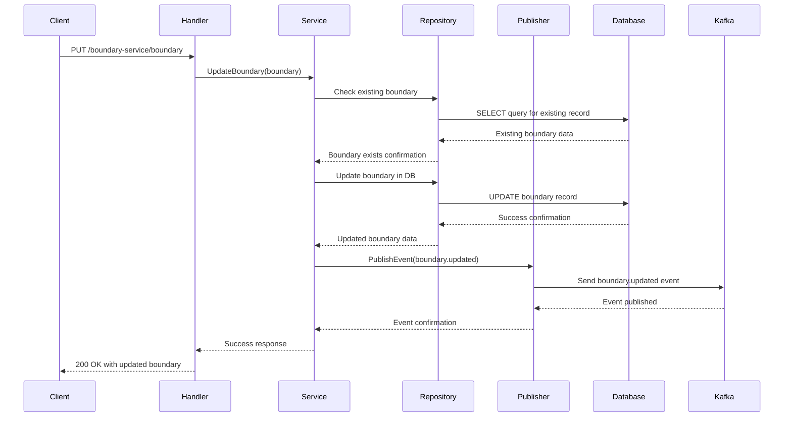

# Boundary Service (Go)

A Go-based implementation of the DIGIT boundary management service using the Gin framework. This service provides geographical boundary management with hierarchical relationships and event publishing capabilities.

## Overview

**Service Name:** boundary-go

**Purpose:** Provides multi-tenant geographical boundary management services for DIGIT applications with hierarchical relationships, event publishing, and efficient database persistence.

**Owner/Team:** DIGIT Platform Team

## Architecture

**Tech Stack:**
- Go 1.23
- Gin Web Framework
- PostgreSQL (via GORM)
- Redis (via go-redis/v9)
- Kafka/Redis Event Publishing
- OpenTelemetry Tracing
- Docker

**Core Responsibilities:**
- Store and manage geographical boundaries with JSONB geometry data
- Multi-tenant support for different organizations
- Hierarchical boundary relationships management
- Boundary relationship mapping between entities
- Event publishing for boundary operations (create, update)
- PostgreSQL persistence with optimized queries
- REST API interfaces
- OpenTelemetry distributed tracing

**Dependencies:**
- PostgreSQL 15
- Redis 6+ for caching (optional)
- Kafka or Redis for event publishing

### Diagrams

#### High-level Architecture Diagram



## Features

- ✅ Store and manage geographical boundaries with JSONB geometry data
- ✅ Multi-tenant support with tenant isolation
- ✅ Hierarchical boundary relationships (parent-child)
- ✅ Boundary relationship mapping between entities
- ✅ Event publishing for boundary operations (Kafka/Redis)
- ✅ PostgreSQL database for persistent storage
- ✅ Clean architecture with separation of concerns
- ✅ REST API with JSON responses
- ✅ Database migrations with rollback support
- ✅ OpenTelemetry distributed tracing
- ✅ Docker containerization
- ✅ Comprehensive test coverage

## Installation & Setup

### Local Development (Manual Setup)

**Prerequisites:**
- Go 1.24+
- PostgreSQL 15
- Redis 6+ (optional)
- Kafka 2.x+ (for event publishing)

**Steps:**

1. Clone and setup
   ```bash
   git clone https://github.com/yourusername/boundary-go.git
   cd boundary-go
   go mod download
   ```

2. Setup PostgreSQL database
   ```bash
   createdb bound
   ```

3. Setup Redis (optional)
   ```bash
   redis-server
   ```

4. Run migrations
   ```bash
   go run ./cmd/server --migrate
   ```

5. Start service
   ```bash
   go run ./cmd/server
   ```

### Docker Production Setup

**Build the image:**
```bash
docker build -t boundary-go:latest .
```

**Run with environment variables:**
```bash
docker run -p 8080:8080 \
  -e DB_HOST=your-db-host \
  -e DB_PASSWORD=your-db-password \
  -e PUBLISHER_TYPE=kafka \
  -e PUBLISHER_KAFKA_BROKERS=localhost:9092 \
  boundary-go:latest
```

## Configuration

### Environment Variables

| Variable | Description | Default Value | Required |
|----------|-------------|---------------|----------|
| `SERVER_PORT` | Port for REST API server | `8080` | No |
| `DB_HOST` | PostgreSQL database host | `localhost` | Yes |
| `DB_PORT` | PostgreSQL database port | `5432` | No |
| `DB_USER` | PostgreSQL database username | `postgres` | No |
| `DB_PASSWORD` | PostgreSQL database password | `postgres` | Yes |
| `DB_NAME` | PostgreSQL database name | `bound` | No |
| `DB_SSL_MODE` | PostgreSQL SSL mode | `disable` | No |
| `KAFKA_BOOTSTRAP_SERVERS` | Kafka broker addresses | `localhost:9092` | No |
| `CACHE_TYPE` | Cache type (redis) | `redis` | No |
| `CACHE_REDIS_ADDR` | Redis server address | `localhost:6379` | No |
| `CACHE_REDIS_PASSWORD` | Redis password | `(empty)` | No |
| `CACHE_REDIS_DB` | Redis database index | `0` | No |
| `OTEL_EXPORTER_OTLP_ENDPOINT` | OTLP endpoint for tracing | `jaeger-collector.tracing:4318` | No |
| `OTEL_SERVICE_NAME` | Service name for tracing | `boundary-service` | No |
| `OTEL_ENABLED` | Enable OpenTelemetry tracing | `true` | No |

### Example .env file

```bash
# Server Configuration
SERVER_PORT=8080

# Database Configuration
DB_HOST=localhost
DB_PORT=5432
DB_USER=postgres
DB_PASSWORD=secure_password
DB_NAME=bound
DB_SSL_MODE=disable

# Kafka Configuration
KAFKA_BOOTSTRAP_SERVERS=localhost:9092

# Cache Configuration
CACHE_TYPE=redis
CACHE_REDIS_ADDR=localhost:6379
CACHE_REDIS_PASSWORD=
CACHE_REDIS_DB=0

# OpenTelemetry Configuration
OTEL_EXPORTER_OTLP_ENDPOINT=jaeger-collector.tracing:4318
OTEL_SERVICE_NAME=boundary-service
OTEL_ENABLED=true
```

## API Reference

### REST API Endpoints

#### 1. Create Boundary
- **Endpoint**: `POST /boundary`
- **Description**: Creates a new geographical boundary
- **Headers**: `X-Tenant-ID: {tenantId}`, `X-Client-Id: {clientId}`
- **Request Body**:
```json
{
  "boundary": [
    {
      "code": "WARD_001",
      "geometry": {
        "type": "Polygon",
        "coordinates": [[[77.5, 12.9], [77.6, 12.9], [77.6, 13.0], [77.5, 13.0], [77.5, 12.9]]]
      },
      "additionalDetails": {
        "name": "Ward 1",
        "description": "Administrative Ward 1"
      }
    }
  ]
}
```
- **Response**: `201 Created` with created boundary

**Sequence Diagram:**



#### 2. Search Boundaries
- **Endpoint**: `GET /boundary`
- **Description**: Searches for boundaries
- **Headers**: `X-Tenant-ID: {tenantId}`
- **Query Parameters**:
  - `codes` (required, array)
  - `limit` (optional)
  - `offset` (optional)
- **Response**: `200 OK` with matching boundaries

**Sequence Diagram:**



#### 3. Update Boundary
- **Endpoint**: `PUT /boundary`
- **Description**: Updates existing boundaries
- **Headers**: `X-Tenant-ID: {tenantId}`, `X-Client-Id: {clientId}`
- **Request Body**: Same as create boundary (but with `id` field required)
- **Response**: `200 OK` with updated boundary

**Sequence Diagram:**



#### 4. Create Boundary Hierarchy
- **Endpoint**: `POST /boundary-hierarchy-definition`
- **Description**: Creates hierarchical boundary type definitions
- **Headers**: `X-Tenant-ID: {tenantId}`, `X-Client-Id: {clientId}`
- **Request Body**:
```json
{
  "boundaryHierarchy": {
    "hierarchyType": "ADMIN",
    "boundaryHierarchy": [
      {
        "boundaryType": "STATE",
        "parentBoundaryType": null,
        "active": true
      },
      {
        "boundaryType": "DISTRICT",
        "parentBoundaryType": "STATE",
        "active": true
      },
      {
        "boundaryType": "WARD",
        "parentBoundaryType": "DISTRICT",
        "active": true
      }
    ]
  }
}
```
- **Response**: `201 Created` with created hierarchy

#### 5. Create Boundary Relationship
- **Endpoint**: `POST /boundary-relationships`
- **Description**: Creates hierarchical relationships between boundary instances
- **Headers**: `X-Tenant-ID: {tenantId}`, `X-Client-Id: {clientId}`
- **Request Body**:
```json
{
  "boundaryRelationship": {
    "code": "WARD_001",
    "hierarchyType": "ADMIN",
    "boundaryType": "WARD",
    "parent": "DISTRICT_001"
  }
}
```
- **Response**: `201 Created` with created relationship

### Error Codes

| HTTP Status | Error Code | Description |
|-------------|------------|-----------|
| 400 | BAD_REQUEST | Invalid request parameters |
| 401 | UNAUTHORIZED | Authentication required |
| 403 | FORBIDDEN | Insufficient permissions |
| 404 | NOT_FOUND | Resource not found |
| 409 | CONFLICT | Resource already exists |
| 422 | UNPROCESSABLE_ENTITY | Validation failed |
| 500 | INTERNAL_SERVER_ERROR | Server error |

## Observability

### Logging

**Format:** JSON structured logging with request correlation IDs

**Framework:** Standard Go log with context support

**Log Levels:** DEBUG, INFO, WARN, ERROR

**Example Log:**
```json
{
  "level": "INFO",
  "timestamp": "2024-01-15T10:30:45Z",
  "request_id": "req-123456",
  "tenant_id": "DEFAULT",
  "method": "POST",
  "path": "/boundary-service/boundary",
  "duration_ms": 45,
  "status_code": 201
}
```

### Metrics

**Framework:** Prometheus metrics exposed on `/metrics` endpoint

**Key Metrics:**
- `http_requests_total{path, method, status}` - Total HTTP requests
- `http_request_duration_seconds{path, method}` - Request duration histogram
- `db_connections_active` - Active database connections
- `boundaries_created_total` - Total boundaries created
- `boundaries_updated_total` - Total boundaries updated
- `events_published_total{type}` - Total events published

### Tracing

**Framework:** OpenTelemetry with Jaeger integration

**Configuration:**
```bash
export OTEL_TRACES_EXPORTER=jaeger
export OTEL_EXPORTER_JAEGER_ENDPOINT=http://localhost:14268/api/traces
export OTEL_SERVICE_NAME=boundary-service
```

**Trace Context:** Automatic trace propagation with W3C trace context headers

## Operations

### Health Checks

#### REST Health Check
- **Endpoint**: `GET /health`
- **Response**: `200 OK` with service status

#### Ready Check
- **Endpoint**: `GET /ready`
- **Response**: `200 OK` when service is ready to accept traffic

### Scaling Guidelines

**Resource Requirements:**
- **CPU:** 0.5-1 core per 1000 RPS
- **Memory:** 512MB base + 100MB per tenant
- **Storage:** 2GB per 100k boundaries

**Recommended Replicas:** 2-3 for production

**Horizontal Scaling:** Stateless design supports horizontal scaling

### Database Operations

#### Running Migrations
```bash
# Automatic (on startup)
go run ./cmd/server

# Manual migration
go run ./internal/migration --path ./migrations
```

#### Backup Strategy
```bash
# PostgreSQL backup
pg_dump bound > backup.sql

# Restore
psql bound < backup.sql
```

#### Connection Pool Settings
- Max Open Connections: 25
- Max Idle Connections: 10
- Connection Max Lifetime: 5 minutes

### Event Publishing Operations

#### Event Types Published
- `boundary.created` - When a new boundary is created
- `boundary.updated` - When a boundary is updated
- `boundary-hierarchy.created` - When hierarchy is created
- `boundary-hierarchy.updated` - When hierarchy is updated
- `boundary-relationship.created` - When relationship is created
- `boundary-relationship.updated` - When relationship is updated

#### Monitoring Events
```bash
# Kafka consumer example
kafka-console-consumer --bootstrap-server localhost:9092 --topic boundary-events

# Redis stream example
redis-cli XREAD STREAMS boundary-stream $
```

## Testing

### Running Tests

**All Tests:**
```bash
go test ./...
```

**Unit Tests Only:**
```bash
go test ./internal/...
```

**Integration Tests Only:**
```bash
go test ./tests/...
```

**With Coverage:**
```bash
go test -coverprofile=coverage.out ./...
go tool cover -html=coverage.out
```

**With Verbose Output:**
```bash
go test -v ./...
```

### Test Structure

#### Unit Tests
Located in the same package with `_test.go` suffix:
- `internal/core/services/boundaryservice_test.go` - Business logic tests
- `internal/repositories/postgres/boundaryrepository_test.go` - Database layer tests
- `internal/handlers/boundaryhandler_test.go` - HTTP handler tests

#### Integration Tests
End-to-end tests in `tests/` directory:
- `tests/integration_test.go` - Complete API flow tests

### Test Dependencies

- **Testify:** `github.com/stretchr/testify` - Assertions and mocks
- **SQLMock:** `github.com/DATA-DOG/go-sqlmock` - Database mocking
- **SQLite:** `github.com/mattn/go-sqlite3` - In-memory database for integration tests

### Mock Setup

```go
// Database mock example
db, mock, err := sqlmock.New()
defer db.Close()

mock.ExpectQuery("SELECT (.+) FROM boundary").
    WithArgs(tenantID, code).
    WillReturnRows(rows)

// Service test
service := services.NewBoundaryService(repo, publisher)
boundaries, err := service.SearchBoundaries(ctx, tenantID, code)
```

### Project Structure

```
boundary-go/
├── cmd/server/                   # Application entrypoint
├── configs/                      # Configuration management
├── internal/                     # Private application code
│   ├── common/                  # Shared utilities
│   ├── core/                    # Business logic
│   │   ├── domain/             # Domain models
│   │   ├── ports/              # Interfaces
│   │   └── services/           # Business logic
│   ├── handlers/               # HTTP handlers
│   ├── migration/              # Database migrations
│   ├── platform/               # Platform-specific code
│   ├── pubsub/                 # Event publishing
│   └── repositories/           # Data access layer
├── migrations/                  # SQL migration files
├── pkg/dtos/                    # Data transfer objects
├── scripts/                     # Build/utility scripts
└── tests/                       # Integration tests
```

## Release & Deployment

### Branching Strategy

**Git Flow:**
- `master` - Production releases
- `develop` - Development integration

### CI/CD Pipeline

TBD

### Versioning

TBD

### Deployment

**Docker Compose (Development):**
```yaml
version: '3.8'
services:
  boundary-go:
    build: .
    ports:
      - "8080:8080"
    environment:
      - DB_HOST=postgres
      - KAFKA_BOOTSTRAP_SERVERS=kafka:9092
      - CACHE_TYPE=redis
      - CACHE_REDIS_ADDR=redis:6379
    depends_on:
      - postgres
      - kafka
  
  postgres:
    image: postgres:15
    environment:
      - POSTGRES_DB=boundary
      - POSTGRES_PASSWORD=password
  
  kafka:
    image: confluentinc/cp-kafka:latest
    environment:
      - KAFKA_ZOOKEEPER_CONNECT=zookeeper:2181
      - KAFKA_ADVERTISED_LISTENERS=PLAINTEXT://kafka:9092
```

**Kubernetes (Production):**
```yaml
# k8s/deployment.yaml
apiVersion: apps/v1
kind: Deployment
metadata:
  name: boundary-go
spec:
  replicas: 3
  selector:
    matchLabels:
      app: boundary-go
  template:
    metadata:
      labels:
        app: boundary-go
    spec:
      containers:
      - name: boundary-go
        image: boundary-go:latest
        ports:
        - containerPort: 8080
        env:
        - name: DB_HOST
          valueFrom:
            secretKeyRef:
              name: db-secret
              key: host
        livenessProbe:
          httpGet:
            path: /health
            port: 8080
          initialDelaySeconds: 30
          periodSeconds: 10
```

## Troubleshooting

### Common Issues

#### Database Connection Issues

**Error:** `could not connect to the database`

**Solutions:**
1. Verify PostgreSQL is running
2. Check connection string
3. Verify database exists
4. Check firewall settings

**Debug:**
```bash
# Test database connection
psql -h localhost -U postgres -d bound
```

#### Event Publishing Issues

**Error:** `failed to publish event`

**Solutions:**
1. Verify Kafka/Redis is running
2. Check publisher configuration
3. Verify network connectivity
4. Check authentication credentials

**Debug:**
```bash
# Test Kafka connection
kafka-topics --bootstrap-server localhost:9092 --list

# Test Redis connection
redis-cli ping
```

#### High Memory Usage

**Symptoms:** Service consuming excessive memory

**Causes:**
- Large geometry data loaded in memory
- Memory leaks in application code
- Too many database connections

**Solutions:**
1. Review geometry data size
2. Monitor memory usage
3. Check for goroutine leaks
4. Optimize database queries

### Debug Mode

**Enable Debug Logging:**
```bash
export LOG_LEVEL=debug
go run ./cmd/server
```

**Enable SQL Query Logging:**
```bash
# In configuration
DB_DEBUG=true
```

### Monitoring Queries

**Database Performance:**
```sql
-- Slow queries
SELECT * FROM pg_stat_statements 
ORDER BY total_time DESC 
LIMIT 10;

-- Connection count
SELECT count(*) FROM pg_stat_activity;
```

**Event Publishing Performance:**
```bash
# Kafka lag monitoring
kafka-consumer-groups --bootstrap-server localhost:9092 --describe --group boundary-consumer

# Redis stream info
redis-cli XINFO STREAM boundary-stream
```

### Log Analysis

**Common Log Patterns:**
```bash
# Search for errors
grep "ERROR" application.log

# Find slow requests
grep "duration_ms" application.log | sort -k3 -n

# Analyze by endpoint
grep "/boundary-service/boundary" application.log | head -20
```

## FAQ

### Technical Questions

**Q: Can I use different event publishers?**
A: Yes, implement the Publisher interface for custom event providers. Kafka and Redis are provided by default.

**Q: How do I add custom geometry validation?**
A: Extend the boundary validation logic in the service layer with custom geometry validators.

**Q: What's the maximum geometry size?**
A: PostgreSQL JSONB can handle large geometries, but consider performance impact for complex polygons.

### Operational Questions

**Q: How do I backup the data?**
A: Use PostgreSQL pg_dump for database backup and ensure event replay capability for published events.

**Q: Can I run multiple instances?**
A: Yes, the service is stateless and supports horizontal scaling with proper database connection pooling.

**Q: How do I monitor the service?**
A: Use the /health endpoint, Prometheus metrics, OpenTelemetry traces, and application logs.

## References

TBD

### Support Channels

TBD

---

**Last Updated:** September 2025
**Version:** 1.0.0
**Maintainer:** DIGIT Platform Team 