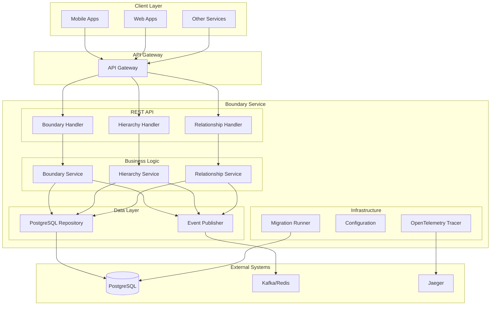
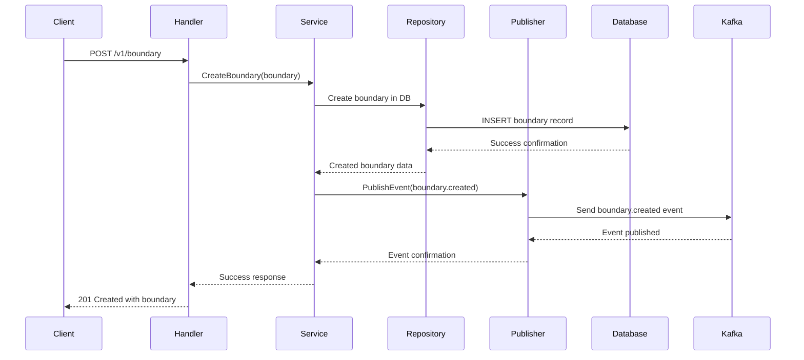
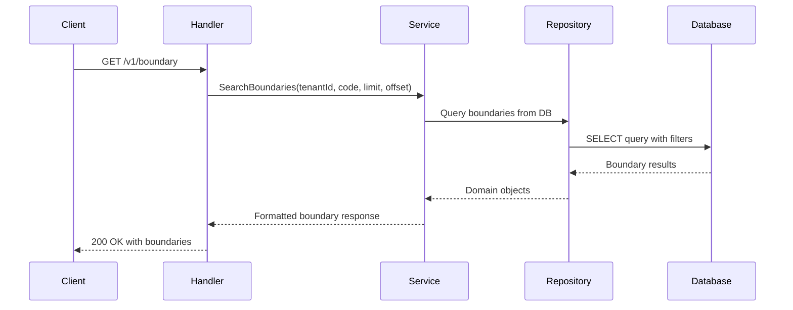
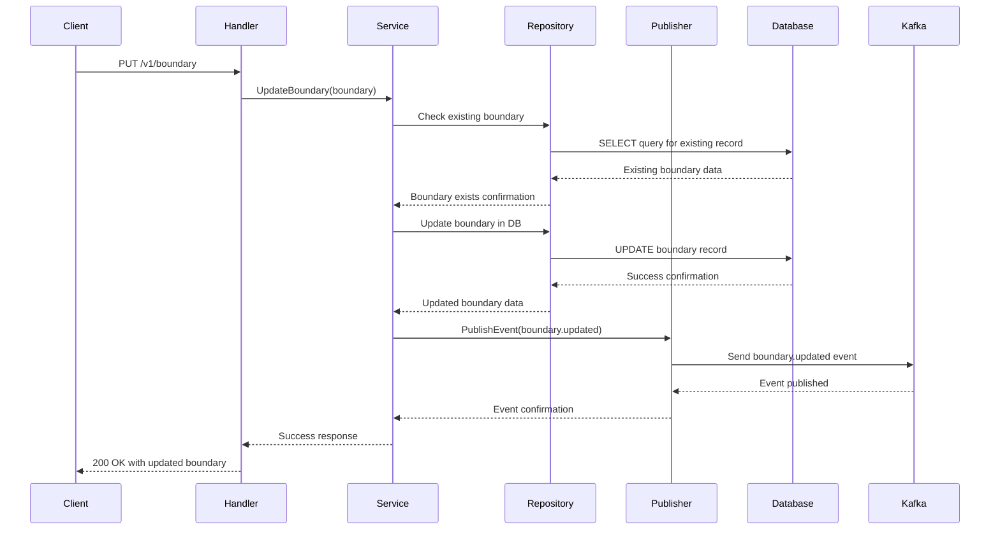

# Boundary Service (Go)

A Go-based implementation of the DIGIT boundary management service using the Gin framework. This service provides geographical boundary management with hierarchical relationships and event publishing capabilities.

## Overview

**Service Name:** boundary

**Purpose:** Provides multi-tenant geographical boundary management services for DIGIT applications with hierarchical relationships, event publishing, and efficient database persistence.

**Owner/Team:** DIGIT Platform Team

## Architecture

**Tech Stack:**
- Go 1.23
- Gin Web Framework
- PostgreSQL (via GORM)
- Redis (via go-redis/v9)
- Kafka/Redis Event Publishing
- OpenTelemetry Tracing
- Docker

**Core Responsibilities:**
- Store and manage geographical boundaries with JSONB geometry data
- Multi-tenant support for different organizations
- Hierarchical boundary relationships management
- Boundary relationship mapping between entities
- Event publishing for boundary operations (create, update)
- PostgreSQL persistence with optimized queries
- REST API interfaces
- OpenTelemetry distributed tracing

**Dependencies:**
- PostgreSQL 15
- Redis 6+ for caching (optional)
- Kafka or Redis for event publishing

### Diagrams

#### High-level Architecture Diagram



## Features

- ✅ Store and manage geographical boundaries with JSONB geometry data
- ✅ Multi-tenant support with tenant isolation
- ✅ Hierarchical boundary relationships (parent-child)
- ✅ Boundary relationship mapping between entities
- ✅ Event publishing for boundary operations (Kafka/Redis)
- ✅ PostgreSQL database for persistent storage
- ✅ Clean architecture with separation of concerns
- ✅ REST API with JSON responses
- ✅ Database migrations with rollback support
- ✅ OpenTelemetry distributed tracing
- ✅ Docker containerization
- ✅ Comprehensive test coverage

## Installation & Setup

### Local Development (Manual Setup)

**Prerequisites:**
- Go 1.24+
- PostgreSQL 15
- Redis 6+ (optional)
- Kafka 2.x+ (for event publishing)

**Steps:**

1. Clone and setup
   ```bash
   git clone https://github.com/yourusername/boundary.git
   cd boundary
   go mod download
   ```

2. Setup PostgreSQL database
   ```bash
   createdb bound
   ```

3. Setup Redis (optional)
   ```bash
   redis-server
   ```

4. Run migrations
   ```bash
   go run ./cmd/server --migrate
   ```

5. Start service
   ```bash
   go run ./cmd/server
   ```

### Docker Production Setup

**Build the image:**
```bash
docker build -t boundary:latest .
```

**Run with environment variables:**
```bash
docker run -p 8080:8080 \
  -e DB_HOST=your-db-host \
  -e DB_PASSWORD=your-db-password \
  -e PUBLISHER_TYPE=kafka \
  -e PUBLISHER_KAFKA_BROKERS=localhost:9092 \
  boundary:latest
```

## Configuration

### Environment Variables

| Variable | Description | Default Value | Required |
|----------|-------------|---------------|----------|
| `SERVER_PORT` | Port for REST API server | `8080` | No |
| `DB_HOST` | PostgreSQL database host | `localhost` | Yes |
| `DB_PORT` | PostgreSQL database port | `5432` | No |
| `DB_USER` | PostgreSQL database username | `postgres` | No |
| `DB_PASSWORD` | PostgreSQL database password | `postgres` | Yes |
| `DB_NAME` | PostgreSQL database name | `bound` | No |
| `DB_SSL_MODE` | PostgreSQL SSL mode | `disable` | No |
| `KAFKA_BOOTSTRAP_SERVERS` | Kafka broker addresses | `localhost:9092` | No |
| `CACHE_TYPE` | Cache type (redis) | `redis` | No |
| `CACHE_REDIS_ADDR` | Redis server address | `localhost:6379` | No |
| `CACHE_REDIS_PASSWORD` | Redis password | `(empty)` | No |
| `CACHE_REDIS_DB` | Redis database index | `0` | No |
| `OTEL_EXPORTER_OTLP_ENDPOINT` | OTLP endpoint for tracing | `jaeger-collector.tracing:4318` | No |
| `OTEL_SERVICE_NAME` | Service name for tracing | `boundary-service` | No |
| `OTEL_ENABLED` | Enable OpenTelemetry tracing | `true` | No |

### Example .env file

```bash
# Server Configuration
SERVER_PORT=8080

# Database Configuration
DB_HOST=localhost
DB_PORT=5432
DB_USER=postgres
DB_PASSWORD=secure_password
DB_NAME=bound
DB_SSL_MODE=disable

# Kafka Configuration
KAFKA_BOOTSTRAP_SERVERS=localhost:9092

# Cache Configuration
CACHE_TYPE=redis
CACHE_REDIS_ADDR=localhost:6379
CACHE_REDIS_PASSWORD=
CACHE_REDIS_DB=0

# OpenTelemetry Configuration
OTEL_EXPORTER_OTLP_ENDPOINT=jaeger-collector.tracing:4318
OTEL_SERVICE_NAME=boundary-service
OTEL_ENABLED=true
```

## API Reference

### REST API Endpoints

#### 1. Create Boundary
- **Endpoint**: `POST /v1/boundary`
- **Description**: Creates a new geographical boundary
- **Headers**: `X-Tenant-ID: {tenantId}`, `X-Client-Id: {clientId}`
- **Request Body**:
```json
{
  "boundary": [
    {
      "code": "WARD_001",
      "geometry": {
        "type": "Polygon",
        "coordinates": [[[77.5, 12.9], [77.6, 12.9], [77.6, 13.0], [77.5, 13.0], [77.5, 12.9]]]
      },
      "additionalDetails": {
        "name": "Ward 1",
        "description": "Administrative Ward 1"
      }
    }
  ]
}
```
- **Response**: `201 Created` with created boundary

**Sequence Diagram:**



#### 2. Search Boundaries
- **Endpoint**: `GET /v1/boundary`
- **Description**: Searches for boundaries
- **Headers**: `X-Tenant-ID: {tenantId}`
- **Query Parameters**:
  - `codes` (required, array)
  - `limit` (optional)
  - `offset` (optional)
- **Response**: `200 OK` with matching boundaries

**Sequence Diagram:**



#### 3. Update Boundary
- **Endpoint**: `PUT /v1/boundary`
- **Description**: Updates existing boundaries
- **Headers**: `X-Tenant-ID: {tenantId}`, `X-Client-Id: {clientId}`
- **Request Body**: Same as create boundary (but with `id` field required)
- **Response**: `200 OK` with updated boundary

**Sequence Diagram:**



#### 4. Create Boundary Hierarchy
- **Endpoint**: `POST /v1/boundary-hierarchy-definition`
- **Description**: Creates hierarchical boundary type definitions
- **Headers**: `X-Tenant-ID: {tenantId}`, `X-Client-Id: {clientId}`
- **Request Body**:
```json
{
  "boundaryHierarchy": {
    "hierarchyType": "ADMIN",
    "boundaryHierarchy": [
      {
        "boundaryType": "STATE",
        "parentBoundaryType": null,
        "active": true
      },
      {
        "boundaryType": "DISTRICT",
        "parentBoundaryType": "STATE",
        "active": true
      },
      {
        "boundaryType": "WARD",
        "parentBoundaryType": "DISTRICT",
        "active": true
      }
    ]
  }
}
```
- **Response**: `201 Created` with created hierarchy

#### 5. Create Boundary Relationship
- **Endpoint**: `POST /v1/boundary-relationships`
- **Description**: Creates hierarchical relationships between boundary instances
- **Headers**: `X-Tenant-ID: {tenantId}`, `X-Client-Id: {clientId}`
- **Request Body**:
```json
{
  "boundaryRelationship": {
    "code": "WARD_001",
    "hierarchyType": "ADMIN",
    "boundaryType": "WARD",
    "parent": "DISTRICT_001"
  }
}
```
- **Response**: `201 Created` with created relationship

### Error Codes

| HTTP Status | Error Code | Description |
|-------------|------------|-----------|
| 400 | BAD_REQUEST | Invalid request parameters |
| 401 | UNAUTHORIZED | Authentication required |
| 403 | FORBIDDEN | Insufficient permissions |
| 404 | NOT_FOUND | Resource not found |
| 409 | CONFLICT | Resource already exists |
| 422 | UNPROCESSABLE_ENTITY | Validation failed |
| 500 | INTERNAL_SERVER_ERROR | Server error |


### Project Structure

```
boundary/
├── cmd/server/                   # Application entrypoint
├── configs/                      # Configuration management
├── internal/                     # Private application code
│   ├── common/                  # Shared utilities
│   ├── core/                    # Business logic
│   │   ├── domain/             # Domain models
│   │   ├── ports/              # Interfaces
│   │   └── services/           # Business logic
│   ├── handlers/               # HTTP handlers
│   ├── migration/              # Database migrations
│   ├── platform/               # Platform-specific code
│   ├── pubsub/                 # Event publishing
│   └── repositories/           # Data access layer
├── migrations/                  # SQL migration files
├── pkg/dtos/                    # Data transfer objects
├── scripts/                     # Build/utility scripts
└── tests/                       # Integration tests
```


## References

TBD

### Support Channels

TBD

---

**Last Updated:** September 2025
**Version:** 1.0.0
**Maintainer:** DIGIT Platform Team 