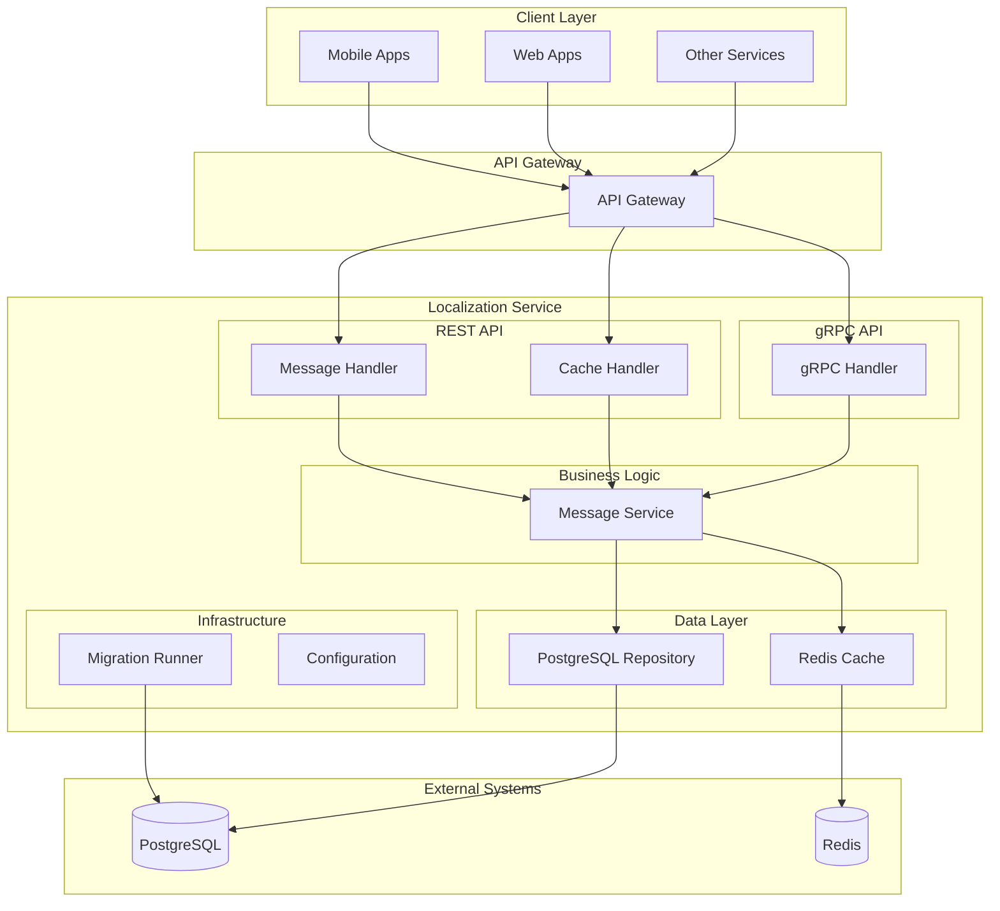
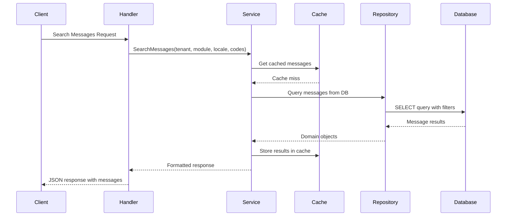
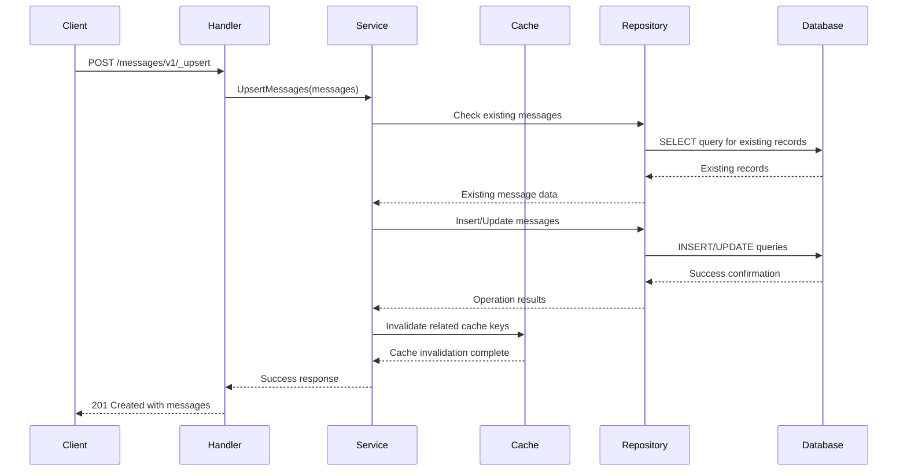
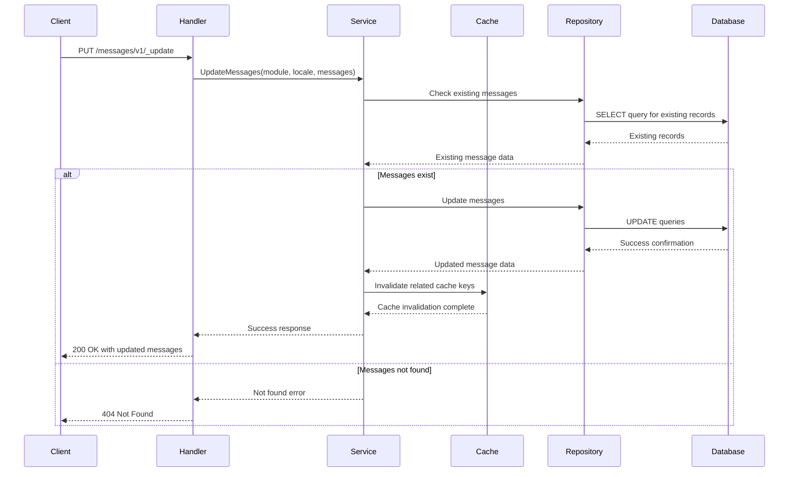
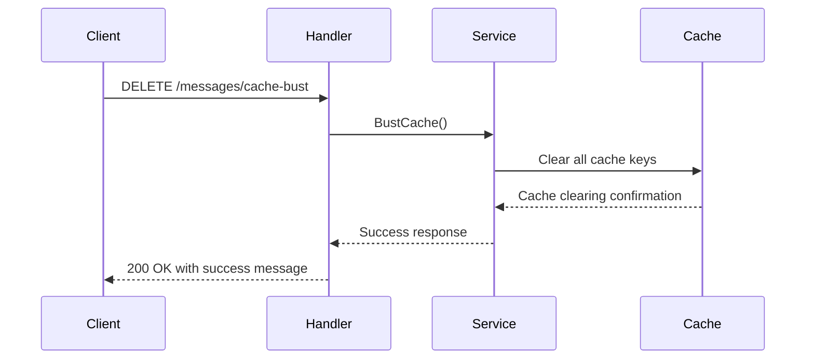

# Localization Service (Go)

A Go-based implementation of the DIGIT localization service using the Gin framework. This service provides locale-specific components and translates text for applications.

## Overview

**Service Name:** localization-go

**Purpose:** Provides multi-tenant, multi-language localization services for DIGIT applications with efficient caching and database persistence.

**Owner/Team:** DIGIT Platform Team

## Architecture

**Tech Stack:**
- Go 1.24.2
- Gin Web Framework
- PostgreSQL (via GORM)
- Redis (via go-redis/v9)
- Protocol Buffers (gRPC)
- Docker

**Core Responsibilities:**
- Store and retrieve locale-specific messages with key-value pairs
- Multi-tenant support for different organizations
- Multi-language support with locale-specific content
- Efficient caching with Redis for performance
- PostgreSQL persistence with optimized queries
- REST and gRPC API interfaces
- Database migrations management
- Cache busting functionality
- Missing message detection

**Dependencies:**
- PostgreSQL 12+ for persistent storage
- Redis 6+ for caching
- Other DIGIT services (via REST/gRPC APIs)

### Diagrams

#### High-level Architecture Diagram



#### Sequence Diagram for Message Search



## Features

- ✅ Store and retrieve locale-specific messages with key-value pairs
- ✅ Multi-tenant support with tenant isolation
- ✅ Multi-language support with locale-specific content
- ✅ Efficient Redis caching for high performance
- ✅ PostgreSQL database for persistent storage
- ✅ Clean architecture with separation of concerns
- ✅ REST API with JSON responses
- ✅ gRPC API for high-performance service communication
- ✅ Database migrations with rollback support
- ✅ Cache busting functionality
- ✅ Missing message detection feature
- ✅ Docker containerization
- ✅ Comprehensive test coverage

## Installation & Setup

### Local Development (Docker Compose)

**Prerequisites:**
- Docker & Docker Compose
- Go 1.24.2+ (for local development)
- Git

**Steps:**

1. Clone the repository
   ```bash
   git clone https://github.com/yourusername/localisationgo.git
   cd localisationgo
   ```

2. Start dependencies with Docker Compose
   ```bash
   docker-compose up -d postgres redis
   ```

3. Install Go dependencies
   ```bash
   go mod download
   ```

4. Run database migrations
   ```bash
   go run ./cmd/server --migrate
   ```

5. Start the service
   ```bash
   go run ./cmd/server
   ```

### Local Development (Manual Setup)

**Prerequisites:**
- Go 1.24.2+
- PostgreSQL 12+
- Redis 6+

**Steps:**

1. Clone and setup
   ```bash
   git clone https://github.com/yourusername/localisationgo.git
   cd localisationgo
   go mod download
   ```

2. Setup PostgreSQL database
   ```bash
   createdb localization
   ```

3. Setup Redis
   ```bash
   redis-server
   ```

4. Run migrations
   ```bash
   go run ./cmd/server --migrate
   ```

5. Start service
   ```bash
   go run ./cmd/server
   ```

### Docker Production Setup

**Build the image:**
```bash
docker build -t localisationgo:latest .
```

**Run with environment variables:**
```bash
docker run -p 8088:8088 \
  -e DB_HOST=your-db-host \
  -e DB_PASSWORD=your-db-password \
  -e REDIS_HOST=your-redis-host \
  localisationgo:latest
```

## Configuration

### Environment Variables

| Variable | Description | Default Value | Required |
|----------|-------------|---------------|----------|
| `REST_PORT` | Port for REST API server | `8088` | No |
| `GRPC_PORT` | Port for gRPC API server | `8089` | No |
| `DB_HOST` | PostgreSQL database host | `localhost` | Yes |
| `DB_PORT` | PostgreSQL database port | `5432` | No |
| `DB_USER` | PostgreSQL database username | `postgres` | No |
| `DB_PASSWORD` | PostgreSQL database password | `postgres` | Yes |
| `DB_NAME` | PostgreSQL database name | `postgres` | No |
| `DB_SSL_MODE` | PostgreSQL SSL mode | `disable` | No |
| `REDIS_HOST` | Redis server host | `localhost` | Yes |
| `REDIS_PORT` | Redis server port | `6379` | No |
| `REDIS_PASSWORD` | Redis server password | `(empty)` | No |
| `REDIS_DB` | Redis database index | `0` | No |
| `CACHE_EXPIRATION` | Cache expiration duration | `24h` | No |
| `CACHE_TYPE` | Cache type (redis/in-memory) | `redis` | No |

### Example .env file

```bash
# Server Configuration
REST_PORT=8088
GRPC_PORT=8089

# Database Configuration
DB_HOST=localhost
DB_PORT=5432
DB_USER=postgres
DB_PASSWORD=secure_password
DB_NAME=localization
DB_SSL_MODE=disable

# Redis Configuration
REDIS_HOST=localhost
REDIS_PORT=6379
REDIS_PASSWORD=
REDIS_DB=0

# Cache Configuration
CACHE_EXPIRATION=24h
CACHE_TYPE=redis
```

## API Reference

### REST API Endpoints

#### 1. Upsert Messages
- **Endpoint**: `POST /localization/messages/v1/_upsert`
- **Description**: Creates or updates localization messages
- **Headers**: `X-Tenant-ID: {tenantId}`
- **Request Body**:
```json
{
  "messages": [
    {
      "code": "welcome.message",
      "message": "Welcome to our application",
      "module": "auth",
      "locale": "en_US"
    }
  ]
}
```
- **Response**: `201 Created` with created/updated messages


##### Sequence Diagram: Upsert Messages



##### Sequence Diagram: Search Messages

```mermaid
sequenceDiagram
    participant Client
    participant Handler
    participant Service
    participant Cache
    participant Repository
    participant Database

    Client->>Handler: GET /messages (with query params)
    Handler->>Service: SearchMessages(tenantId, module, locale, codes)
    
    alt Cache Hit
        Cache-->>Service: Return cached data
    else Cache Miss
        Service->>Repository: Query messages from DB
        Repository->>Database: SELECT query with filters
        Database-->>Repository: Message results
        Repository-->>Service: Domain objects
        Service->>Cache: Store results in cache
    end
    
    Service-->>Handler: Formatted message response
    Handler-->>Client: 200 OK with messages
##### Sequence Diagram: Update Messages

##### Sequence Diagram: Create Messages

```mermaid
sequenceDiagram
    participant Client
    participant Handler
    participant Service
    participant Repository
    participant Database

    Client->>Handler: POST /messages/v1/_create
    Handler->>Service: CreateMessages(messages)
    
    Service->>Repository: Check for existing messages
    Repository->>Database: SELECT query for conflicts
    Database-->>Repository: Check results
    Repository-->>Service: Conflict check results
    
    alt No conflicts
        Service->>Repository: Insert new messages
        Repository->>Database: INSERT queries
        Database-->>Repository: Success confirmation
        Repository-->>Service: Created message data
        Service-->>Handler: Success response
        Handler-->>Client: 201 Created with messages
    else Conflicts exist
        Service-->>Handler: Conflict error
        Handler-->>Client: 409 Conflict
    end
```




##### Sequence Diagram: Delete Messages

```mermaid
sequenceDiagram
    participant Client
    participant Handler
    participant Service
    participant Cache
    participant Repository
    participant Database

    Client->>Handler: DELETE /messages/v1/_delete
    Handler->>Service: DeleteMessages(messages)

##### Sequence Diagram: Find Missing Messages

```mermaid
sequenceDiagram
    participant Client
    participant Handler
    participant Service
    participant Cache
    participant Repository
    participant Database

    Client->>Handler: POST /messages/v1/_missing
    Handler->>Service: FindMissingMessages(module)
    
    alt Module specified
        Service->>Service: Load all messages for module
    else All modules
        Service->>Service: Load all messages
    end
    
    Service->>Repository: Query all messages
    Repository->>Database: SELECT all messages
    Database-->>Repository: All message records
    Repository-->>Service: Message data
    
    Service->>Service: Analyze message coverage
    Service->>Service: Identify missing translations
    
    Service-->>Handler: Missing messages analysis
    Handler-->>Client: 200 OK with missing codes by module/locale
```

    
    Service->>Repository: Delete messages
    Repository->>Database: DELETE queries
    Database-->>Repository: Deletion results
    Repository-->>Service: Deletion confirmation
    
    Service->>Cache: Invalidate related cache keys
    Cache-->>Service: Cache invalidation complete
    
    Service-->>Handler: Success response
    Handler-->>Client: 200 OK with success status
```

##### Sequence Diagram: Cache Bust




```mermaid
sequenceDiagram
    participant Client
    participant Handler
    participant Service
    participant Cache
    participant Repository
    participant Database

    Client->>Handler: PUT /messages/v1/_update
    Handler->>Service: UpdateMessages(module, locale, messages)
    
    Service->>Repository: Check existing messages
    Repository->>Database: SELECT query for existing records
    Database-->>Repository: Existing records
    Repository-->>Service: Existing message data
    
    alt Messages exist
        Service->>Repository: Update messages
        Repository->>Database: UPDATE queries
        Database-->>Repository: Success confirmation
        Repository-->>Service: Updated message data
        
        Service->>Cache: Invalidate related cache keys

