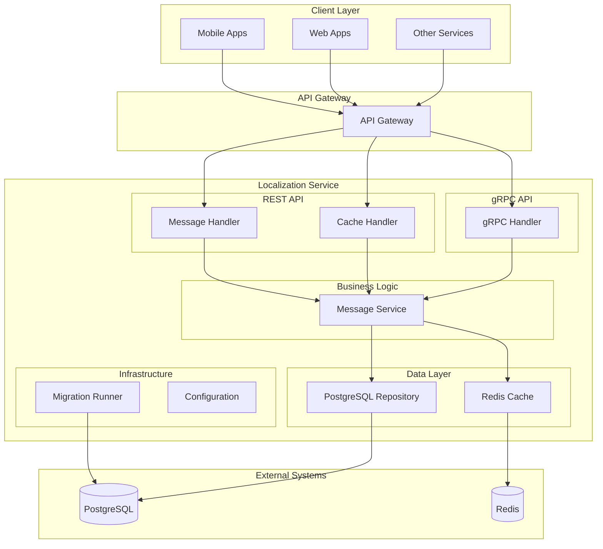
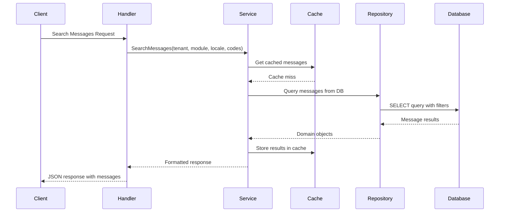
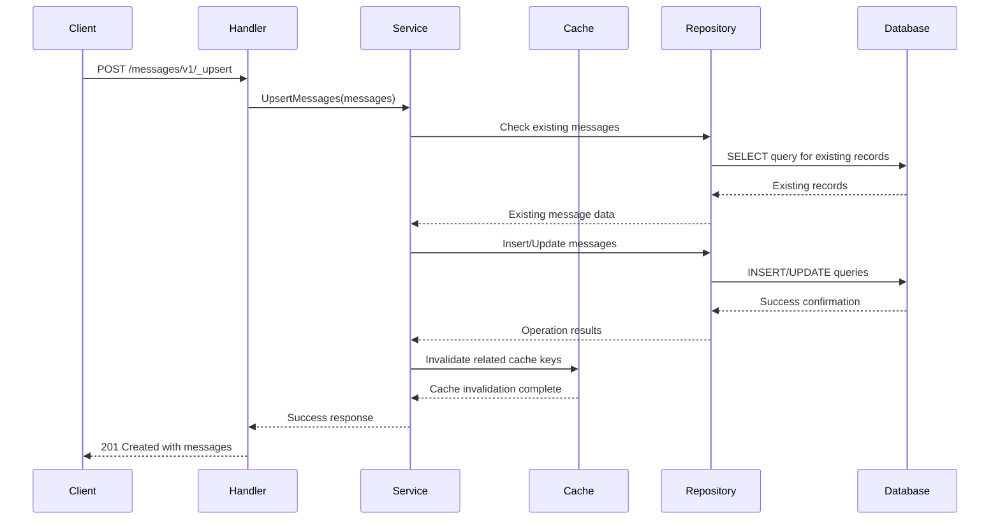
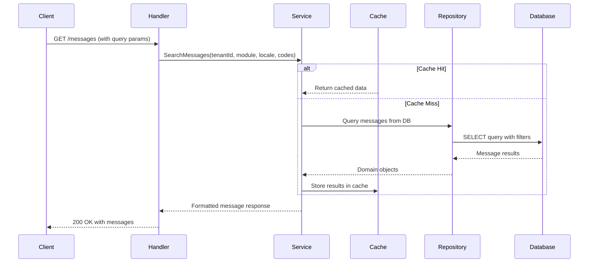
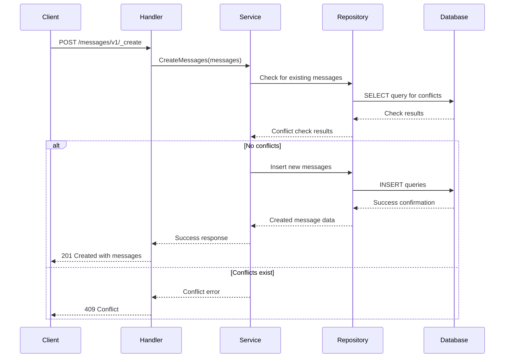
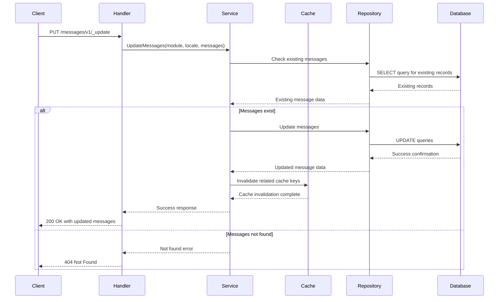
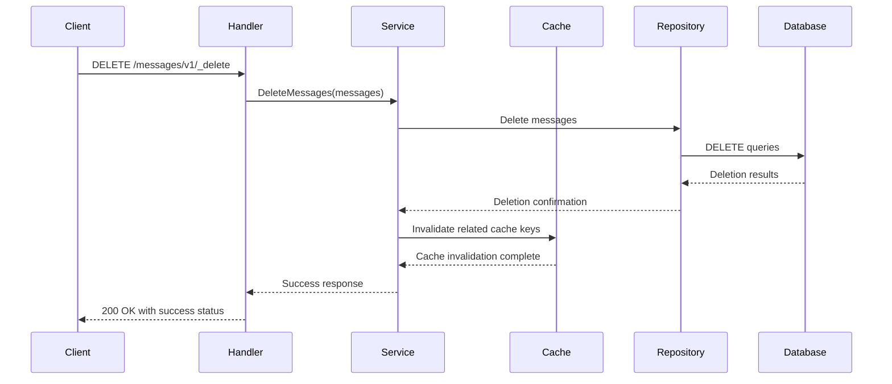
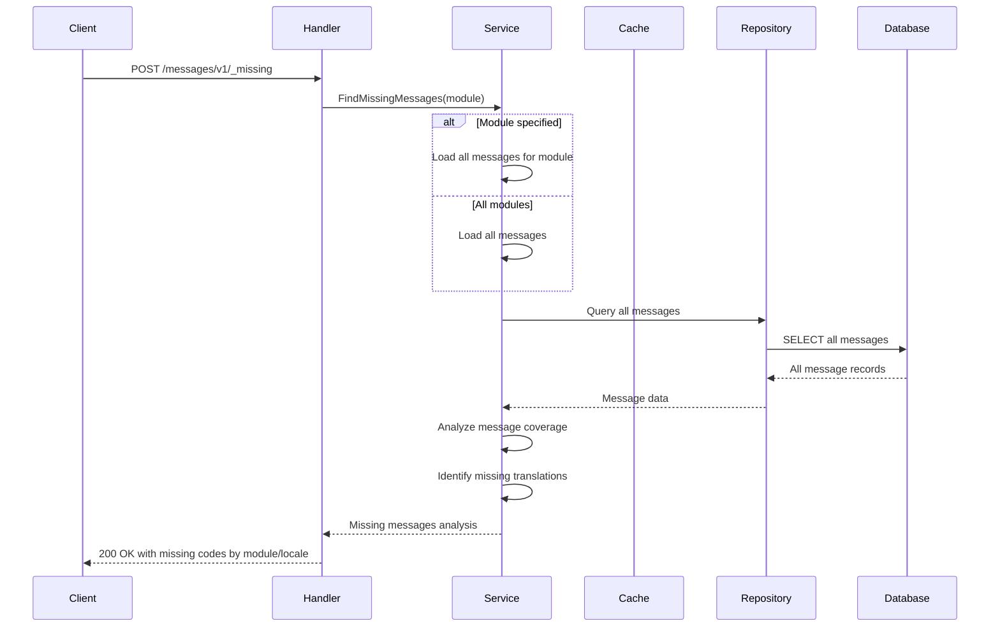
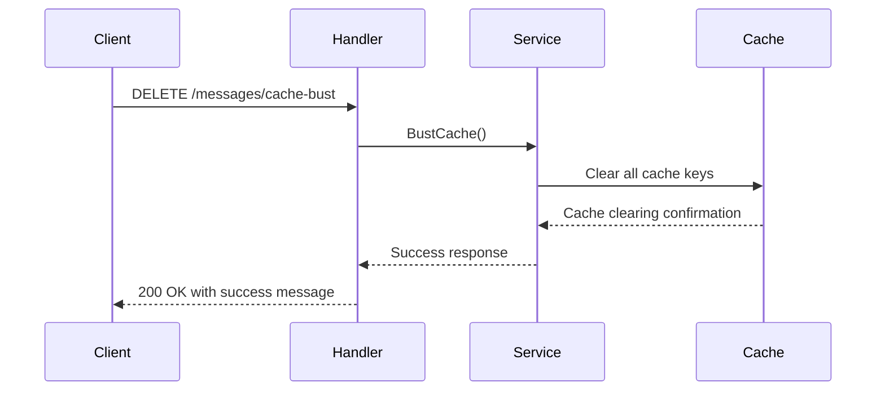

# Localization Service (Go)

A Go-based implementation of the DIGIT localization service using the Gin framework. This service provides locale-specific components and translates text for applications.

## Overview

**Service Name:** localization-go

**Purpose:** Provides multi-tenant, multi-language localization services for DIGIT applications with efficient caching and database persistence.

**Owner/Team:** DIGIT Platform Team

## Architecture

**Tech Stack:**
- Go 1.24.2
- Gin Web Framework
- PostgreSQL (via GORM)
- Redis (via go-redis/v9)
- Protocol Buffers (gRPC)
- Docker

**Core Responsibilities:**
- Store and retrieve locale-specific messages with key-value pairs
- Multi-tenant support for different organizations
- Multi-language support with locale-specific content
- Efficient caching with Redis for performance
- PostgreSQL persistence with optimized queries
- REST and gRPC API interfaces
- Database migrations management
- Cache busting functionality
- Missing message detection

**Dependencies:**
- PostgreSQL 12+ for persistent storage
- Redis 6+ for caching
- Other DIGIT services (via REST/gRPC APIs)

### Diagrams

#### High-level Architecture Diagram



#### Sequence Diagram for Message Search



## Features

- ✅ Store and retrieve locale-specific messages with key-value pairs
- ✅ Multi-tenant support with tenant isolation
- ✅ Multi-language support with locale-specific content
- ✅ Efficient Redis caching for high performance
- ✅ PostgreSQL database for persistent storage
- ✅ Clean architecture with separation of concerns
- ✅ REST API with JSON responses
- ✅ gRPC API for high-performance service communication
- ✅ Database migrations with rollback support
- ✅ Cache busting functionality
- ✅ Missing message detection feature
- ✅ Docker containerization
- ✅ Comprehensive test coverage

## Installation & Setup

### Local Development (Docker Compose)

**Prerequisites:**
- Docker & Docker Compose
- Go 1.24.2+ (for local development)
- Git

**Steps:**

1. Clone the repository
   ```bash
   git clone https://github.com/yourusername/localisationgo.git
   cd localisationgo
   ```

2. Start dependencies with Docker Compose
   ```bash
   docker-compose up -d postgres redis
   ```

3. Install Go dependencies
   ```bash
   go mod download
   ```

4. Run database migrations
   ```bash
   go run ./cmd/server --migrate
   ```

5. Start the service
   ```bash
   go run ./cmd/server
   ```

### Local Development (Manual Setup)

**Prerequisites:**
- Go 1.24.2+
- PostgreSQL 12+
- Redis 6+

**Steps:**

1. Clone and setup
   ```bash
   git clone https://github.com/yourusername/localisationgo.git
   cd localisationgo
   go mod download
   ```

2. Setup PostgreSQL database
   ```bash
   createdb localization
   ```

3. Setup Redis
   ```bash
   redis-server
   ```

4. Run migrations
   ```bash
   go run ./cmd/server --migrate
   ```

5. Start service
   ```bash
   go run ./cmd/server
   ```

### Docker Production Setup

**Build the image:**
```bash
docker build -t localisationgo:latest .
```

**Run with environment variables:**
```bash
docker run -p 8088:8088 \
  -e DB_HOST=your-db-host \
  -e DB_PASSWORD=your-db-password \
  -e REDIS_HOST=your-redis-host \
  localisationgo:latest
```

## Configuration

### Environment Variables

| Variable | Description | Default Value | Required |
|----------|-------------|---------------|----------|
| `REST_PORT` | Port for REST API server | `8088` | No |
| `GRPC_PORT` | Port for gRPC API server | `8089` | No |
| `DB_HOST` | PostgreSQL database host | `localhost` | Yes |
| `DB_PORT` | PostgreSQL database port | `5432` | No |
| `DB_USER` | PostgreSQL database username | `postgres` | No |
| `DB_PASSWORD` | PostgreSQL database password | `postgres` | Yes |
| `DB_NAME` | PostgreSQL database name | `postgres` | No |
| `DB_SSL_MODE` | PostgreSQL SSL mode | `disable` | No |
| `REDIS_HOST` | Redis server host | `localhost` | Yes |
| `REDIS_PORT` | Redis server port | `6379` | No |
| `REDIS_PASSWORD` | Redis server password | `(empty)` | No |
| `REDIS_DB` | Redis database index | `0` | No |
| `CACHE_EXPIRATION` | Cache expiration duration | `24h` | No |
| `CACHE_TYPE` | Cache type (redis/in-memory) | `redis` | No |

### Example .env file

```bash
# Server Configuration
REST_PORT=8088
GRPC_PORT=8089

# Database Configuration
DB_HOST=localhost
DB_PORT=5432
DB_USER=postgres
DB_PASSWORD=secure_password
DB_NAME=localization
DB_SSL_MODE=disable

# Redis Configuration
REDIS_HOST=localhost
REDIS_PORT=6379
REDIS_PASSWORD=
REDIS_DB=0

# Cache Configuration
CACHE_EXPIRATION=24h
CACHE_TYPE=redis
```

## API Reference

### REST API Endpoints

#### 1. Upsert Messages
- **Endpoint**: `POST /localization/messages/v1/_upsert`
- **Description**: Creates or updates localization messages
- **Headers**: `X-Tenant-ID: {tenantId}`
- **Request Body**:
```json
{
  "messages": [
    {
      "code": "welcome.message",
      "message": "Welcome to our application",
      "module": "auth",
      "locale": "en_US"
    }
  ]
}
```
- **Response**: `201 Created` with created/updated messages


##### Sequence Diagram: Upsert Messages



##### Sequence Diagram: Search Messages


```
##### Sequence Diagram: Create Messages




##### Sequence Diagram: Update Messages



##### Sequence Diagram: Delete Messages



##### Sequence Diagram: Find Missing Messages



##### Sequence Diagram: Cache Bust



#### 2. Search Messages
- **Endpoint**: `GET /localization/messages`
- **Description**: Searches for localization messages
- **Query Parameters**:
  - `tenantId` (required)
  - `module` (optional)
  - `locale` (optional)
  - `codes` (optional, comma-separated)
  - `limit` (optional, default: 20)
  - `offset` (optional, default: 0)
- **Response**: `200 OK` with matching messages

#### 3. Create Messages
- **Endpoint**: `POST /localization/messages/v1/_create`
- **Description**: Creates new localization messages (fails if exists)
- **Headers**: `X-Tenant-ID: {tenantId}`
- **Request Body**: Same as upsert
- **Response**: `201 Created` with created messages

#### 4. Update Messages
- **Endpoint**: `PUT /localization/messages/v1/_update`
- **Description**: Updates existing localization messages
- **Headers**: `X-Tenant-ID: {tenantId}`
- **Request Body**:
```json
{
  "module": "auth",
  "locale": "en_US",
  "messages": [
    {
      "code": "welcome.message",
      "message": "Updated welcome message"
    }
  ]
}
```
- **Response**: `200 OK` with updated messages

#### 5. Delete Messages
- **Endpoint**: `DELETE /localization/messages/v1/_delete`
- **Description**: Deletes localization messages
- **Headers**: `X-Tenant-ID: {tenantId}`
- **Request Body**:
```json
{
  "messages": [
    {
      "module": "auth",
      "locale": "en_US",
      "code": "welcome.message"
    }
  ]
}
```
- **Response**: `200 OK` with success status

#### 6. Cache Bust
- **Endpoint**: `DELETE /localization/messages/cache-bust`
- **Description**: Clears the entire message cache
- **Response**: `200 OK` with success message

#### 7. Find Missing Messages
- **Endpoint**: `POST /localization/messages/v1/_missing`
- **Description**: Finds missing localization messages
- **Headers**: `X-Tenant-ID: {tenantId}`
- **Request Body**:
```json
{
  "module": "auth"
}
```
- **Response**: `200 OK` with missing message codes by module/locale

### gRPC API

The service also provides a gRPC API with identical functionality. The protobuf definition can be found in `api/proto/localization/v1/localization.proto`.

### Error Codes

| HTTP Status | Error Code | Description |
|-------------|------------|-----------|
| 400 | BAD_REQUEST | Invalid request parameters |
| 401 | UNAUTHORIZED | Authentication required |
| 403 | FORBIDDEN | Insufficient permissions |
| 404 | NOT_FOUND | Resource not found |
| 409 | CONFLICT | Resource already exists |
| 422 | UNPROCESSABLE_ENTITY | Validation failed |
| 500 | INTERNAL_SERVER_ERROR | Server error |

## Observability

### Logging

**Format:** JSON structured logging with request correlation IDs

**Framework:** Standard Go log with context support

**Log Levels:** DEBUG, INFO, WARN, ERROR


**Example Log:**
```json
{
  "level": "INFO",
  "timestamp": "2024-01-15T10:30:45Z",
  "request_id": "req-123456",
  "tenant_id": "DEFAULT",
  "method": "GET",
  "path": "/localization/messages",
  "duration_ms": 45,
  "status_code": 200
}
```

### Metrics

**Framework:** Prometheus metrics exposed on `/metrics` endpoint

**Key Metrics:**
- `http_requests_total{path, method, status}` - Total HTTP requests
- `http_request_duration_seconds{path, method}` - Request duration histogram
- `db_connections_active` - Active database connections
- `cache_hit_total` - Cache hit counter
- `cache_miss_total` - Cache miss counter
- `messages_created_total` - Total messages created
- `messages_updated_total` - Total messages updated

### Tracing

**Framework:** OpenTelemetry with Jaeger integration

**Configuration:**
```bash
export OTEL_TRACES_EXPORTER=jaeger
export OTEL_EXPORTER_JAEGER_ENDPOINT=http://localhost:14268/api/traces
```

**Trace Context:** Automatic trace propagation with W3C trace context headers

## Operations

### Health Checks

#### REST Health Check
- **Endpoint**: `GET /health`
- **Response**: `200 OK` with service status

#### Ready Check
- **Endpoint**: `GET /ready`
- **Response**: `200 OK` when service is ready to accept traffic

### Scaling Guidelines

**Resource Requirements:**
- **CPU:** 0.5-1 core per 1000 RPS
- **Memory:** 512MB base + 50MB per tenant
- **Storage:** 1GB per 100k messages

**Recommended Replicas:** 2-3 for production

**Horizontal Scaling:** Stateless design supports horizontal scaling

### Database Operations

#### Running Migrations
```bash
# Automatic (on startup)
go run ./cmd/server

# Manual migration
go run ./internal/migration --path ./migrations
```

#### Backup Strategy
```bash
# PostgreSQL backup
pg_dump localization > backup.sql

# Restore
psql localization < backup.sql
```

#### Connection Pool Settings
- Max Open Connections: 25
- Max Idle Connections: 10
- Connection Max Lifetime: 5 minutes

### Cache Operations

#### Cache Busting
```bash
curl -X DELETE http://localhost:8088/localization/messages/cache-bust
```

#### Redis Monitoring
```bash
# Check Redis connectivity
redis-cli ping

# Monitor cache keys
redis-cli keys "localization:*"
```

## Security

### Authentication & Authorization

**Current Implementation:** Header-based authentication
- `X-User-ID`: User identifier
- `X-Tenant-ID`: Tenant identifier (required for multi-tenancy)

**Recommended:** Implement JWT-based authentication for production

### Data Protection

**Database Security:**
- SSL/TLS encryption in transit (`DB_SSL_MODE=require`)
- Database credentials via environment variables
- Principle of least privilege for database user

**Cache Security:**
- Redis AUTH with password
- Network isolation for Redis instance

**API Security:**
- Input validation and sanitization
- Rate limiting (recommended)
- CORS configuration for web clients

### Sensitive Data Handling

**Environment Variables:**
- Database passwords
- Redis passwords
- API keys

**Recommendations:**
- Use Docker secrets or Kubernetes secrets
- Rotate credentials regularly
- Audit access logs

## Testing

### Running Tests

**All Tests:**
```bash
go test ./...
```

**Unit Tests Only:**
```bash
go test ./internal/...
```

**Integration Tests Only:**
```bash
go test ./tests/...
```

**With Coverage:**
```bash
go test -coverprofile=coverage.out ./...
go tool cover -html=coverage.out
```

**With Verbose Output:**
```bash
go test -v ./...
```

### Test Structure

#### Unit Tests
Located in the same package with `_test.go` suffix:
- `internal/core/services/messageservice_test.go` - Business logic tests
- `internal/repositories/postgres/messagerepository_test.go` - Database layer tests
- `internal/platform/cache/rediscache_test.go` - Cache layer tests
- `internal/handlers/messagehandler_test.go` - HTTP handler tests

#### Integration Tests
End-to-end tests in `tests/` directory:
- `tests/integration_test.go` - Complete API flow tests

### Test Dependencies

- **Testify:** `github.com/stretchr/testify` - Assertions and mocks
- **SQLMock:** `github.com/DATA-DOG/go-sqlmock` - Database mocking
- **MiniRedis:** `github.com/alicebob/miniredis/v2` - Redis mocking
- **SQLite:** `github.com/mattn/go-sqlite3` - In-memory database for integration tests

### Mock Setup

```go
// Database mock example
db, mock, err := sqlmock.New()
defer db.Close()

mock.ExpectQuery("SELECT (.+) FROM localisation").
//   WithArgs(tenantID, module, locale).
//   WillReturnRows(rows)

// Service test
service := services.NewMessageService(repo, cache)
messages, err := service.SearchMessages(ctx, tenantID, module, locale)
```

## Development Guide

### Coding Standards

**Go Standards:**
- Follow standard Go formatting (`gofmt`)
- Use `goimports` for import organization
- Follow Go naming conventions
- Use `golangci-lint` for code quality

**Project Standards:**
- Clean Architecture principles
- Dependency injection
- Interface-based design
- Comprehensive error handling
- Unit test coverage > 80%

### Common Utilities

#### Retry Logic
```go
// Exponential backoff retry utility
func retryWithBackoff(operation func() error, maxRetries int) error {
    // Implementation with exponential backoff
}
```

#### Cache Abstraction
```go
// Cache interface
type MessageCache interface {
    Get(ctx context.Context, key string) (interface{}, error)
    Set(ctx context.Context, key string, value interface{}, ttl time.Duration) error
    Delete(ctx context.Context, key string) error
}
```

#### Database Connection
```go
// Database configuration helper
func newDatabaseConnection(config *Config) (*sql.DB, error) {
    // Connection pooling and configuration
}
```

### Adding New API Endpoints

**Step-by-step guide:**

1. **Define the domain model** (if needed):
   ```go
   // internal/core/domain/newmodel.go
   type NewModel struct {
       // fields
   }
   ```

2. **Add repository interface**:
   ```go
   // internal/core/ports/repository.go
   type NewRepository interface {
       Create(ctx context.Context, model *NewModel) error
       GetByID(ctx context.Context, id string) (*NewModel, error)
   }
   ```

3. **Implement repository**:
   ```go
   // internal/repositories/postgres/newrepository.go
   type newRepository struct {
       db *gorm.DB
   }
   ```

4. **Add service interface and implementation**:
   ```go
   // internal/core/ports/service.go
   type NewService interface {
       Process(ctx context.Context, data interface{}) error
   }
   
   // internal/core/services/newservice.go
   type newService struct {
       repo NewRepository
   }
   ```

5. **Add HTTP handler**:
   ```go
   // internal/handlers/newhandler.go
   func (h *NewHandler) ProcessNewRequest(c *gin.Context) {
       // Handler implementation
   }
   ```

6. **Register routes**:
   ```go
   // internal/handlers/newhandler.go
   func (h *NewHandler) RegisterRoutes(router *gin.RouterGroup) {
       router.POST("/new-endpoint", h.ProcessNewRequest)
   }
   ```

7. **Update main.go**:
   ```go
   // cmd/server/main.go
   newHandler := handlers.NewNewHandler(newService)
   apiGroup := router.Group("/api")
   newHandler.RegisterRoutes(apiGroup)
   ```

8. **Add tests** for all layers

### Project Structure

```
localisationgo/
├── api/proto/                    # Protocol buffer definitions
├── cmd/server/                   # Application entrypoint
├── configs/                      # Configuration management
├── internal/                     # Private application code
│   ├── cache/                   # Cache implementations
│   ├── common/                  # Shared utilities
│   ├── core/                    # Business logic
│   │   ├── domain/             # Domain models
│   │   ├── ports/              # Interfaces
│   │   └── services/           # Business logic
│   ├── handlers/               # HTTP/gRPC handlers
│   ├── migration/              # Database migrations
│   ├── platform/               # Platform-specific code
│   └── repositories/           # Data access layer
├── migrations/                  # SQL migration files
├── pkg/dtos/                    # Data transfer objects
├── scripts/                     # Build/utility scripts
└── tests/                       # Integration tests
```

## Release & Deployment

### Branching Strategy

**Git Flow:**
- `main` - Production releases
- `develop` - Development integration
- `feature/*` - Feature branches
- `hotfix/*` - Hotfix branches

### CI/CD Pipeline

**GitHub Actions Workflow:**
```yaml
# .github/workflows/ci-cd.yml
name: CI/CD Pipeline

on:
  push:
    branches: [ main, develop ]
  pull_request:
    branches: [ main ]

jobs:
  test:
    runs-on: ubuntu-latest
    steps:
      - uses: actions/checkout@v3
      - uses: actions/setup-go@v4
        with:
          go-version: '1.24.2'
      - run: go mod download
      - run: go test ./... -coverprofile=coverage.out
      - run: go tool cover -html=coverage.out -o coverage.html
  
  build:
    needs: test
    runs-on: ubuntu-latest
    steps:
      - uses: actions/checkout@v3
      - uses: docker/build-push-action@v4
        with:
          context: .
          push: true
          tags: localisationgo:latest
```

### Versioning

**Semantic Versioning:** `MAJOR.MINOR.PATCH`
- `MAJOR`: Breaking changes
- `MINOR`: New features
- `PATCH`: Bug fixes

**Version Tags:**
```bash
git tag v1.2.3
git push origin v1.2.3
```

### Deployment

**Docker Compose (Development):**
```yaml
version: '3.8'
services:
  localisationgo:
    build: .
    ports:
      - "8088:8088"
    environment:
      - DB_HOST=postgres
      - REDIS_HOST=redis
    depends_on:
      - postgres
      - redis
  
  postgres:
    image: postgres:13
    environment:
      - POSTGRES_DB=localization
      - POSTGRES_PASSWORD=password
  
  redis:
    image: redis:6-alpine
```

**Kubernetes (Production):**
```yaml
# k8s/deployment.yaml
apiVersion: apps/v1
kind: Deployment
metadata:
  name: localisationgo
spec:
  replicas: 3
  selector:
    matchLabels:
      app: localisationgo
  template:
    metadata:
      labels:
        app: localisationgo
    spec:
      containers:
      - name: localisationgo
        image: localisationgo:latest
        ports:
        - containerPort: 8088
        env:
        - name: DB_HOST
          valueFrom:
            secretKeyRef:
              name: db-secret
              key: host
        livenessProbe:
          httpGet:
            path: /health
            port: 8088
          initialDelaySeconds: 30
          periodSeconds: 10
```

## Troubleshooting

### Common Issues

#### Database Connection Issues

**Error:** `could not connect to the database`

**Solutions:**
1. Verify PostgreSQL is running
2. Check connection string
3. Verify database exists
4. Check firewall settings

**Debug:**
```bash
# Test database connection
psql -h localhost -U postgres -d localization
```

#### Cache Connection Issues

**Error:** `redis: connection refused`

**Solutions:**
1. Verify Redis is running
2. Check Redis configuration
3. Verify network connectivity
4. Check Redis authentication

**Debug:**
```bash
# Test Redis connection
redis-cli ping
```

#### High Memory Usage

**Symptoms:** Service consuming excessive memory

**Causes:**
- Large dataset loaded in memory
- Cache not properly configured
- Memory leaks in application code

**Solutions:**
1. Review cache configuration
2. Implement cache TTL
3. Monitor memory usage
4. Check for goroutine leaks

#### Slow API Responses

**Symptoms:** API calls taking longer than expected

**Diagnosis:**
1. Check database query performance
2. Monitor cache hit/miss ratios
3. Review connection pool settings
4. Check network latency

**Solutions:**
1. Add database indexes
2. Optimize queries
3. Increase cache TTL
4. Scale horizontally

### Debug Mode

**Enable Debug Logging:**
```bash
export LOG_LEVEL=debug
go run ./cmd/server
```

**Enable SQL Query Logging:**
```bash
// In configuration
DB_DEBUG=true
```

### Monitoring Queries

**Database Performance:**
```sql
-- Slow queries
SELECT * FROM pg_stat_statements 
ORDER BY total_time DESC 
LIMIT 10;

-- Connection count
SELECT count(*) FROM pg_stat_activity;
```

**Redis Performance:**
```bash
# Cache statistics
redis-cli info stats

# Memory usage
redis-cli info memory
```

### Log Analysis

**Common Log Patterns:**
```bash
# Search for errors
grep "ERROR" application.log

# Find slow requests
grep "duration_ms" application.log | sort -k3 -n

# Analyze by endpoint
grep "/localization/messages" application.log | head -20
```

## FAQ

### General Questions

**Q: How does multi-tenancy work?**
A: Each tenant's data is isolated using tenant_id in all database queries and cache keys.

**Q: What's the difference between upsert and update?**
A: Upsert creates or updates records, while update only modifies existing records.

**Q: How does caching improve performance?**
A: Frequently accessed messages are stored in Redis, reducing database load and improving response times.

### Technical Questions

**Q: Can I use different cache backends?**
A: Yes, implement the MessageCache interface for custom cache providers.

**Q: How do I add a new locale?**
A: Just insert messages with the new locale code - no schema changes required.

**Q: What's the maximum message size?**
A: Limited by PostgreSQL TEXT field (1GB) and Redis value size limits.

### Operational Questions

**Q: How do I backup the data?**
A: Use PostgreSQL pg_dump for database backup and Redis RDB/AOF for cache backup.

**Q: Can I run multiple instances?**
A: Yes, the service is stateless and supports horizontal scaling.

**Q: How do I monitor the service?**
A: Use the /health endpoint, Prometheus metrics, and application logs.

## References

### Related Repositories

- [DIGIT Platform](https://github.com/digitnxt/digit-platform) - Main DIGIT platform
- [DIGIT UI](https://github.com/digitnxt/digit-ui) - Frontend application
- [DIGIT Commons](https://github.com/digitnxt/digit-commons) - Shared utilities

### External Documentation

- [Go Documentation](https://golang.org/doc/) - Go programming language
- [Gin Framework](https://gin-gonic.com/docs/) - Web framework documentation
- [GORM Documentation](https://gorm.io/docs/) - ORM documentation
- [PostgreSQL Manual](https://www.postgresql.org/docs/) - Database documentation
- [Redis Documentation](https://redis.io/documentation) - Cache documentation

### Standards & Specifications

- [Semantic Versioning](https://semver.org/) - Versioning standard
- [OpenAPI Specification](https://swagger.io/specification/) - API documentation standard
- [Protocol Buffers](https://developers.google.com/protocol-buffers) - gRPC serialization

### Support Channels

- **Slack:** #digit-platform-support
- **Email:** digit-support@egov.org.in
- **Documentation:** [DIGIT Wiki](https://digit-discuss.atlassian.net/wiki)

---

**Last Updated:** January 2024
**Version:** 1.0.0
**Maintainer:** DIGIT Platform Team
