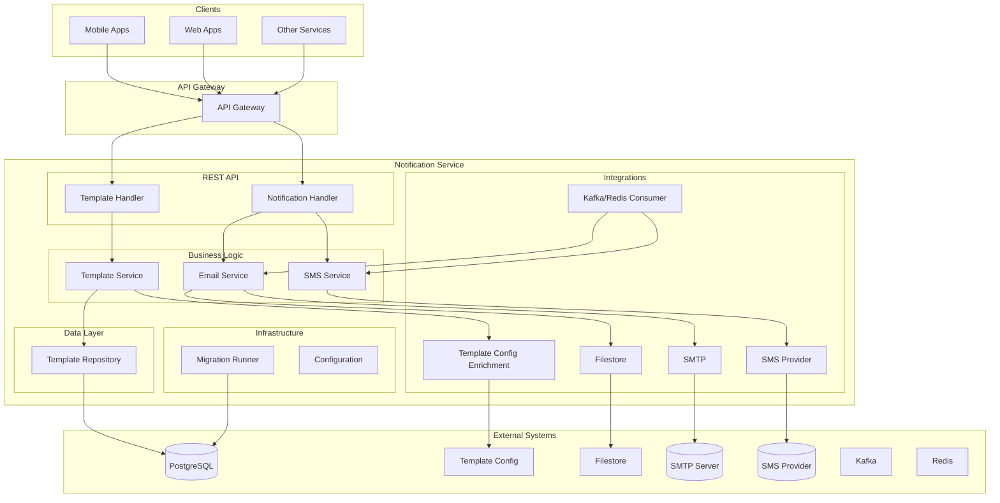
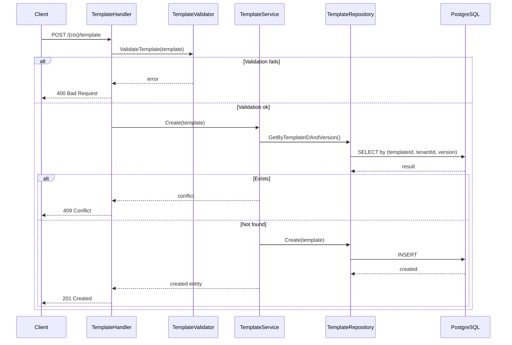
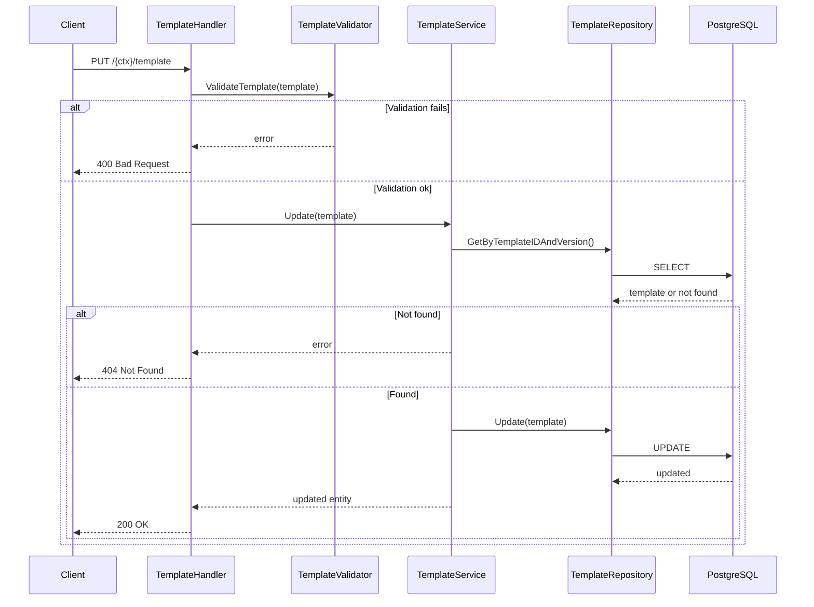
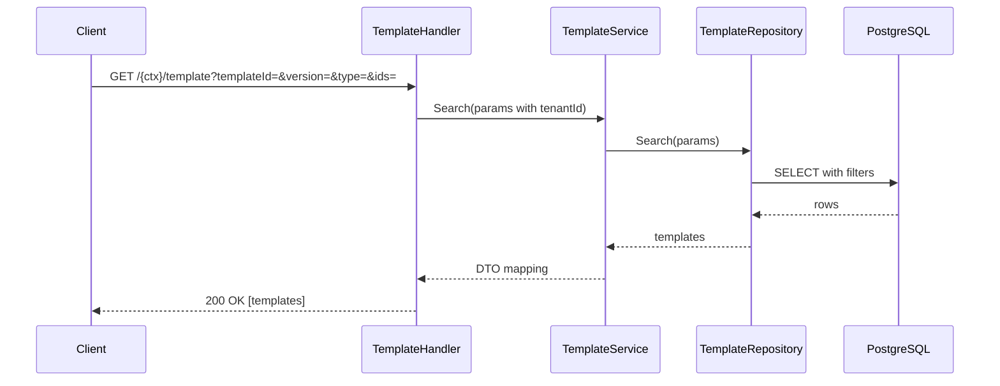
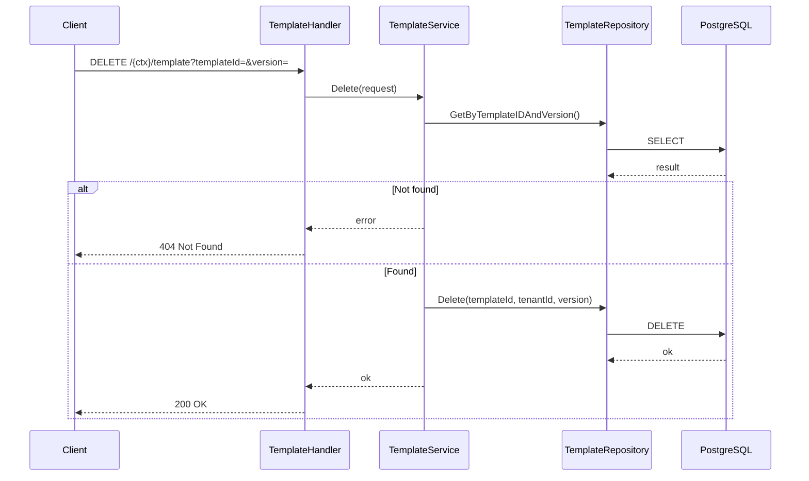
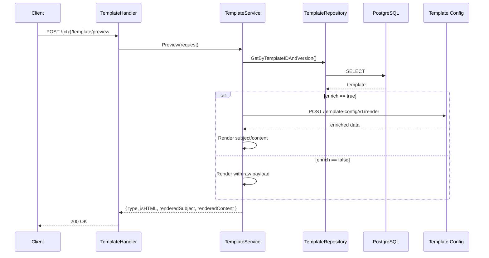
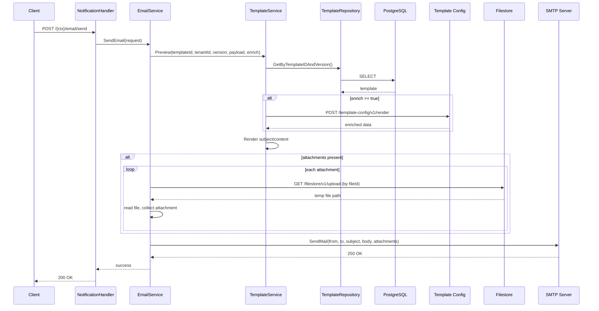
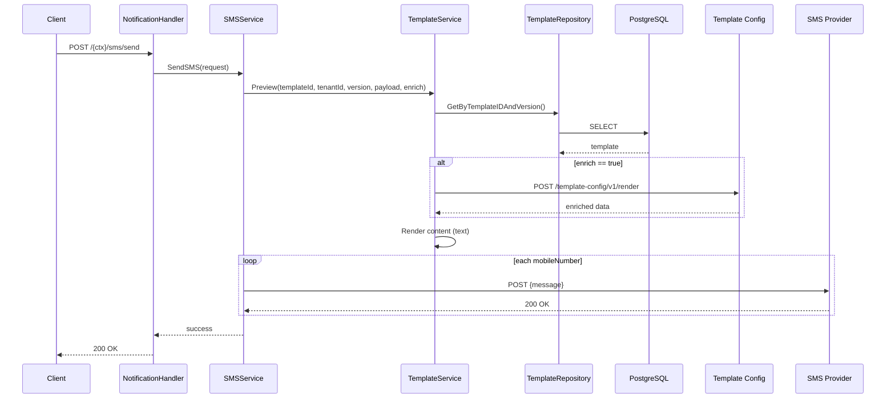

# Notification Service (Go)

A Go-based DIGIT service for template-driven email and SMS notifications. It manages notification templates, enriches payloads via the Template Config service, renders content, and delivers messages through email and SMS providers. It also supports background consumption from Kafka or Redis.

## Overview

**Service Name:** Notification

**Purpose:** Provide multi-tenant notification templating, enrichment, rendering, and delivery for email and SMS channels, with REST API for template lifecycle and synchronous send, and optional async consumption from message brokers.

**Owner/Team:** DIGIT Platform Team

## Architecture

**Tech Stack:**
- Go 1.23
- Gin Web Framework
- PostgreSQL (via GORM)
- SMTP (email), SMSCountry (SMS)
- Kafka or Redis consumer (optional)
- Docker

**Core Responsibilities:**
- Manage notification templates (create, update, search, delete, preview)
- Enrich payloads by calling Template Config service before rendering
- Render subject/content using Go templates (text/HTML)
- Send email (SMTP) with attachments via Filestore
- Send SMS via provider integration
- Optionally consume email/SMS messages from Kafka or Redis
- Multi-tenant scoping via `X-Tenant-ID`
- Database migrations

**Dependencies:**
- PostgreSQL 15
- Template Config service for enrichment
- Filestore service for attachments
- SMTP server (for email)
- SMS provider (default SMSCountry)
- Kafka or Redis (if broker consumption enabled)

### Diagrams

#### High-level Architecture Diagram



## Features

- ✅ CRUD lifecycle for notification templates (EMAIL/SMS)
- ✅ Preview rendering with optional enrichment
- ✅ Go templates for subject/content (HTML or text)
- ✅ Email sending over SMTP with attachments (via Filestore)
- ✅ SMS sending via provider (default: SMSCountry)
- ✅ Async consumption from Kafka or Redis
- ✅ Multi-tenant support via headers
- ✅ Database migrations with uniqueness on `(templateId, tenantId, version)`
- ✅ Docker containerization

## Installation & Setup

### Local Development (Manual Setup)

**Prerequisites:**
- Go 1.23+
- PostgreSQL 15

**Steps:**
1. Clone and setup
   ```bash
   git clone https://github.com/digitnxt/digit3.git
   cd code/services/notification
   go mod download
   ```
2. Setup PostgreSQL database
   ```bash
   createdb notification_db
   ```
3. Start service (migrations run automatically if enabled)
   ```bash
   go run ./cmd/server
   ```

### Docker

**Build the image:**
```bash
docker build -t notification:latest .
```

**Run with environment variables:**
```bash
docker run -p 8080:8080 \
  -e DB_HOST=your-db-host \
  -e DB_PASSWORD=your-db-password \
  -e MIGRATION_ENABLED=true \
  notification:latest
```

## Configuration

### Environment Variables

| Variable | Description | Default | Required |
|----------|-------------|---------|----------|
| `HTTP_PORT` | Port for REST API server | `8080` | No |
| `SERVER_CONTEXT_PATH` | Base path for API routes | `/notification` | No |
| `DB_HOST` | PostgreSQL host | `localhost` | Yes |
| `DB_PORT` | PostgreSQL port | `5432` | No |
| `DB_USER` | PostgreSQL username | `postgres` | No |
| `DB_PASSWORD` | PostgreSQL password | `postgres` | Yes |
| `DB_NAME` | PostgreSQL database | `notification_db` | No |
| `DB_SSL_MODE` | PostgreSQL SSL mode | `disable` | No |
| `MIGRATION_SCRIPT_PATH` | Path to SQL migrations | `./db/migrations` | No |
| `MIGRATION_ENABLED` | Run migrations on startup | `false` | No |
| `MIGRATION_TIMEOUT` | Migration timeout (Go duration) | `5m` | No |
| `TEMPLATE_CONFIG_HOST` | Template Config host | `http://localhost:8082` | Yes |
| `TEMPLATE_CONFIG_PATH` | Template Config render path | `/template-config/v1/render` | Yes |
| `FILESTORE_HOST` | Filestore host | `http://localhost:8083` | Yes |
| `FILESTORE_PATH` | Filestore upload path | `/filestore/v1/upload` | Yes |
| `SMTP_HOST` | SMTP server host | `smtp.gmail.com` | Yes |
| `SMTP_PORT` | SMTP server port | `587` | No |
| `SMTP_USERNAME` | SMTP username | `username` | Yes |
| `SMTP_PASSWORD` | SMTP password | `password` | Yes |
| `SMTP_FROM_ADDRESS` | From email address | `notification@example.com` | Yes |
| `SMTP_FROM_NAME` | From display name | `Notification Service` | No |
| `SMS_PROVIDER_URL` | SMS provider endpoint | `https://smscountry.com/api/v3/sendsms/plain` | Yes |
| `SMS_PROVIDER_USERNAME` | SMS provider username | `username` | Yes |
| `SMS_PROVIDER_PASSWORD` | SMS provider password | `password` | Yes |
| `SMS_PROVIDER_CONTENT_TYPE` | SMS request content type | `application/x-www-form-urlencoded` | No |
| `MESSAGE_BROKER_ENABLED` | Enable broker consumer | `false` | No |
| `MESSAGE_BROKER_TYPE` | `kafka` or `redis` | `kafka` | No |
| `KAFKA_BROKERS` | Kafka brokers (comma-separated) | `localhost:9092` | If Kafka |
| `KAFKA_CONSUMER_GROUP` | Kafka consumer group | `notification-consumer-group` | If Kafka |
| `REDIS_ADDR` | Redis address | `localhost:6379` | If Redis |
| `REDIS_PASSWORD` | Redis password | `` | If Redis |
| `REDIS_DB` | Redis DB index | `0` | If Redis |
| `EMAIL_TOPIC` | Topic/channel for email | `notification-email` | If broker |
| `SMS_TOPIC` | Topic/channel for SMS | `notification-sms` | If broker |

### Example .env file

```bash
HTTP_PORT=8080
SERVER_CONTEXT_PATH=/notification

DB_HOST=localhost
DB_PORT=5432
DB_USER=postgres
DB_PASSWORD=secure_password
DB_NAME=notification_db
DB_SSL_MODE=disable

MIGRATION_SCRIPT_PATH=./db/migrations
MIGRATION_ENABLED=true
MIGRATION_TIMEOUT=5m

TEMPLATE_CONFIG_HOST=http://localhost:8082
TEMPLATE_CONFIG_PATH=/template-config/v1/render
FILESTORE_HOST=http://localhost:8083
FILESTORE_PATH=/filestore/v1/upload

SMTP_HOST=smtp.gmail.com
SMTP_PORT=587
SMTP_USERNAME=your-username
SMTP_PASSWORD=your-password
SMTP_FROM_ADDRESS=no-reply@example.com
SMTP_FROM_NAME="DIGIT Notifications"

SMS_PROVIDER_URL=https://smscountry.com/api/v3/sendsms/plain
SMS_PROVIDER_USERNAME=your-sms-user
SMS_PROVIDER_PASSWORD=your-sms-pass
SMS_PROVIDER_CONTENT_TYPE=application/x-www-form-urlencoded

MESSAGE_BROKER_ENABLED=false
MESSAGE_BROKER_TYPE=kafka
KAFKA_BROKERS=localhost:9092
KAFKA_CONSUMER_GROUP=notification-consumer-group
EMAIL_TOPIC=notification-email
SMS_TOPIC=notification-sms
```

## API Reference

Base path is `SERVER_CONTEXT_PATH` (default `/notification`).

### Template Management

#### 1) Create Template
- Endpoint: `POST /{ctx}/template`
- Headers: `X-Tenant-ID`, `X-Client-ID`
- Description: Creates a new notification template (EMAIL or SMS)
- Request Body:
```json
{
  "templateId": "user-welcome",
  "version": "v1",
  "type": "EMAIL",
  "subject": "Welcome {{ .name }}",
  "content": "Hello {{ .name }}, your account is ready.",
  "isHTML": false
}
```
- Responses: `201 Created`, `400 Bad Request`, `409 Conflict`, `500 Internal Server Error`

**Sequence Diagram:**


#### 2) Update Template
- Endpoint: `PUT /{ctx}/template`
- Headers: `X-Tenant-ID`, `X-Client-ID`
- Description: Updates an existing template for a tenant and version
- Request Body:
```json
{
  "id": "0b01a433-9f05-47b1-b055-026ab4b4a90f",
  "templateId": "user-welcome",
  "version": "v1",
  "type": "EMAIL",
  "subject": "Welcome {{ .name }}",
  "content": "Hello {{ .name }}, your account is ready.",
  "isHTML": false
}
```
- Responses: `200 OK`, `400 Bad Request`, `404 Not Found`, `500 Internal Server Error`

**Sequence Diagram:**


#### 3) Search Templates
- Endpoint: `GET /{ctx}/template`
- Headers: `X-Tenant-ID`
- Description: Searches templates for a tenant
- Request (Query Parameters): `templateId` (optional), `version` (optional), `type` (optional), `ids` (optional, CSV)
- Responses: `200 OK`, `400 Bad Request`, `500 Internal Server Error`

**Sequence Diagram:**


#### 4) Delete Template
- Endpoint: `DELETE /{ctx}/template`
- Headers: `X-Tenant-ID`
- Description: Deletes a template by `templateId` and `version`
- Request (Query Parameters): `templateId` (required), `version` (required)
- Responses: `200 OK`, `400 Bad Request`, `404 Not Found`, `500 Internal Server Error`

**Sequence Diagram:**


#### 5) Preview Template
- Endpoint: `POST /{ctx}/template/preview`
- Headers: `X-Tenant-ID`
- Description: Renders a template with an optional enrichment step via Template Config
- Request Body:
```json
{
  "templateId": "user-welcome",
  "version": "v1",
  "enrich": true,
  "payload": {"name": "John"}
}
```
- Responses: `200 OK` with `{ type, isHTML, renderedSubject, renderedContent }`, `400 Bad Request`, `404 Not Found`, `500 Internal Server Error`

**Sequence Diagram:**


### Notification Sending

#### 6) Send Email
- Endpoint: `POST /{ctx}/email/send`
- Headers: `X-Tenant-ID`
- Description: Renders an EMAIL template and sends via SMTP; supports attachments fetched from Filestore
- Request Body:
```json
{
  "templateId": "user-welcome",
  "version": "v1",
  "emailIds": ["user@example.com"],
  "enrich": true,
  "payload": {"name": "John"},
  "attachments": ["file-id-1", "file-id-2"]
}
```
- Responses: `200 OK`, `400 Bad Request`, `500 Internal Server Error`

**Sequence Diagram:**


#### 7) Send SMS
- Endpoint: `POST /{ctx}/sms/send`
- Headers: `X-Tenant-ID`
- Description: Renders an SMS template and sends via configured SMS provider
- Request Body:
```json
{
  "templateId": "otp-template",
  "version": "v1",
  "mobileNumbers": ["9876543210"],
  "enrich": false,
  "payload": {"otp": "123456"},
  "category": "OTP"
}
```
- Responses: `200 OK`, `400 Bad Request`, `500 Internal Server Error`

**Sequence Diagram:**


### Error Codes

| HTTP Status | Error Code | Description |
|-------------|------------|-------------|
| 400 | BAD_REQUEST | Invalid request parameters/body |
| 401 | UNAUTHORIZED | Authentication required (via gateway) |
| 403 | FORBIDDEN | Insufficient permissions (via gateway) |
| 404 | NOT_FOUND | Resource not found |
| 409 | CONFLICT | Resource already exists |
| 422 | ENRICHMENT_FAILED | Enrichment or rendering failed |
| 500 | INTERNAL_SERVER_ERROR | Server error |

## Project Structure

```
notification/
├── cmd/server/                  # Entrypoint
├── db/migrations/               # SQL migrations
├── internal/
│   ├── config/                  # Env config
│   ├── database/                # Postgres connection
│   ├── email/                   # Email providers
│   ├── handlers/                # HTTP handlers
│   ├── messaging/               # Kafka/Redis consumers
│   ├── migration/               # Migration runner
│   ├── models/                  # API & DB models
│   ├── repository/              # Data access layer
│   ├── routes/                  # Route setup
│   ├── service/                 # Business logic
│   └── sms/                     # SMS providers
└── go.mod / go.sum
```

## References

TBD

### Support Channels

TBD

---
**Last Updated:** September 2025
**Version:** 1.0.0
**Maintainer:** DIGIT Platform Team