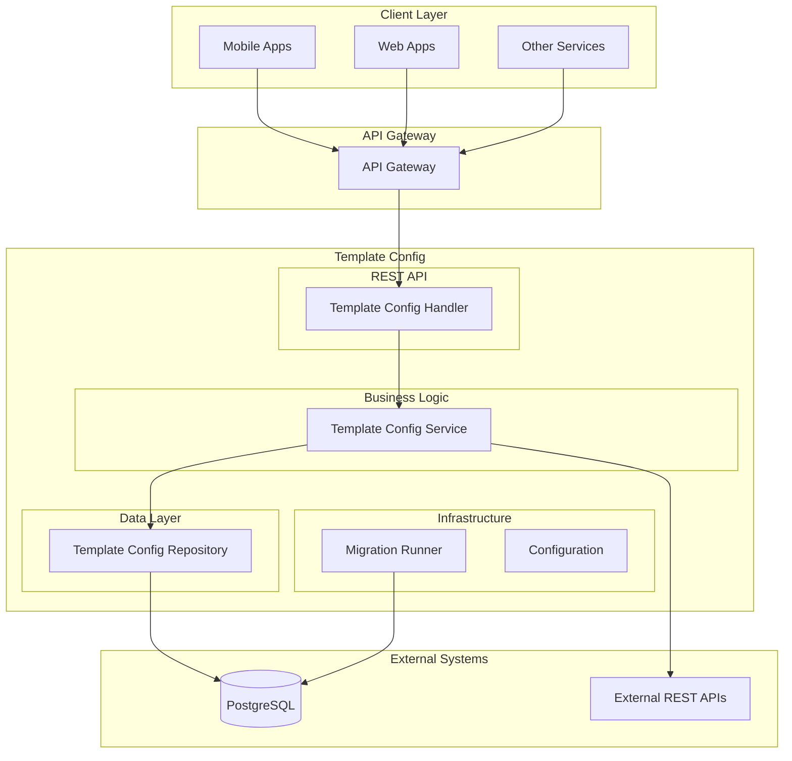
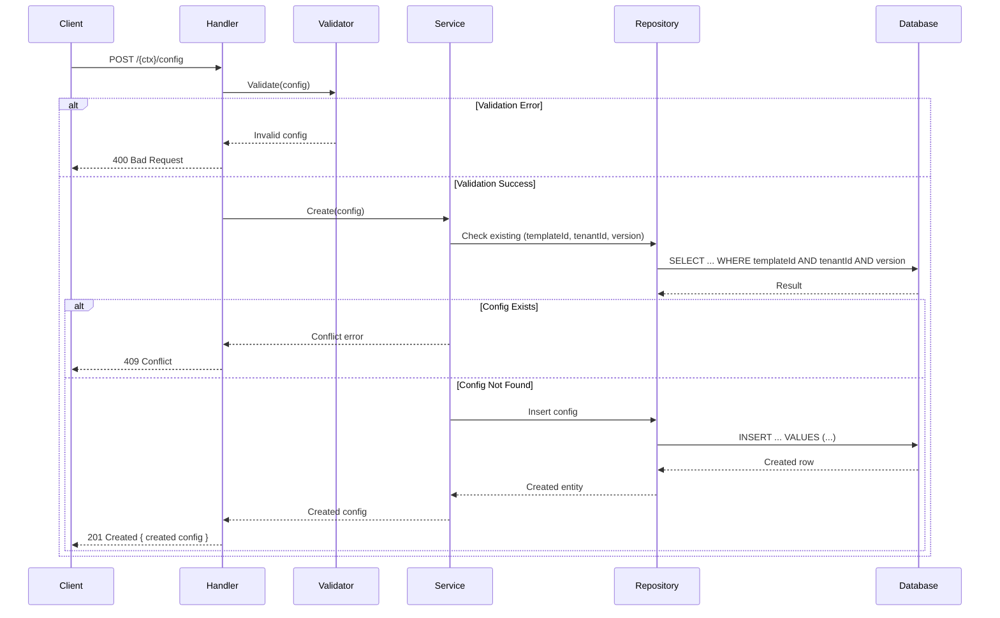
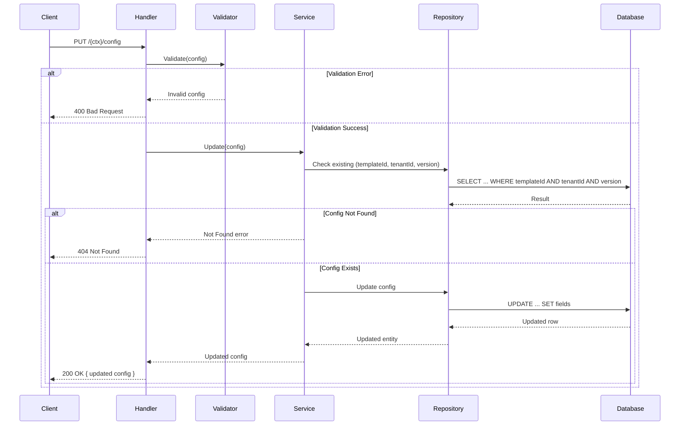
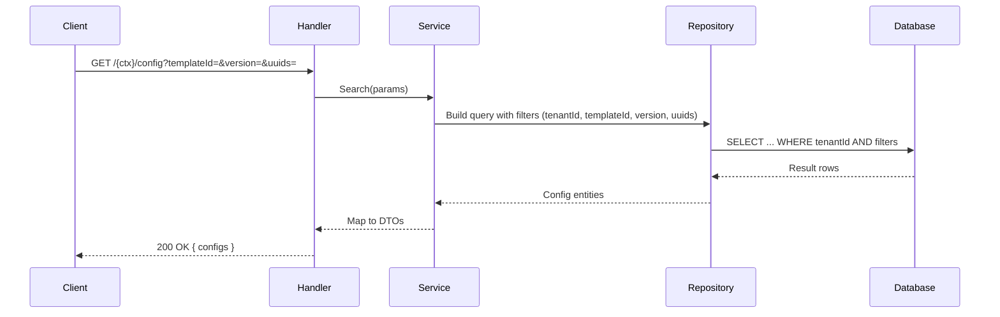
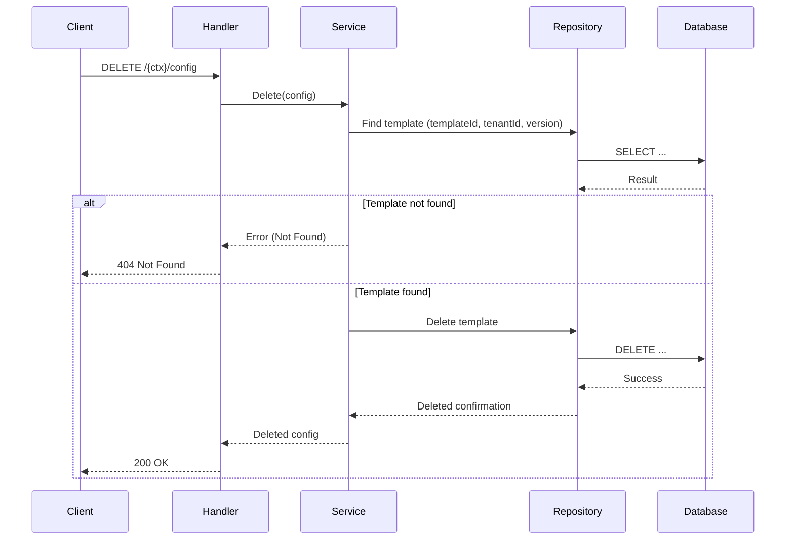
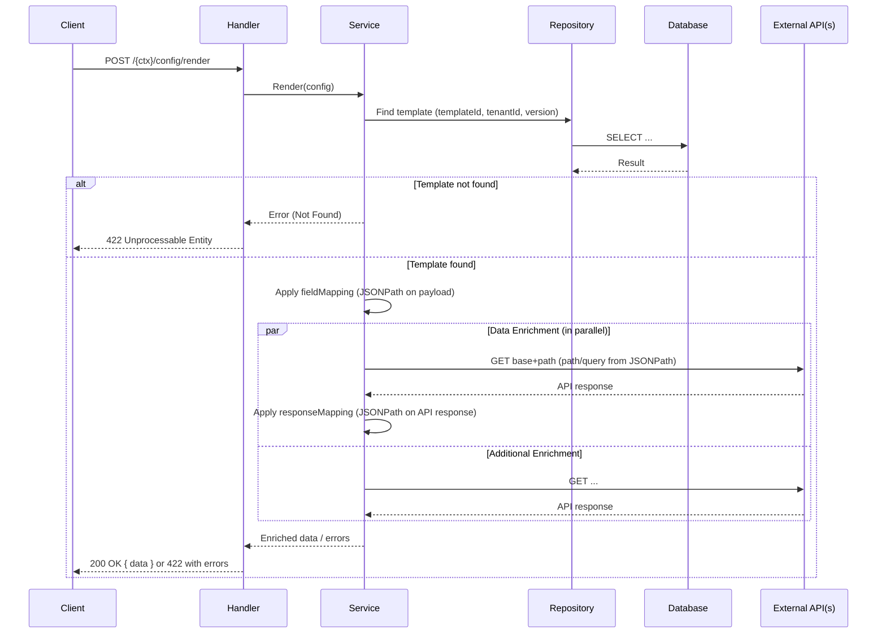

# Template Config Service (Go)

A Go-based implementation of the DIGIT template configuration service using the Gin framework. This service manages template configurations and performs payload enrichment using JSONPath mappings and external REST API lookups to return enriched data for downstream rendering.

## Overview

**Service Name:** template-config

**Purpose:** Provides multi-tenant configuration-driven enrichment of arbitrary payloads. It maps fields from an input payload using JSONPath and optionally performs parallel external API calls (GET) whose responses are mapped (via JSONPath) into the final enriched output.

**Owner/Team:** DIGIT Platform Team

## Architecture

**Tech Stack:**
- Go 1.23
- Gin Web Framework
- PostgreSQL (via GORM)
- Resty (HTTP client)
- JSONPath (`github.com/oliveagle/jsonpath`)
- Docker

**Core Responsibilities:**
- Manage template configurations (create, update, search, delete)
- JSONPath-based field extraction from request payloads
- Parallel HTTP GET enrichment with JSONPath response mapping
- Multi-tenant scoping via `X-Tenant-ID`
- Database migrations runner (idempotent, checksums)

**Dependencies:**
- PostgreSQL 15
- External REST APIs (for enrichment)

### Diagrams

#### High-level Architecture Diagram



## Features

- ✅ CRUD lifecycle for template configurations (create, update, search, delete)
- ✅ Deterministic JSONPath-based field extraction from payloads
- ✅ Parallel HTTP GET enrichment with JSONPath response mapping
- ✅ Multi-tenant support with tenant isolation via header
- ✅ Database migrations
- ✅ Clean separation across handler, service, repository layers
- ✅ Docker containerization
- ✅ Comprehensive error handling

## Installation & Setup

### Local Development (Manual Setup)

**Prerequisites:**
- Go 1.23+
- PostgreSQL 15

**Steps:**

1. Clone and setup
   ```bash
   git clone https://github.com/digitnxt/digit3.git
   cd code/services/template-config
   go mod download
   ```

2. Setup PostgreSQL database
   ```bash
   createdb template_config_db
   ```

3. Start service (migrations run automatically if enabled)
   ```bash
   go run ./cmd/server
   ```

### Docker

**Build the image:**
```bash
docker build -t template-config:latest .
```

**Run with environment variables:**
```bash
docker run -p 8080:8080 \
  -e DB_HOST=your-db-host \
  -e DB_PASSWORD=your-db-password \
  template-config:latest
```

## Configuration

### Environment Variables

| Variable | Description | Default Value | Required |
|----------|-------------|---------------|----------|
| `HTTP_PORT` | Port for REST API server | `8080` | No |
| `SERVER_CONTEXT_PATH` | Base path for API routes (without leading slash) | `template-config/v1` | No |
| `DB_HOST` | PostgreSQL database host | `localhost` | Yes |
| `DB_PORT` | PostgreSQL database port | `5432` | No |
| `DB_USER` | PostgreSQL database username | `postgres` | No |
| `DB_PASSWORD` | PostgreSQL database password | `postgres` | Yes |
| `DB_NAME` | PostgreSQL database name | `template_config_db` | No |
| `DB_SSL_MODE` | PostgreSQL SSL mode | `disable` | No |
| `MIGRATION_SCRIPT_PATH` | Path to SQL migration files | `./db/migrations` | No |
| `MIGRATION_ENABLED` | Run migrations on startup | `true` | No |
| `MIGRATION_TIMEOUT` | Migration timeout (Go duration) | `5m` | No |

### Example .env file

```bash
# Server Configuration
HTTP_PORT=8080
SERVER_CONTEXT_PATH=template-config/v1

# Database Configuration
DB_HOST=localhost
DB_PORT=5432
DB_USER=postgres
DB_PASSWORD=secure_password
DB_NAME=template_config_db
DB_SSL_MODE=disable

# Migration Configuration
MIGRATION_SCRIPT_PATH=./db/migrations
MIGRATION_ENABLED=true
MIGRATION_TIMEOUT=5m
```

## API Reference

### REST API Endpoints

#### 1. Create Template Config
- Endpoint: `POST /{SERVER_CONTEXT_PATH}/config`
- Headers: `X-Tenant-ID: {tenantId}`, `X-Client-Id: {clientId}`
- Description: Creates a new template configuration
- Request Body:
```json
{
  "templateId": "user-profile",
  "version": "1.0",
  "fieldMapping": {
    "userName": "$.user.name",
    "userEmail": "$.user.email"
  },
  "apiMapping": [
    {
      "method": "GET",
      "endpoint": {
        "base": "https://api.example.com",
        "path": "/users/{{userId}}",
        "pathParams": { "userId": "$.user.id" },
        "queryParams": { "include": "$.include" }
      },
      "responseMapping": {
        "userStatus": "$.status"
      }
    }
  ]
}
```
- Responses: `201 Created`, `400 Bad Request`, `409 Conflict`, `500 Internal Server Error`

**Sequence Diagram:**


#### 2. Update Template Config
- Endpoint: `PUT /{SERVER_CONTEXT_PATH}/config`
- Headers: `X-Tenant-ID: {tenantId}`, `X-Client-Id: {clientId}`
- Description: Updates an existing template configuration
- Request Body:
```json
{
  "id": "44f3b080-7de1-47dc-82d3-2d528d12a0f9",
  "templateId": "user-profile",
  "version": "1.0",
  "fieldMapping": {
    "userName": "$.user.name",
    "userEmail": "$.user.email"
  },
  "apiMapping": [
    {
      "method": "GET",
      "endpoint": {
        "base": "https://api.example.com",
        "path": "/users/{{userId}}",
        "pathParams": { "userId": "$.user.id" },
        "queryParams": { "include": "$.include" }
      },
      "responseMapping": {
        "userStatus": "$.status"
      }
    }
  ]
}
```
- Responses: `200 OK`, `400 Bad Request`, `404 Not Found`, `500 Internal Server Error`

**Sequence Diagram:**


#### 3. Search Template Configs
- Endpoint: `GET /{SERVER_CONTEXT_PATH}/config`
- Headers: `X-Tenant-ID: {tenantId}`
- Query Parameters: `templateId`, `version`, `uuids`
- Description: Searches for template configurations
- Responses: `200 OK`, `400 Bad Request`, `500 Internal Server Error`

**Sequence Diagram:**


#### 4. Delete Template Config
- Endpoint: `DELETE /{SERVER_CONTEXT_PATH}/config`
- Headers: `X-Tenant-ID: {tenantId}`
- Query Parameters: `templateId` (required), `version` (required)
- Description: Deletes a template configuration
- Responses: `200 OK`, `400 Bad Request`, `404 Not Found`, `500 Internal Server Error`

**Sequence Diagram:**


#### 5. Render (Enrich) Payload
- Endpoint: `POST /{SERVER_CONTEXT_PATH}/render`
- Headers: `X-Tenant-ID: {tenantId}`
- Description: Applies field mappings and enrichment API calls to return enriched data
- Request Body:
```json
{
  "templateId": "user-profile",
  "version": "1.0",
  "payload": {
    "user": { "id": "123", "name": "John Doe", "email": "john@example.com" },
    "include": "details"
  }
}
```
- Success `200 OK`:
```json
{
  "templateId": "user-profile",
  "tenantId": "tenant1",
  "version": "1.0",
  "data": {
    "userName": "John Doe",
    "userEmail": "john@example.com",
    "userStatus": "ACTIVE"
  }
}
```
- Error `422 Unprocessable Entity` (partial/failed enrichment):
```json
[
  {
    "code": "API_CALL_FAILED",
    "message": "External API call failed",
    "description": "HTTP 500: ...",
    "params": ["https://api.example.com/users/123", "GET"]
  }
]
```
**Sequence Diagram:**


### Error Codes

| HTTP Status | Error Code | Description |
|-------------|------------|-----------|
| 400 | BAD_REQUEST | Invalid request parameters/body |
| 401 | UNAUTHORIZED | Authentication required (via gateway) |
| 403 | FORBIDDEN | Insufficient permissions (via gateway) |
| 404 | NOT_FOUND | Resource not found |
| 409 | CONFLICT | Resource already exists |
| 422 | UNPROCESSABLE_ENTITY | Enrichment failed/validation errors |
| 500 | INTERNAL_SERVER_ERROR | Server error |

## Project Structure

```
template-config/
├── cmd/server/                  # Application entrypoint
├── internal/                    # Private application code
│   ├── config/                  # Env config
│   ├── db/                      # Postgres connection
│   ├── handlers/                # HTTP handlers
│   ├── migration/               # Migration runner
│   ├── models/                  # API & DB models
│   ├── repository/              # Data access layer
│   ├── routes/                  # Route definitions
│   └── service/                 # Business logic
├── db/migrations/               # SQL migration files
├── go.mod                       # Go module definition
└── go.sum                       # Checksums
```

## References

TBD

### Support Channels

TBD

---
**Last Updated:** September 2025
**Version:** 1.0.0
**Maintainer:** DIGIT Platform Team