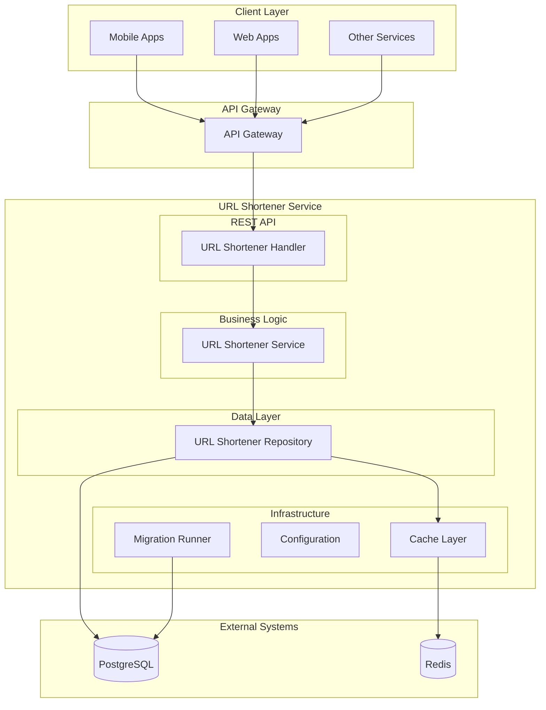
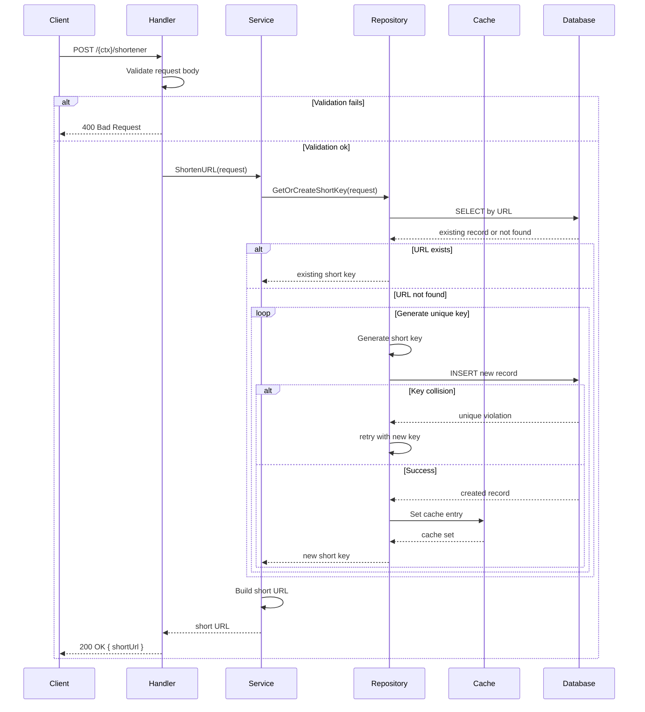
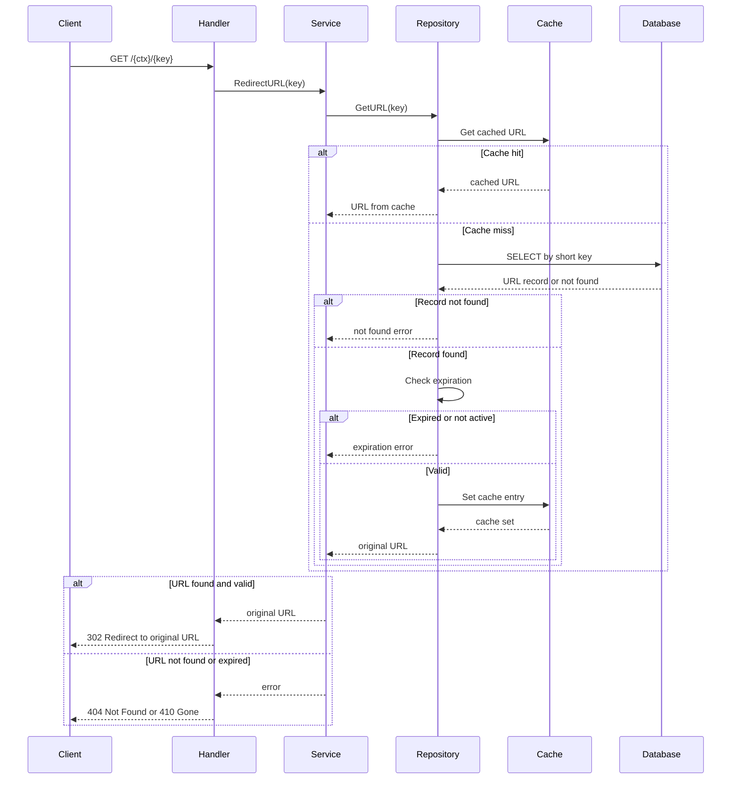

# URL Shortener Service (Go)

A Go-based DIGIT service for URL shortening with caching support, expiration handling, and high-performance redirect capabilities. It provides a REST API for creating short URLs and handles redirects with configurable caching backends.

## Overview

**Service Name:** url-shortener

**Purpose:** Provides URL shortening services with configurable caching, expiration support, and high-performance redirect handling for DIGIT applications.

**Owner/Team:** DIGIT Platform Team

## Architecture

**Tech Stack:**
- Go 1.23
- Gin Web Framework
- PostgreSQL (via GORM)
- Redis/In-Memory caching
- Docker

**Core Responsibilities:**
- Generate short URLs from long URLs using configurable key length
- Handle URL redirects with high performance
- Support URL expiration (valid from/till timestamps)
- Provide configurable caching (Redis, in-memory, or disabled)
- Prevent duplicate URLs by returning existing short keys
- Handle key collision resolution with retry logic

**Dependencies:**
- PostgreSQL 15
- Redis 6+ (optional, for caching)
- Docker (for containerization)

### Diagrams

#### High-level Architecture Diagram



## Features

- ✅ URL shortening with configurable key length
- ✅ High-performance URL redirects
- ✅ URL expiration support (valid from/till)
- ✅ Duplicate URL prevention (returns existing short key)
- ✅ Configurable caching (Redis, in-memory, or disabled)
- ✅ Key collision resolution with retry logic
- ✅ Base62 encoding for short keys
- ✅ Database migrations with rollback support
- ✅ Docker containerization
- ✅ Comprehensive error handling

## Installation & Setup

### Local Development (Manual Setup)

**Prerequisites:**
- Go 1.23+
- PostgreSQL 15
- Redis 6+ (optional)

**Steps:**
1. Clone and setup
   ```bash
   git clone https://github.com/digitnxt/digit3.git
   cd code/services/url-shortener
   go mod download
   ```

2. Setup PostgreSQL database
   ```bash
   createdb url_shortener_db
   ```

3. Start service (migrations run automatically if enabled)
   ```bash
   go run ./cmd/server
   ```

### Docker

**Build the image:**
```bash
docker build -t url-shortener:latest .
```

**Run with environment variables:**
```bash
docker run -p 8080:8080 \
  -e DB_HOST=your-db-host \
  -e DB_PASSWORD=your-db-password \
  -e CACHE_ENABLED=true \
  -e CACHE_TYPE=redis \
  -e REDIS_ADDR=your-redis-host:6379 \
  url-shortener:latest
```

## Configuration

### Environment Variables

| Variable | Description | Default | Required |
|----------|-------------|---------|----------|
| `HTTP_PORT` | Port for REST API server | `8080` | No |
| `SERVER_CONTEXT_PATH` | Base path for API routes | `/url-shortener` | No |
| `DB_HOST` | PostgreSQL host | `localhost` | Yes |
| `DB_PORT` | PostgreSQL port | `5432` | No |
| `DB_USER` | PostgreSQL username | `postgres` | No |
| `DB_PASSWORD` | PostgreSQL password | `postgres` | Yes |
| `DB_NAME` | PostgreSQL database | `url_shortener_db` | No |
| `DB_SSL_MODE` | PostgreSQL SSL mode | `disable` | No |
| `MIGRATION_SCRIPT_PATH` | Path to SQL migrations | `./db/migrations` | No |
| `MIGRATION_ENABLED` | Run migrations on startup | `false` | No |
| `MIGRATION_TIMEOUT` | Migration timeout (Go duration) | `5m` | No |
| `CACHE_ENABLED` | Enable caching | `false` | No |
| `CACHE_TYPE` | Cache type (`redis`, `inmemory`) | `redis` | No |
| `CACHE_TTL` | Cache TTL duration | `24h` | No |
| `REDIS_ADDR` | Redis address | `localhost:6379` | If Redis |
| `REDIS_PASSWORD` | Redis password | `` | If Redis |
| `REDIS_DB` | Redis DB index | `0` | If Redis |
| `SHORT_KEY_MIN_LENGTH` | Minimum short key length | `4` | No |
| `MAX_SHORT_KEY_RETRIES` | Max retries for key generation | `10` | No |
| `HOST_NAME` | Base hostname for short URLs | `http://localhost:8080` | Yes |

### Example .env file

```bash
HTTP_PORT=8080
SERVER_CONTEXT_PATH=/url-shortener

DB_HOST=localhost
DB_PORT=5432
DB_USER=postgres
DB_PASSWORD=secure_password
DB_NAME=url_shortener_db
DB_SSL_MODE=disable

MIGRATION_SCRIPT_PATH=./db/migrations
MIGRATION_ENABLED=true
MIGRATION_TIMEOUT=5m

CACHE_ENABLED=true
CACHE_TYPE=redis
CACHE_TTL=24h
REDIS_ADDR=localhost:6379
REDIS_PASSWORD=
REDIS_DB=0

SHORT_KEY_MIN_LENGTH=4
MAX_SHORT_KEY_RETRIES=10
HOST_NAME=http://localhost:8080
```

## API Reference

Base path is `SERVER_CONTEXT_PATH` (default `/url-shortener`).

### URL Shortening

#### 1) Shorten URL
- Endpoint: `POST /{ctx}/shortener`
- Description: Creates a short URL from a long URL
- Request Body:
```json
{
  "url": "https://example.com/very/long/url/path",
  "validFrom": 1640995200,
  "validTill": 1672531200
}
```
- Responses: `200 OK`, `400 Bad Request`, `500 Internal Server Error`

**Sequence Diagram:**


### URL Redirection

#### 2) Redirect URL
- Endpoint: `GET /{ctx}/{key}`
- Description: Redirects to the original URL using short key
- Responses: `302 Temporary Redirect`, `404 Not Found`, `410 Gone` (expired)

**Sequence Diagram:**


### Error Codes

| HTTP Status | Error Code | Description |
|-------------|------------|-------------|
| 400 | BAD_REQUEST | Invalid request parameters/body |
| 401 | UNAUTHORIZED | Authentication required (via gateway) |
| 403 | FORBIDDEN | Insufficient permissions (via gateway) |
| 404 | NOT_FOUND | Short key not found |
| 410 | GONE | URL expired or not yet active |
| 500 | INTERNAL_ERROR | Server error |
```

## Project Structure

```
url-shortener/
├── cmd/server/                  # Application entrypoint
├── db/migrations/               # SQL migration files
├── internal/                    # Private application code
│   ├── cache/                   # Cache interface and implementations (redis, in-memory, noop)
│   ├── config/                  # Environment configuration loader
│   ├── db/                      # Postgres connection setup
│   ├── handlers/                # HTTP handlers
│   ├── migration/               # Migration runner and config
│   ├── models/                  # API & DB models
│   ├── repository/              # Data access layer
│   ├── routes/                  # Route definitions
│   └── service/                 # Business logic
├── Dockerfile                   # Docker image definition
├── go.mod                       # Go module definition
├── go.sum                       # Go module checksums
└── url-shortener.postman_collection.json
```

## References

TBD

### Support Channels

TBD

---

**Last Updated:** September 2025
**Version:** 1.0.0
**Maintainer:** DIGIT Platform Team
