# Workflow Service (Go)

A Go-based implementation of the DIGIT workflow service using the Gin framework. This service provides stateful workflow management, process definitions, and automated state transitions for applications.

## Overview

**Service Name:** workflow-go

**Purpose:** Provides multi-tenant, stateful workflow management services for DIGIT applications with process definitions, state transitions, and automated escalation capabilities.

**Owner/Team:** DIGIT Platform Team

## Architecture

**Tech Stack:**
- Go 1.24
- Gin Web Framework
- PostgreSQL (via GORM and pgx)
- Protocol Buffers (gRPC ready)
- Docker

**Core Responsibilities:**
- Define and manage workflow processes with states and actions
- Track process instances as they move through workflow states
- Enforce business rules and guard conditions at state transitions
- Support parallel workflow execution with branch coordination
- Provide auto-escalation capabilities based on SLA breaches
- Multi-tenant support for different organizations
- REST API interface for workflow operations

**Dependencies:**
- PostgreSQL 15
- UUID extension for PostgreSQL

### Diagrams

#### High-level Architecture Diagram

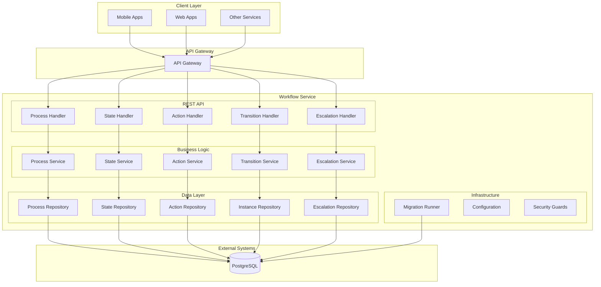

## Features

- ✅ Define and manage workflow processes with states and actions
- ✅ Multi-tenant support with tenant isolation
- ✅ Stateful process instance tracking
- ✅ Guard condition enforcement (attribute validation, assignee checks)
- ✅ Parallel workflow execution with branch coordination
- ✅ Auto-escalation based on SLA breaches
- ✅ Clean architecture with separation of concerns
- ✅ REST API with JSON responses
- ✅ Database migrations with rollback support
- ✅ Comprehensive audit trail
- ✅ Docker containerization
- ✅ Multi-step process orchestration

## Installation & Setup

### Local Development (Manual Setup)

**Prerequisites:**
- Go 1.24+
- PostgreSQL 15 with UUID extension

**Steps:**

1. Clone and setup
   ```bash
   git clone https://github.com/yourusername/workflow-go.git
   cd workflow-go
   go mod download
   ```

2. Setup PostgreSQL database
   ```bash
   createdb workflow
   psql workflow -c "CREATE EXTENSION IF NOT EXISTS \"uuid-ossp\";"
   ```

3. Run migrations
   ```bash
   go run ./cmd/server --migrate
   ```

4. Start service
   ```bash
   go run ./cmd/server
   ```

### Docker Production Setup

**Build the image:**
```bash
docker build -t workflow-go:latest .
```

**Run with environment variables:**
```bash
docker run -p 8081:8081 \
  -e DB_HOST=your-db-host \
  -e DB_PASSWORD=your-db-password \
  workflow-go:latest
```

## Configuration

### Environment Variables

| Variable | Description | Default Value | Required |
|----------|-------------|---------------|----------|
| `SERVER_PORT` | Port for REST API server | `8081` | No |
| `DB_HOST` | PostgreSQL database host | `localhost` | Yes |
| `DB_PORT` | PostgreSQL database port | `5432` | No |
| `DB_USER` | PostgreSQL database username | `postgres` | No |
| `DB_PASSWORD` | PostgreSQL database password | `postgres` | Yes |
| `DB_NAME` | PostgreSQL database name | `postgres` | No |
| `RUN_MIGRATIONS` | Whether to run migrations on startup | `true` | No |
| `MIGRATION_PATH` | Path to migration files | `db/migration` | No |
| `MIGRATION_TIMEOUT` | Migration timeout duration | `5m` | No |

### Example .env file

```bash
# Server Configuration
SERVER_PORT=8081

# Database Configuration
DB_HOST=localhost
DB_PORT=5432
DB_USER=postgres
DB_PASSWORD=secure_password
DB_NAME=workflow

# Migration Configuration
RUN_MIGRATIONS=true
MIGRATION_PATH=db/migration
MIGRATION_TIMEOUT=5m
```

## API Reference

### REST API Endpoints

#### 1. Create Process
- **Endpoint**: `POST /workflow/v3/process`
- **Description**: Creates a new workflow process definition
- **Headers**: `X-Tenant-ID: {tenantId}`
- **Request Body**:
```json
{
  "name": "Application Review Process",
  "code": "APP_REVIEW",
  "description": "Process for reviewing applications",
  "version": "1.0",
  "sla": 1440
}
```
- **Response**: `201 Created` with created process

**Sequence Diagram:**

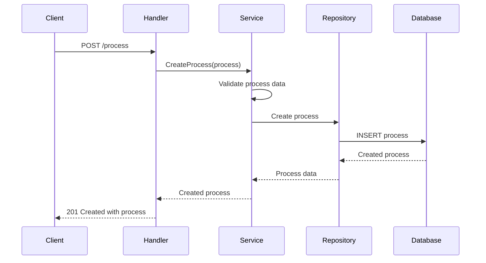

#### 2. Get Process Definitions
- **Endpoint**: `GET /workflow/v3/process/definition`
- **Description**: Retrieves process definitions with states and actions
- **Query Parameters**:
  - `id` (optional, array)
  - `name` (optional, array)
- **Response**: `200 OK` with process definitions

**Sequence Diagram:**

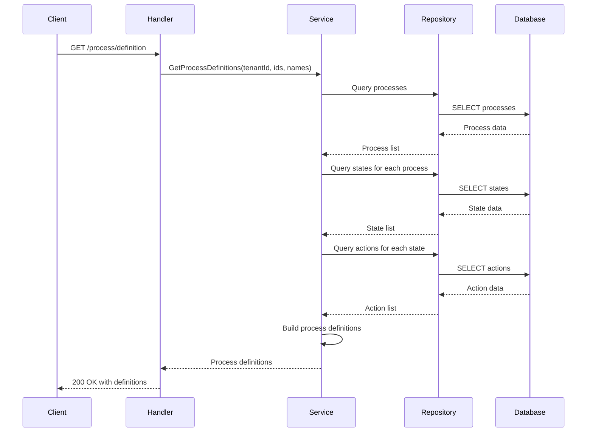

#### 3. Create State
- **Endpoint**: `POST /workflow/v3/process/{processId}/state`
- **Description**: Creates a new state within a process
- **Headers**: `X-Tenant-ID: {tenantId}`
- **Request Body**:
```json
{
  "code": "SUBMITTED",
  "name": "Application Submitted",
  "description": "Application has been submitted for review",
  "processId": "process-uuid",
  "sla": 60,
  "isInitial": true
}
```
- **Response**: `201 Created` with created state

**Sequence Diagram:**

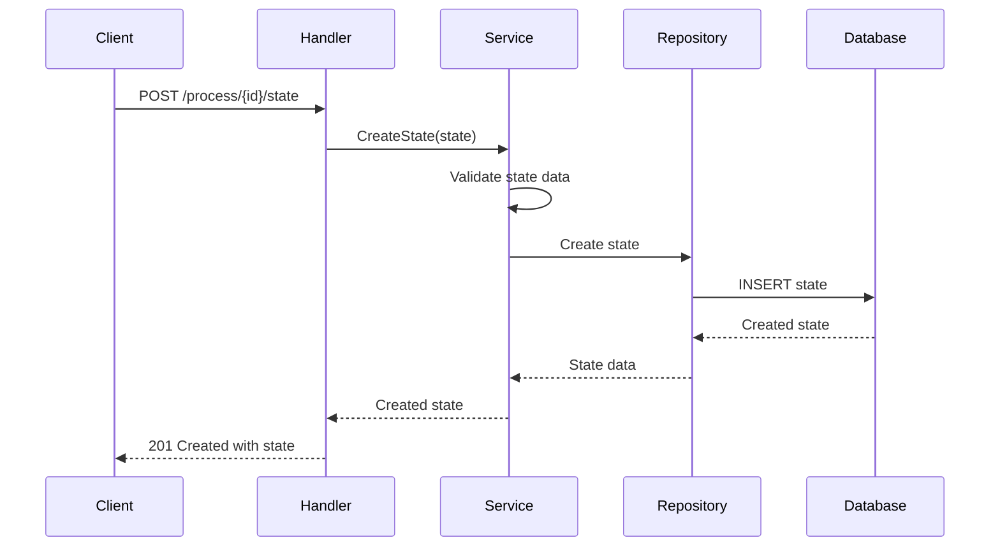

#### 4. Create Action
- **Endpoint**: `POST /workflow/v3/state/{stateId}/action`
- **Description**: Creates a new action/transition between states
- **Headers**: `X-Tenant-ID: {tenantId}`
- **Request Body**:
```json
{
  "name": "APPROVE",
  "label": "Approve Application",
  "currentState": "state-uuid-1",
  "nextState": "state-uuid-2",
  "attributeValidation": {
    "attributes": {
      "role": ["REVIEWER", "ADMIN"],
      "department": ["IT", "HR"]
    },
    "assigneeCheck": true
  }
}
```
- **Response**: `201 Created` with created action

**Sequence Diagram:**

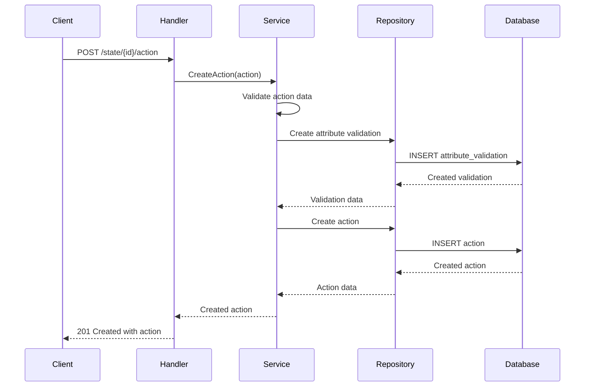

#### 5. Process Transition
- **Endpoint**: `POST /workflow/v3/transition`
- **Description**: Transitions a process instance to the next state
- **Headers**: `X-Tenant-ID: {tenantId}`
- **Request Body**:
```json
{
  "processId": "process-uuid",
  "entityId": "application-123",
  "action": "APPROVE",
  "comment": "Application approved by reviewer",
  "assigner": "user-123",
  "assignees": ["user-456"],
  "attributes": {
    "role": ["REVIEWER"],
    "department": ["IT"]
  }
}
```
- **Response**: `202 Accepted` with updated process instance

**Sequence Diagram:**

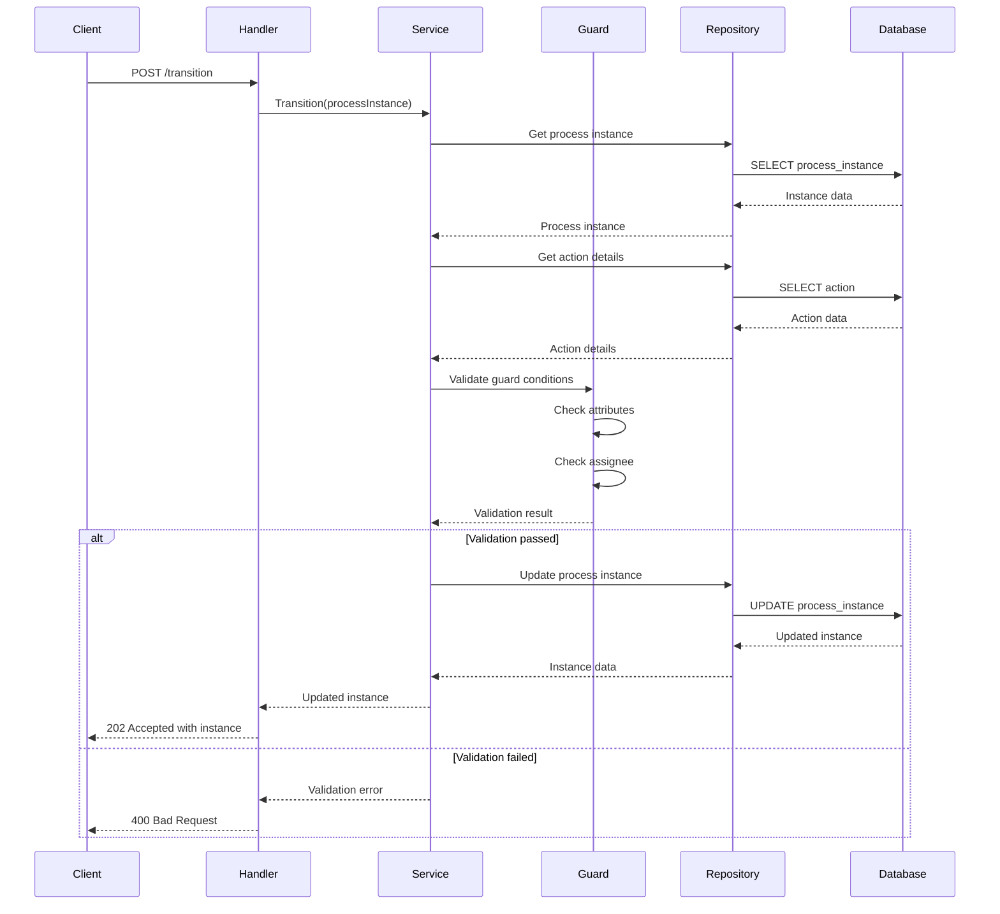

#### 6. Auto-Escalation
- **Endpoint**: `POST /workflow/v3/auto/{processCode}/_escalate`
- **Description**: Escalates process instances based on SLA breaches
- **Headers**: `X-Tenant-ID: {tenantId}`
- **Request Body**:
```json
{
  "attributes": {
    "role": ["ADMIN"],
    "department": ["IT"]
  }
}
```
- **Response**: `200 OK` with escalation results

**Sequence Diagram:**

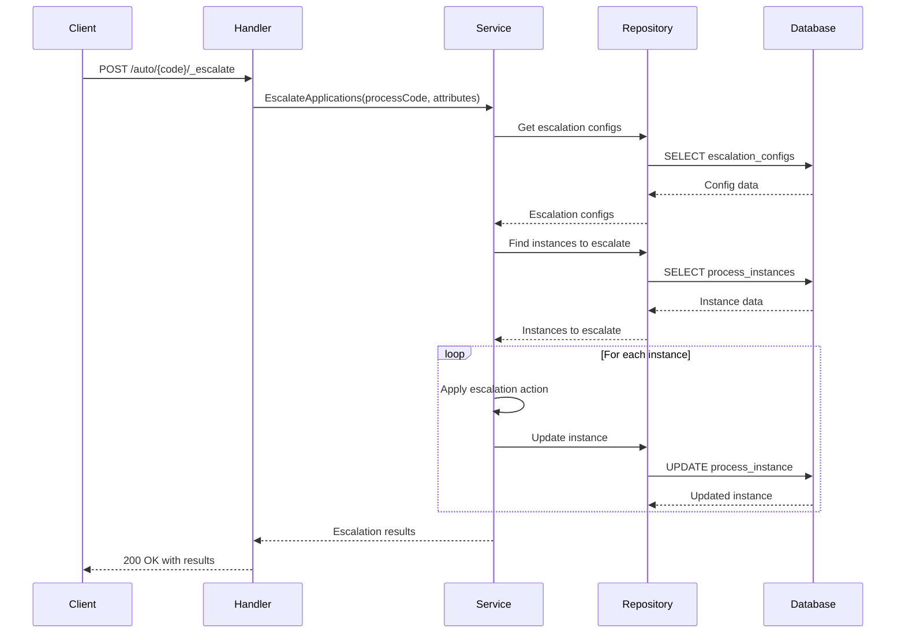

### Error Codes

| HTTP Status | Error Code | Description |
|-------------|------------|-----------|
| 400 | BAD_REQUEST | Invalid request parameters |
| 401 | UNAUTHORIZED | Authentication required |
| 403 | FORBIDDEN | Insufficient permissions |
| 404 | NOT_FOUND | Resource not found |
| 409 | CONFLICT | Resource already exists |
| 422 | UNPROCESSABLE_ENTITY | Validation failed |
| 500 | INTERNAL_SERVER_ERROR | Server error |

## Observability

### Logging

**Format:** JSON structured logging with request correlation IDs

**Framework:** Standard Go log with context support

**Log Levels:** DEBUG, INFO, WARN, ERROR

**Example Log:**
```json
{
  "level": "INFO",
  "timestamp": "2024-01-15T10:30:45Z",
  "request_id": "req-123456",
  "tenant_id": "DEFAULT",
  "method": "POST",
  "path": "/workflow/v3/transition",
  "duration_ms": 120,
  "status_code": 202
}
```

### Metrics

**Framework:** Prometheus metrics exposed on `/metrics` endpoint

**Key Metrics:**
- `http_requests_total{path, method, status}` - Total HTTP requests
- `http_request_duration_seconds{path, method}` - Request duration histogram
- `db_connections_active` - Active database connections
- `process_instances_created_total` - Total process instances created
- `transitions_completed_total` - Total state transitions completed
- `escalations_triggered_total` - Total escalations triggered

### Tracing

**Framework:** OpenTelemetry with Jaeger integration

**Configuration:**
```bash
export OTEL_TRACES_EXPORTER=jaeger
export OTEL_EXPORTER_JAEGER_ENDPOINT=http://localhost:14268/api/traces
```

**Trace Context:** Automatic trace propagation with W3C trace context headers

## Operations

### Health Checks

#### REST Health Check
- **Endpoint**: `GET /health`
- **Response**: `200 OK` with service status

#### Ready Check
- **Endpoint**: `GET /ready`
- **Response**: `200 OK` when service is ready to accept traffic

### Scaling Guidelines

**Resource Requirements:**
- **CPU:** 0.5-1 core per 1000 RPS
- **Memory:** 512MB base + 100MB per 1000 active instances
- **Storage:** 1GB per 100k process instances

**Recommended Replicas:** 2-3 for production

**Horizontal Scaling:** Stateless design supports horizontal scaling

### Database Operations

#### Running Migrations
```bash
# Automatic (on startup)
go run ./cmd/server

# Manual migration
go run ./internal/migration --path ./db/migration
```

#### Backup Strategy
```bash
# PostgreSQL backup
pg_dump workflow > backup.sql

# Restore
psql workflow < backup.sql
```

#### Connection Pool Settings
- Max Open Connections: 25
- Max Idle Connections: 10
- Connection Max Lifetime: 5 minutes

### Workflow Operations

#### Process Instance Management
```bash
# Get process instances for an entity
curl -H "X-Tenant-ID: DEFAULT" \
  "http://localhost:8081/workflow/v3/transition?entityId=app-123"

# Transition a process instance
curl -X POST -H "X-Tenant-ID: DEFAULT" \
  -H "Content-Type: application/json" \
  -d '{"processId":"proc-123","entityId":"app-123","action":"APPROVE"}' \
  "http://localhost:8081/workflow/v3/transition"
```

#### Escalation Management
```bash
# Trigger auto-escalation
curl -X POST -H "X-Tenant-ID: DEFAULT" \
  -H "Content-Type: application/json" \
  -d '{"attributes":{"role":["ADMIN"]}}' \
  "http://localhost:8081/workflow/v3/auto/APP_REVIEW/_escalate"

# Search escalated applications
curl -H "X-Tenant-ID: DEFAULT" \
  "http://localhost:8081/workflow/v3/auto/_search?processId=proc-123"
```

## Testing

### Running Tests

**All Tests:**
```bash
go test ./...
```

**Unit Tests Only:**
```bash
go test ./internal/...
```

**Integration Tests Only:**
```bash
go test ./tests/...
```

**With Coverage:**
```bash
go test -coverprofile=coverage.out ./...
go tool cover -html=coverage.out
```

**With Verbose Output:**
```bash
go test -v ./...
```

### Test Structure

#### Unit Tests
Located in the same package with `_test.go` suffix:
- `internal/service/process_service_test.go` - Business logic tests
- `internal/repository/postgres/process_repository_test.go` - Database layer tests
- `internal/security/attribute_guard_test.go` - Security layer tests
- `api/handlers/process_handler_test.go` - HTTP handler tests

#### Integration Tests
End-to-end tests in `tests/` directory:
- `tests/integration_test.go` - Complete API flow tests

### Test Dependencies

- **Testify:** `github.com/stretchr/testify` - Assertions and mocks
- **SQLMock:** `github.com/DATA-DOG/go-sqlmock` - Database mocking
- **SQLite:** `github.com/mattn/go-sqlite3` - In-memory database for integration tests

### Mock Setup

```go
// Database mock example
db, mock, err := sqlmock.New()
defer db.Close()

mock.ExpectQuery("SELECT (.+) FROM processes").
    WithArgs(tenantID, processID).
    WillReturnRows(rows)

// Service test
service := services.NewProcessService(repo)
process, err := service.GetProcessByID(ctx, tenantID, processID)
```

## Project Structure

```
workflow/
├── api/                          # API layer
│   ├── handlers/                # HTTP handlers
│   └── routes.go                # Route definitions
├── cmd/server/                  # Application entrypoint
├── config/                      # Configuration management
├── db/migration/                # SQL migration files
├── internal/                    # Private application code
│   ├── migration/               # Migration runner
│   ├── models/                  # Domain models
│   ├── repository/              # Data access layer
│   │   └── postgres/           # PostgreSQL implementations
│   ├── security/               # Security and validation
│   └── service/                # Business logic
├── docker-compose.yml           # Docker compose configuration
├── Dockerfile                   # Docker image definition
├── go.mod                       # Go module definition
└── go.sum                       # Go module checksums
```

## Release & Deployment

### Branching Strategy

**Git Flow:**
- `master` - Production releases
- `develop` - Development integration

### CI/CD Pipeline

TBD

### Versioning

TBD

### Deployment

**Docker Compose (Development):**
```yaml
version: '3.8'
services:
  workflow-go:
    build: .
    ports:
      - "8081:8081"
    environment:
      - DB_HOST=postgres
    depends_on:
      - postgres
  
  postgres:
    image: postgres:15
    environment:
      - POSTGRES_DB=workflow
      - POSTGRES_PASSWORD=password
    volumes:
      - postgres_data:/var/lib/postgresql/data

volumes:
  postgres_data:
```

**Kubernetes (Production):**
```yaml
# k8s/deployment.yaml
apiVersion: apps/v1
kind: Deployment
metadata:
  name: workflow-go
spec:
  replicas: 3
  selector:
    matchLabels:
      app: workflow-go
  template:
    metadata:
      labels:
        app: workflow-go
    spec:
      containers:
      - name: workflow-go
        image: workflow-go:latest
        ports:
        - containerPort: 8081
        env:
        - name: DB_HOST
          valueFrom:
            secretKeyRef:
              name: db-secret
              key: host
        livenessProbe:
          httpGet:
            path: /health
            port: 8081
          initialDelaySeconds: 30
          periodSeconds: 10
```

## Troubleshooting

### Common Issues

#### Database Connection Issues

**Error:** `could not connect to the database`

**Solutions:**
1. Verify PostgreSQL is running
2. Check connection string
3. Verify database exists
4. Check firewall settings

**Debug:**
```bash
# Test database connection
psql -h localhost -U postgres -d workflow
```

#### Migration Issues

**Error:** `migration failed`

**Solutions:**
1. Check migration files syntax
2. Verify database permissions
3. Check for conflicting migrations
4. Review migration logs

**Debug:**
```bash
# Check migration status
psql workflow -c "SELECT * FROM schema_migrations;"
```

#### Guard Validation Failures

**Error:** `guard validation failed`

**Causes:**
- Missing required attributes
- Invalid assignee
- Role mismatch

**Solutions:**
1. Check attribute validation rules
2. Verify user roles and permissions
3. Review assignee configuration
4. Check guard condition logic

### Debug Mode

**Enable Debug Logging:**
```bash
export LOG_LEVEL=debug
go run ./cmd/server
```

**Enable SQL Query Logging:**
```bash
// In configuration
DB_DEBUG=true
```

### Monitoring Queries

**Database Performance:**
```sql
-- Slow queries
SELECT * FROM pg_stat_statements 
ORDER BY total_time DESC 
LIMIT 10;

-- Connection count
SELECT count(*) FROM pg_stat_activity;

-- Process instance statistics
SELECT status, count(*) FROM process_instances GROUP BY status;
```

### Log Analysis

**Common Log Patterns:**
```bash
# Search for errors
grep "ERROR" application.log

# Find slow requests
grep "duration_ms" application.log | sort -k3 -n

# Analyze by endpoint
grep "/workflow/v3/transition" application.log | head -20
```

## FAQ

### Technical Questions

**Q: How do I create a parallel workflow?**
A: Set `isParallel: true` on the state that should create branches, and `isJoin: true` on the state where branches merge. Use `branchStates` to define the parallel branch state codes.

**Q: How do I configure auto-escalation?**
A: Create escalation configurations for specific process states with SLA thresholds and escalation actions.

**Q: What's the maximum number of states per process?**
A: There's no hard limit, but performance may degrade with very complex workflows (100+ states).

### Operational Questions

**Q: How do I backup the data?**
A: Use PostgreSQL pg_dump for database backup. Process instances contain the complete workflow state.

**Q: Can I run multiple instances?**
A: Yes, the service is stateless and supports horizontal scaling.

**Q: How do I monitor workflow performance?**
A: Use the /health endpoint, Prometheus metrics, and application logs to monitor workflow execution.

## References

TBD

### Support Channels

TBD

---

**Last Updated:** January 2025
**Version:** 3.0.0
**Maintainer:** DIGIT Platform Team

#### 7. Get Processes
- **Endpoint**: `GET /workflow/v3/process`
- **Description**: Retrieves a list of processes with optional filtering
- **Query Parameters**:
  - `id` (optional, array)
  - `name` (optional, array)
- **Response**: `200 OK` with list of processes

**Sequence Diagram:**

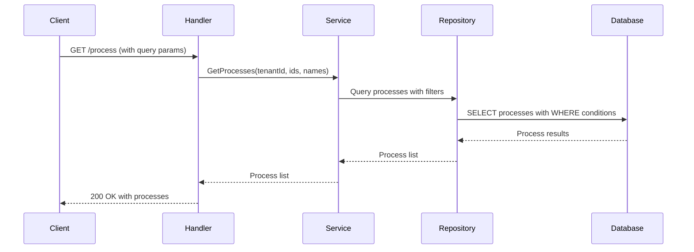

#### 8. Get Process by ID
- **Endpoint**: `GET /workflow/v3/process/{id}`
- **Description**: Retrieves a specific process by its ID
- **Response**: `200 OK` with process details

**Sequence Diagram:**

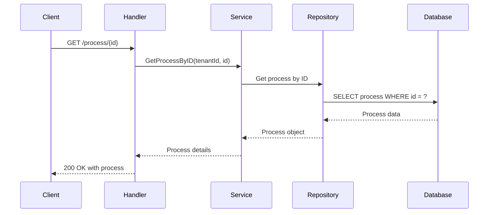

#### 9. Update Process
- **Endpoint**: `PUT /workflow/v3/process/{id}`
- **Description**: Updates an existing process
- **Headers**: `X-Tenant-ID: {tenantId}`
- **Request Body**: Process object with updated fields
- **Response**: `200 OK` with updated process

**Sequence Diagram:**

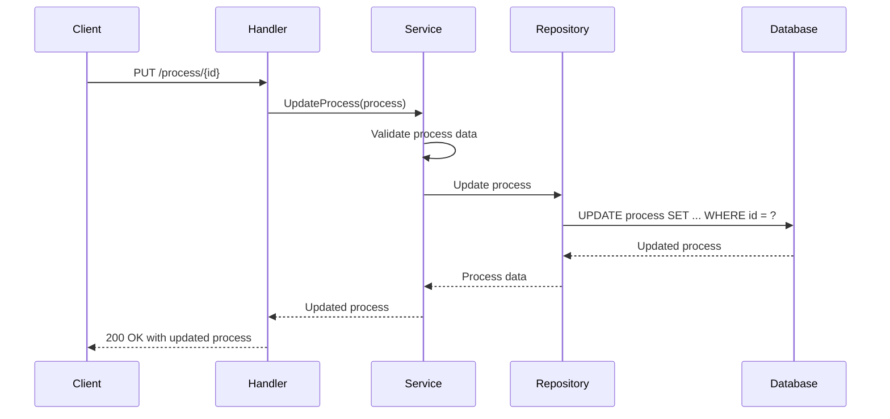

#### 10. Delete Process
- **Endpoint**: `DELETE /workflow/v3/process/{id}`
- **Description**: Deletes a process and its associated states/actions
- **Response**: `204 No Content`

**Sequence Diagram:**

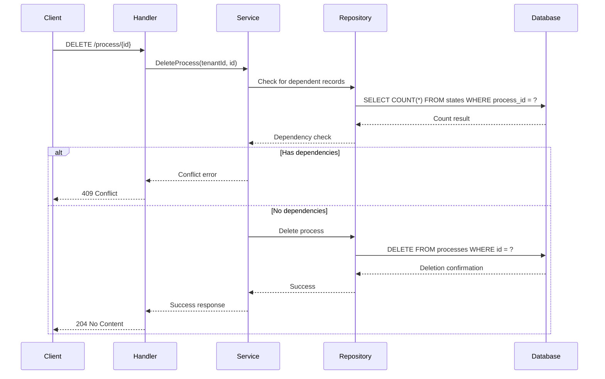

#### 11. Get States
- **Endpoint**: `GET /workflow/v3/process/{processId}/state`
- **Description**: Retrieves all states for a specific process
- **Response**: `200 OK` with list of states

**Sequence Diagram:**

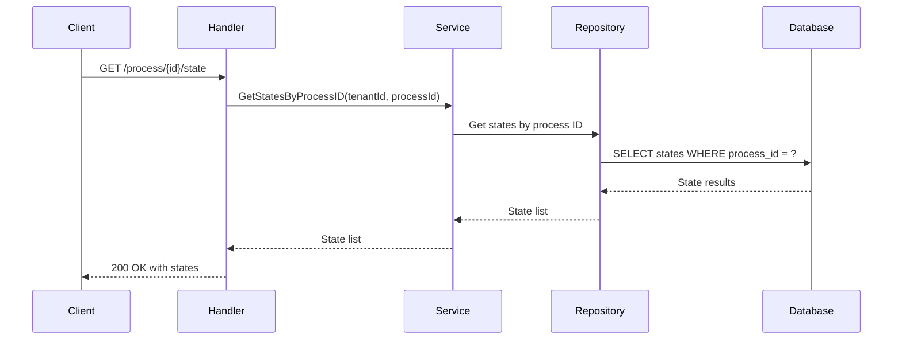

#### 12. Get State by ID
- **Endpoint**: `GET /workflow/v3/state/{id}`
- **Description**: Retrieves a specific state by its ID
- **Response**: `200 OK` with state details

**Sequence Diagram:**

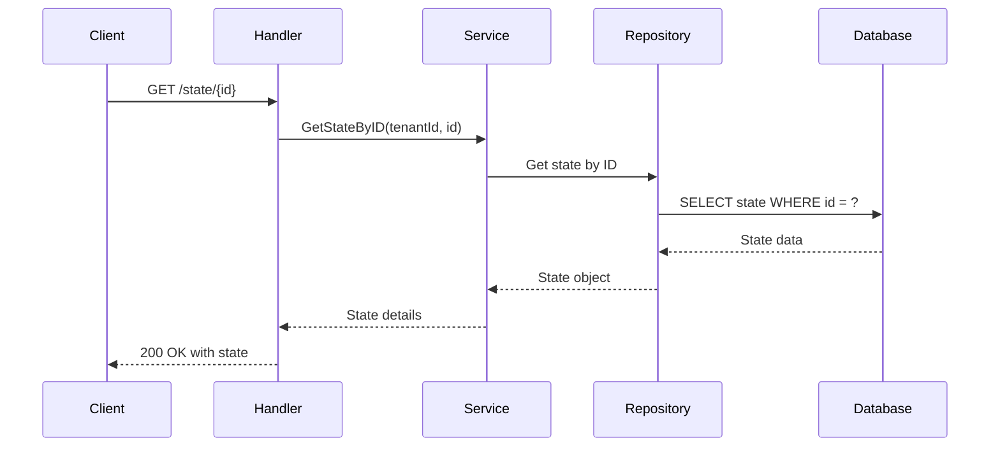

#### 13. Update State
- **Endpoint**: `PUT /workflow/v3/state/{id}`
- **Description**: Updates an existing state
- **Headers**: `X-Tenant-ID: {tenantId}`
- **Request Body**: State object with updated fields
- **Response**: `200 OK` with updated state

**Sequence Diagram:**

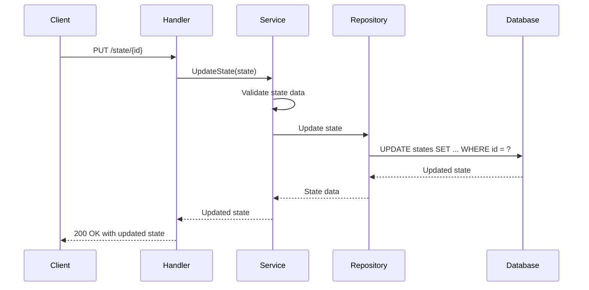

#### 14. Delete State
- **Endpoint**: `DELETE /workflow/v3/state/{id}`
- **Description**: Deletes a state and its associated actions
- **Response**: `204 No Content`

**Sequence Diagram:**

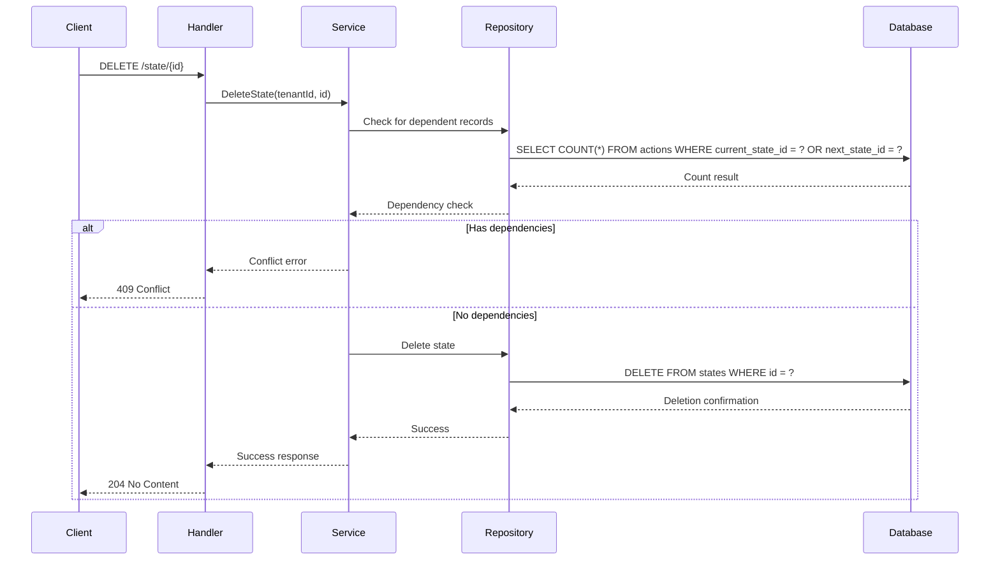

#### 15. Get Actions
- **Endpoint**: `GET /workflow/v3/state/{stateId}/action`
- **Description**: Retrieves all actions for a specific state
- **Query Parameters**:
  - `currentState` (optional)
  - `nextState` (optional)
- **Response**: `200 OK` with list of actions

**Sequence Diagram:**

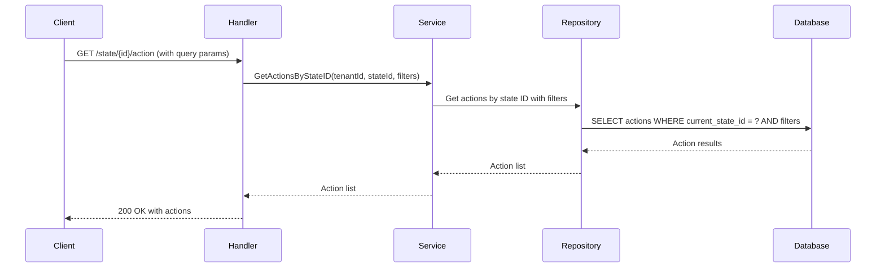

#### 16. Get Action by ID
- **Endpoint**: `GET /workflow/v3/action/{id}`
- **Description**: Retrieves a specific action by its ID
- **Response**: `200 OK` with action details

**Sequence Diagram:**

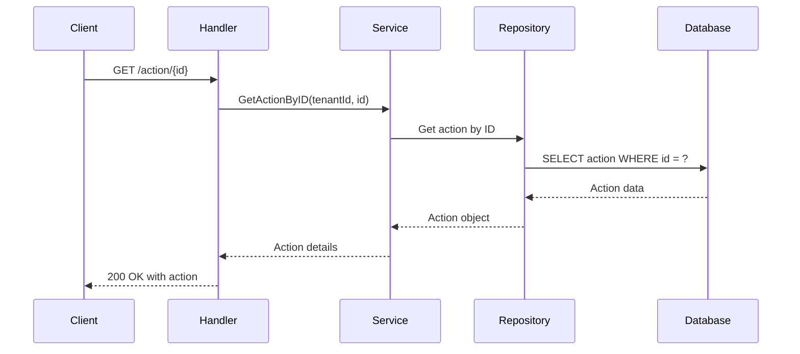

#### 17. Update Action
- **Endpoint**: `PUT /workflow/v3/action/{id}`
- **Description**: Updates an existing action
- **Headers**: `X-Tenant-ID: {tenantId}`
- **Request Body**: Action object with updated fields
- **Response**: `200 OK` with updated action

**Sequence Diagram:**

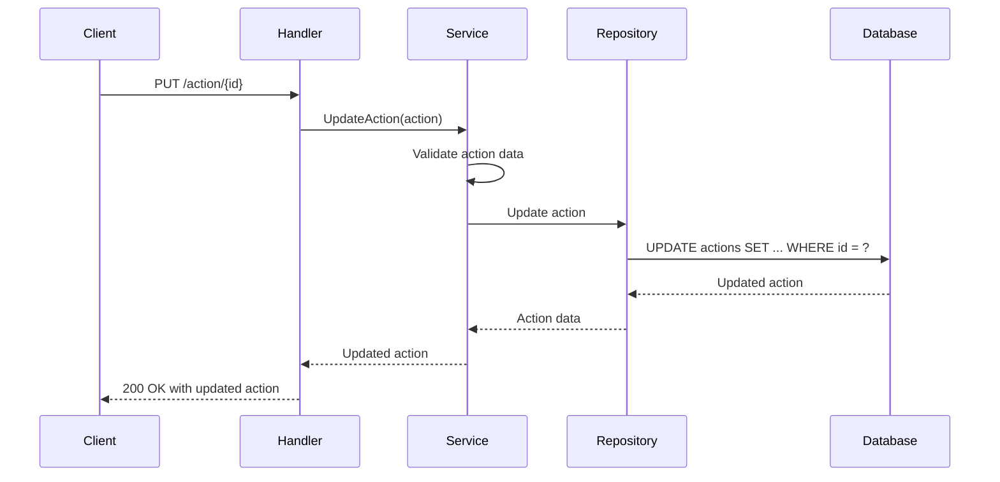

#### 18. Delete Action
- **Endpoint**: `DELETE /workflow/v3/action/{id}`
- **Description**: Deletes an action
- **Response**: `204 No Content`

**Sequence Diagram:**

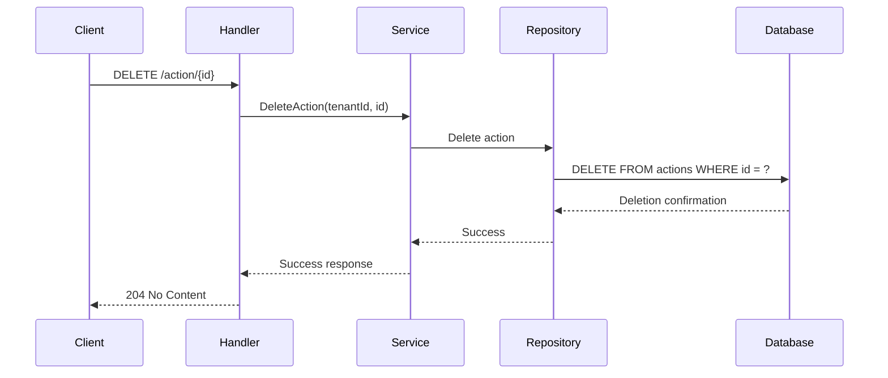

#### 19. Get Transitions
- **Endpoint**: `GET /workflow/v3/transition`
- **Description**: Retrieves process instance transitions/history
- **Query Parameters**:
  - `entityId` (required)
  - `processId` (optional)
  - `history` (optional, boolean)
- **Response**: `200 OK` with transition history

**Sequence Diagram:**

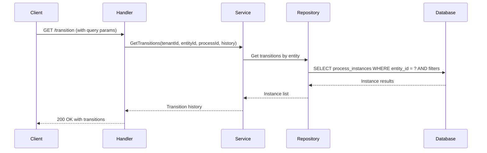

#### 20. Create Escalation Config
- **Endpoint**: `POST /workflow/v3/process/{processId}/escalation`
- **Description**: Creates a new escalation configuration for a process
- **Headers**: `X-Tenant-ID: {tenantId}`
- **Request Body**:
```json
{
  "processId": "process-uuid",
  "stateCode": "PENDING_REVIEW",
  "escalationAction": "AUTO_APPROVE",
  "stateSlaMinutes": 60,
  "processSlaMinutes": 1440
}
```
- **Response**: `201 Created` with created escalation config

**Sequence Diagram:**

```mermaid
sequenceDiagram
    participant Client
    participant Handler
    participant Service
    participant Repository
    participant Database

    Client->>Handler: POST /process/{id}/escalation
    Handler->>Service: CreateEscalationConfig(config)
    
    Service->>Service: Validate escalation config
    Service->>Repository: Create escalation config
    Repository->>Database: INSERT escalation_configs
    Database-->>Repository: Created config
    Repository-->>Service: Config data
    
    Service-->>Handler: Created config
    Handler-->>Client: 201 Created with config
```

#### 21. Get Escalation Configs
- **Endpoint**: `GET /workflow/v3/process/{processId}/escalation`
- **Description**: Retrieves escalation configurations for a process
- **Response**: `200 OK` with list of escalation configs

**Sequence Diagram:**

```mermaid
sequenceDiagram
    participant Client
    participant Handler
    participant Service
    participant Repository
    participant Database

    Client->>Handler: GET /process/{id}/escalation
    Handler->>Service: GetEscalationConfigsByProcessID(tenantId, processId)
    
    Service->>Repository: Get escalation configs by process
    Repository->>Database: SELECT escalation_configs WHERE process_id = ?
    Database-->>Repository: Config results
    Repository-->>Service: Config list
    
    Service-->>Handler: Escalation configs
    Handler-->>Client: 200 OK with configs
```

#### 22. Get Escalation Config by ID
- **Endpoint**: `GET /workflow/v3/escalation/{id}`
- **Description**: Retrieves a specific escalation configuration by its ID
- **Response**: `200 OK` with escalation config details

**Sequence Diagram:**

```mermaid
sequenceDiagram
    participant Client
    participant Handler
    participant Service
    participant Repository
    participant Database

    Client->>Handler: GET /escalation/{id}
    Handler->>Service: GetEscalationConfigByID(tenantId, id)
    
    Service->>Repository: Get escalation config by ID
    Repository->>Database: SELECT escalation_configs WHERE id = ?
    Database-->>Repository: Config data
    Repository-->>Service: Config object
    
    Service-->>Handler: Config details
    Handler-->>Client: 200 OK with config
```

#### 23. Update Escalation Config
- **Endpoint**: `PUT /workflow/v3/escalation/{id}`
- **Description**: Updates an existing escalation configuration
- **Headers**: `X-Tenant-ID: {tenantId}`
- **Request Body**: Escalation config object with updated fields
- **Response**: `200 OK` with updated escalation config

**Sequence Diagram:**

```mermaid
sequenceDiagram
    participant Client
    participant Handler
    participant Service
    participant Repository
    participant Database

    Client->>Handler: PUT /escalation/{id}
    Handler->>Service: UpdateEscalationConfig(config)
    
    Service->>Service: Validate escalation config
    Service->>Repository: Update escalation config
    Repository->>Database: UPDATE escalation_configs SET ... WHERE id = ?
    Database-->>Repository: Updated config
    Repository-->>Service: Config data
    
    Service-->>Handler: Updated config
    Handler-->>Client: 200 OK with updated config
```

#### 24. Delete Escalation Config
- **Endpoint**: `DELETE /workflow/v3/escalation/{id}`
- **Description**: Deletes an escalation configuration
- **Response**: `204 No Content`

**Sequence Diagram:**

```mermaid
sequenceDiagram
    participant Client
    participant Handler
    participant Service
    participant Repository
    participant Database

    Client->>Handler: DELETE /escalation/{id}
    Handler->>Service: DeleteEscalationConfig(tenantId, id)
    
    Service->>Repository: Delete escalation config
    Repository->>Database: DELETE FROM escalation_configs WHERE id = ?
    Database-->>Repository: Deletion confirmation
    Repository-->>Service: Success
    
    Service-->>Handler: Success response
    Handler-->>Client: 204 No Content
```

#### 25. Search Escalated Applications
- **Endpoint**: `GET /workflow/v3/auto/_search`
- **Description**: Searches for escalated process instances
- **Query Parameters**:
  - `processId` (optional)
  - `limit` (optional, default: 20)
  - `offset` (optional, default: 0)
- **Response**: `200 OK` with escalated instances

**Sequence Diagram:**

```mermaid
sequenceDiagram
    participant Client
    participant Handler
    participant Service
    participant Repository
    participant Database

    Client->>Handler: GET /auto/_search (with query params)
    Handler->>Service: SearchEscalatedApplications(tenantId, processId, limit, offset)
    
    Service->>Repository: Search escalated instances
    Repository->>Database: SELECT process_instances WHERE escalated = true AND filters
    Database-->>Repository: Instance results
    Repository-->>Service: Instance list
    
    Service-->>Handler: Escalated instances
    Handler-->>Client: 200 OK with escalated applications
```

