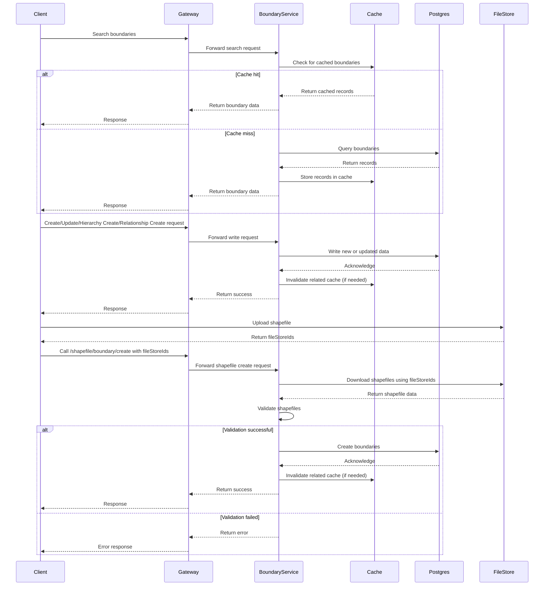

```mermaid
sequenceDiagram
    participant Client
    participant Gateway
    participant BoundaryService
    participant Cache
    participant DB as Postgres
    participant FileStore

    %% Search flow
    Client->>Gateway: Search boundaries
    Gateway->>BoundaryService: Forward search request
    BoundaryService->>Cache: Check for cached boundaries
    alt Cache hit
        Cache-->>BoundaryService: Return cached records
        BoundaryService-->>Gateway: Return boundary data
        Gateway-->>Client: Response
    else Cache miss
        BoundaryService->>DB: Query boundaries
        DB-->>BoundaryService: Return records
        BoundaryService->>Cache: Store records in cache
        BoundaryService-->>Gateway: Return boundary data
        Gateway-->>Client: Response
    end

    %% Create / Update / Hierarchy / Relationship flow
    Client->>Gateway: Create/Update/Hierarchy Create/Relationship Create request
    Gateway->>BoundaryService: Forward write request
    BoundaryService->>DB: Write new or updated data
    DB-->>BoundaryService: Acknowledge
    BoundaryService->>Cache: Invalidate related cache (if needed)
    BoundaryService-->>Gateway: Return success
    Gateway-->>Client: Response

    %% Shapefile flow
    Client->>FileStore: Upload shapefile
    FileStore-->>Client: Return fileStoreIds
    Client->>Gateway: Call /shapefile/boundary/create with fileStoreIds
    Gateway->>BoundaryService: Forward shapefile create request
    BoundaryService->>FileStore: Download shapefiles using fileStoreIds
    FileStore-->>BoundaryService: Return shapefile data
    BoundaryService->>BoundaryService: Validate shapefiles
    alt Validation successful
        BoundaryService->>DB: Create boundaries
        DB-->>BoundaryService: Acknowledge
        BoundaryService->>Cache: Invalidate related cache (if needed)
        BoundaryService-->>Gateway: Return success
        Gateway-->>Client: Response
    else Validation failed
        BoundaryService-->>Gateway: Return error
        Gateway-->>Client: Error response
    end
```
