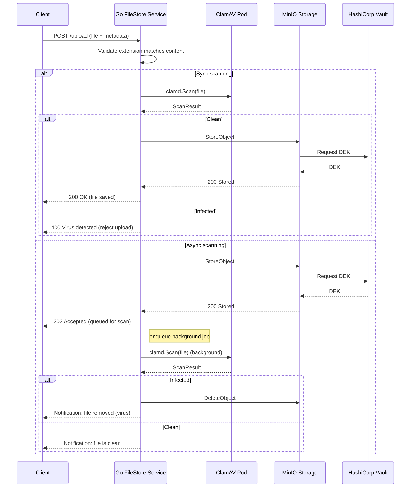

# Filestore Technical Overview

🚧 **Work in Progress**  
_This documentation is actively being refined. Contributions and suggestions are welcome._

## 1. Overview
The Filestore Service is a Go-based microservice that provides secure, scalable file storage with built-in malware protection and content validation. It leverages MinIO (integrated with HashiCorp Vault for envelope-style encryption) as the object store, and ClamAV for virus scanning. Depending on your configuration, uploads can be scanned synchronously—blocking until the result is known—or queued for asynchronous background inspection. Any file whose extension doesn’t match its actual content, or which tests positive for malware, is automatically rejected or purged.

## 2. File Upload Flow

When a client submits a file for upload, the service first inspects the file’s extension against its content to guard against spoofing. Depending on the configured mode, the file is either scanned immediately (synchronous) or queued for later analysis (asynchronous). In synchronous mode, the service calls ClamAV and, if the file is clean, requests a data‐encryption key (DEK) from HashiCorp Vault before handing the encrypted payload off to MinIO; any virus detection aborts the upload. In asynchronous mode, the file is optimistically stored—MinIO automatically contacts Vault to retrieve and apply the DEK—then the service enqueues a background scan; infected files are purged post-scan and the client is notified of the removal, while clean files remain accessible.

